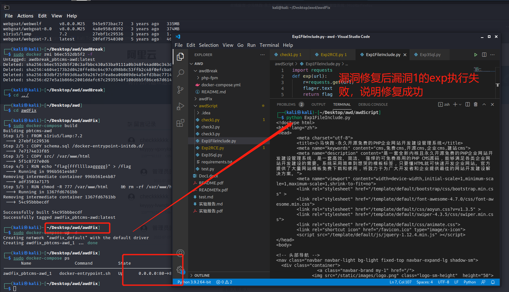
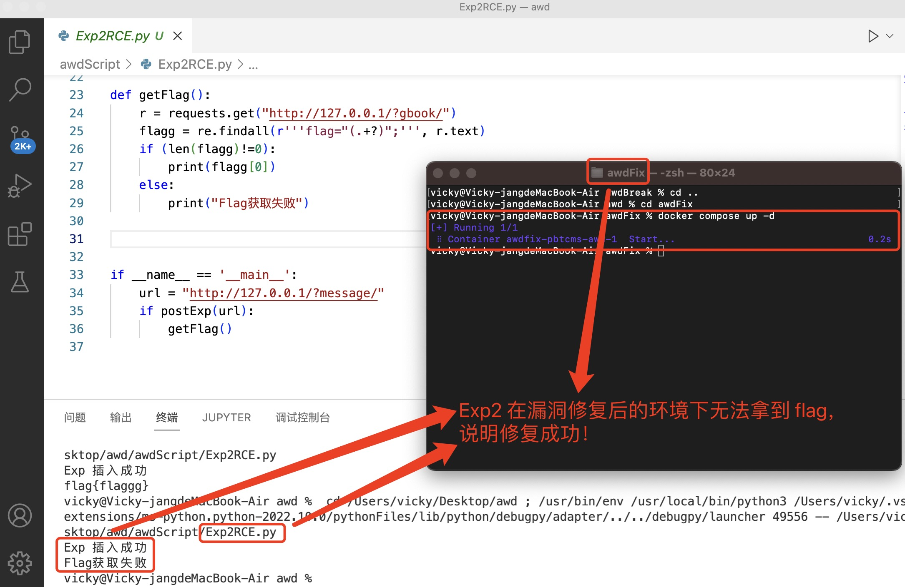
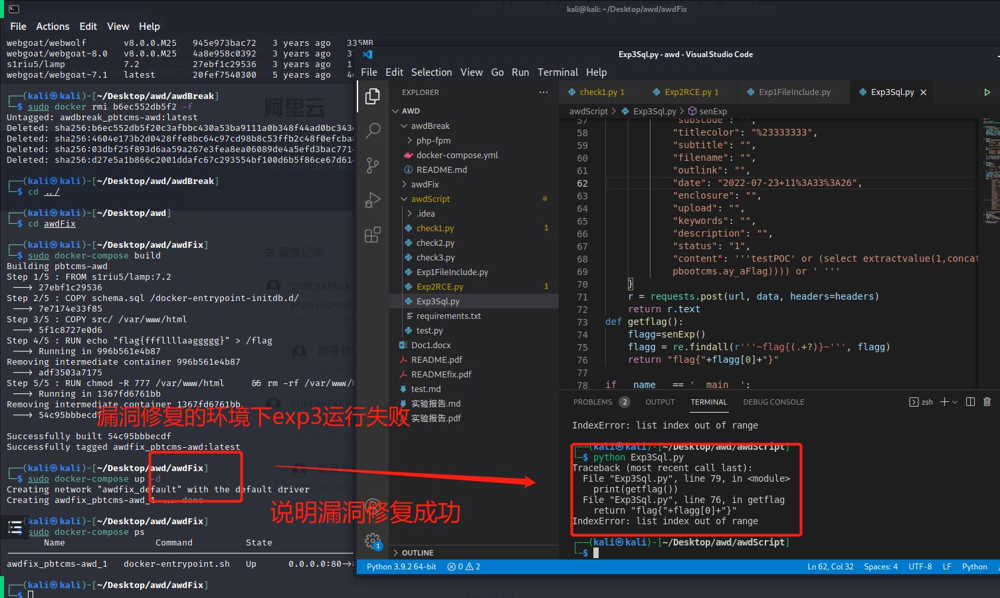

# FixIt ——对应 awdFix 文件夹，是 Fix 之后的 docker

**Fix 之后，三个漏洞的漏洞利用都失效， check 仍能成功。详见[视频](https://www.bilibili.com/video/BV1ya411M7c1/)。具体 Fix 方法如下**

## 漏洞一

- Before Fix — `awdBreak` 文件夹下

  `apps\home\controller\SearchController.php` line 26-32

  ```php
  $searchtpl = request('searchtpl');
  if (! preg_match('/^[\w\-\.\/]+$/', $searchtpl)) {
         $searchtpl = 'search.html';
  }
  ```

- After Fix — `awdFix` 文件夹下

  `apps\home\controller\SearchController.php` line 26-32

  ```php
  $searchtpl = request('searchtpl');
  if (! preg_match('/^[\w]+\.html$/', $searchtpl)) {
      $searchtpl = 'search.html';
  }
  ```

  **这里 Fix 采取白名单策略，匹配正则失败 `$searchtpl` 默认等于 `search.html` 从而防止任意读取其他文件**



## 漏洞二

- Before Fix

`apps\home\controller\FormController.php` line 68-80

```php
foreach ($form as $value) {
    $field_data = post($value->name);
    if (is_array($field_data)) { // 如果是多选等情况时转换
        $field_data = implode(',', $field_data);
    }
    $field_data = str_replace('pboot:if', '', $field_data);
    if ($value->required && ! $field_data) {
        alert_back($value->description . '不能为空！');
    } else {
        $data[$value->name] = $field_data;
        $mail_body .= $value->description . '：' . $field_data . '<br>';
    }
}
```

`core\basic\Model.php` line 1252-1254

```php
if (M != 'admin') {
    $sql = preg_replace('pboot:if', '', $sql); // 过滤插入cms条件语句
}
```

- After Fix

`apps\home\controller\FormController.php`  line 68-80

```php
foreach ($form as $value) {
    $field_data = post($value->name);
    if (is_array($field_data)) { // 如果是多选等情况时转换
        $field_data = implode(',', $field_data);
    }
    $field_data = preg_replace_r('/pboot:if/i', '', $field_data);
    if ($value->required && ! $field_data) {
        alert_back($value->description . '不能为空！');
    } else {
        $data[$value->name] = $field_data;
        $mail_body .= $value->description . '：' . $field_data . '<br>';
    }
}
```

`core/basic/Model.php` line 1252-1254

```php
if (M != 'admin') {
    $sql = preg_replace_r('/pboot:if/i', '', $sql); // 过滤插入cms条件语句
}
```

「函数 preg_replace_r()」

```php
function preg_replace_r($search, $replace, $subject)
{
    while (preg_match($search, $subject)) {
        $subject = preg_replace($search, $replace, $subject);
    }
    return $subject;
}
```

> php 语言中「preg_replace() 函数」语法：
>
> ```php
> mixed preg_replace ( mixed $pattern , mixed $replacement , mixed $subject [, int $limit = -1 [, int &$count ]] )
> ```
>
> 函数功能：搜索 subject 中匹配「pattern」的部分， 以「replacement」进行替换。

将「函数preg_replace()」替换为「函数 preg_replace_r()」使得 **可以循环匹配和过滤**

在 `apps/home/controller/ParserController.php`  新增 **过滤判断函数** ，过滤掉危险函数

```php
// 过滤特殊字符串
if (preg_match('/(\$_GET\[)|(\$_POST\[)|(\$_REQUEST\[)|(\$_COOKIE\[)|(\$_SESSION\[)|(file_put_contents)|(file_get_contents)|(fwrite)|(phpinfo)|(base64)|(`)|(shell_exec)|(eval)|(assert)|(system)|(exec)|(passthru)|(print_r)|(urldecode)/i', $matches[1][$i])) {
    $danger = true;
}
```

利用 Exp 验证漏洞是否被修复，在修复后的环境运行 Exp ，插入失败，说明修复成功！



## 漏洞三

- Before Fix

  `apps/admin/controller/content/ContentController.php` line 114-117

  ```php
  // 自动提取前一百个字符为描述
  if (! $description && isset($_POST['content'])) {
      $description = mb_substr(strip_tags($_POST['content']), 0, 150);
  }
  ```

- After Fix

  **通过过滤和转义的方式进行过滤危险参数**

  `apps/admin/controller/content/ContentController.php` line 114-117

  ```php
  // 自动提取前一百个字符为描述
  if (! $description && isset($_POST['content'])) {
      $description = escape_string(clear_html_blank(substr_both(strip_tags($_POST['content']), 0, 150)));
  }
  ```

  - `escape_string()`

    ```php
    // 获取转义数据，支持字符串、数组、对象
    function escape_string($string)
    {
        if (! $string)
            return $string;
        if (is_array($string)) { // 数组处理
            foreach ($string as $key => $value) {
                $string[$key] = escape_string($value);
            }
        } elseif (is_object($string)) { // 对象处理
            foreach ($string as $key => $value) {
                $string->$key = escape_string($value);
            }
        } else { // 字符串处理
            $string = htmlspecialchars(trim($string), ENT_QUOTES, 'UTF-8');
            $string = addslashes($string);
        }
        return $string;
    }
    ```

  - `clear_html_blank()`

    ```php
    // 清洗html代码的空白符号
    function clear_html_blank($string)
    {
        $string = str_replace("\r\n", '', $string); // 清除换行符
        $string = str_replace("\n", '', $string); // 清除换行符
        $string = str_replace("\t", '', $string); // 清除制表符
        $string = str_replace('　', '', $string); // 清除大空格
        $string = str_replace('&nbsp;', '', $string); // 清除 &nbsp;
        $string = preg_replace('/\s+/', ' ', $string); // 清除空格
        return $string;
    }
    ```

  - `substr_both()`

    ```php
    // 中英混合的字符串截取,以一个汉字为一个单位长度，英文为半个
    function substr_both($string, $strat, $length)
    {
        $s = 0; // 起始位置
        $i = 0; // 实际Byte计数
        $n = 0; // 字符串长度计数
        $str_length = strlen($string); // 字符串的字节长度
        while (($n < $length) and ($i < $str_length)) {
            $ascnum = Ord(substr($string, $i, 1)); // 得到字符串中第$i位字符的ascii码
            if ($ascnum >= 224) { // 根据UTF-8编码规范，将3个连续的字符计为单个字符
                $i += 3;
                $n ++;
            } elseif ($ascnum >= 192) { // 根据UTF-8编码规范，将2个连续的字符计为单个字符
                $i += 2;
                $n ++;
            } else {
                $i += 1;
                $n += 0.5;
            }
            if ($s == 0 && $strat > 0 && $n >= $strat) {
                $s = $i; // 记录起始位置
            }
        }
        if ($n < $strat) { // 起始位置大于字符串长度
            return;
        }
        return substr($string, $s, $i);
    }
    ```


