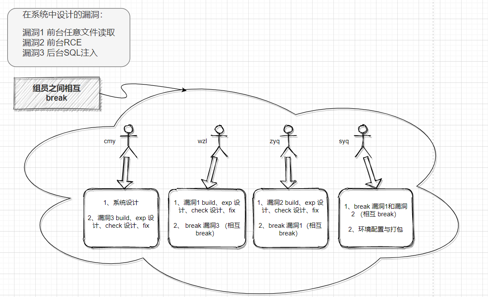

# 作品名

基于开源项目 `PbootCMS2.07` 设计 `WEB` 安全漏洞并进行利用

## 功能清单

本项目设计要求较高，从系统设计、数据库设计、架构设计、漏洞设计、编程语言、环境配置等方面要求较高。每一项都是一些挑战性很大的工作。

- **重点难点是三个漏洞的设计，既要符合逻辑规范，也要符合设计要求，符合实际应用场景**
- 对漏洞设计完成后，再进行 exp 的测试和 check 设计，以及漏洞的修复 fix
- 对整个项目进行打包
- 组员之间相互 break 不同的漏洞，进行 exp 构造以及完成技术总结报告

| 整体功能                                                     | 完成情况 |
| :----------------------------------------------------------- | :------: |
| 基于开源项目 `PbootCMS2.07` 设计管理系统 — 仿真性            |    √     |
| **设计并嵌入漏洞，进行漏洞利用（详见漏洞利用详情表）**  **重点** |    √     |
| 整个项目的打包并对照 [评分要求](https://c4pr1c3.github.io/cuc-wiki/cp/assessment.html) 测试各功能是否可以正常使用 |    √     |
| 组员运行 docker 进行相互 break                               |    √     |

| 漏洞利用详情  （自行构造（有参考历史版本漏洞）） | BuildIt | EXP 设计 | Check 设计 | FixIt |
| ------------------------------------------------ | :-----: | :------: | :--------: | :---: |
| 漏洞一 ——**前台任意文件读取**                    |    √    |    √     |     √      |   √   |
| 漏洞二 ——**前台 RCE**                            |    √    |    √     |     √      |   √   |
| 漏洞三 ——**后台 sql 注入**                       |    √    |    √     |     √      |   √   |

## 本项目用到的关键技术

*  系统主要页面采用模版渲染的方式。同时在一些关键操作的数据传递上采用前后端分离的架构，利用 Ajax 进行异步数据传递。使扩展能力更强。
*  后端基于 `PHP` 的 `Pboot` 框架进行编写，该框架采用 `MVC` 的思想，更符合当前的开发趋势，更利于项目的后期维护。
*  整个项目分为开发环境和实际运行环境；开发环境为本机真实环境。实际运行环境基于 Docker-Compose。该环境的基础镜像来自 `s1riu5/lamp:7.2` 。利用 `docker-entrypoint-initdb.d/` 直接导入数据库。
*  考虑到实际题目运行场景，可能要采取动态 `flag` 的模式，所以在 Docker 启动时添加命令 `RUN echo "flag{fffllllaaggggg}" > /flag` 以方便实际场景应用。
*  三个漏洞对应设置三个 `flag` ，详细内容见 [完整结课报告](https://github.com/Daytoyecho/Summer-Class-Group12/blob/Members_division_and_reports/Members_division_and_reports/%E6%BC%8F%E6%B4%9E%E6%94%BB%E9%98%B2%E5%AE%9E%E8%AE%AD%E5%AE%8C%E6%95%B4%E6%8A%A5%E5%91%8A.md) 。
*  为了更好的管理和配置 `Docker` 容器，同时考虑到与数据库解耦，本次采用 `Docker-Compose` 的方式来管理容器。
*  本项目启动方式非常简单，只需要在项目路径下使用 `docker-compse up -d` 即可启动项目环境，无需其他操作。

## 快速安装与使用方法说明

```shell
#注：awdBreak 文件夹中是未修复漏洞的容器；awdFix 文件夹中是修复漏洞后的容器

##执行切换至相应文件夹路径下执行
sudo docker-compose build 
sudo docker-compose up -d 


###中途不能执行 sudo docker-compose stop，如果不慎执行了，进行如下操作：

##查看全部镜像
sudo docker images

##删除镜像
sudo docker rmi IMAGE_ID  -f

##重新执行启动命令

##查看是否正常启动
sudo docker-compose ps

##成功后本机访问 127.0.0.1 即可出现系统界面。

###本机访问 127.0.0.1 成功后，使用 VScode 执行对应的的 exp 脚本和 check 脚本进行测试即可。(python)
```

## 课程结题报告与系统功能操作视频演示地址

- [完整结课报告链接](https://github.com/Daytoyecho/Summer-Class-Group12/blob/Members_division_and_reports/Members_division_and_reports/%E6%BC%8F%E6%B4%9E%E6%94%BB%E9%98%B2%E5%AE%9E%E8%AE%AD%E5%AE%8C%E6%95%B4%E6%8A%A5%E5%91%8A.md)
- [演示视频链接](https://www.bilibili.com/video/BV1ya411M7c1/)

## 附录一 —— 小组分工 



***备注：所有组员全部都非常积极认真地完成任务，每个人担任的角色都至关重要，每个人的任务量都很重，并且因为各个板块的联系非常紧密，个人的实际任务量远超上图划定的界限。在此期间，通过频繁开组会沟通迭代，用将近一个月的时间较为圆满地完成了此次实践任务。详细的组会记录在畅课平台提交。***

## 附录二——分支说明

1. `BuildIt` 分支说明

   - `awdBreak` 文件夹是带有漏洞环境的 docker

   - `build_check` 文件夹内是针对三个漏洞的 check 脚本

   - `build_exp` 文件夹内是 BuildIt 阶段的 exp 脚本

   - `BuildIt.md` 文件是 BuildIt 阶段的技术总结报告

2. `BreakIt` 分支介绍

   - `BreakIt_exp` 文件夹里面是 BreakIt 阶段的 exp 脚本

   - `BreakIt.md` 文件是 BreakIt 阶段的技术总结报告

3. `FixIt` 分支说明
   - `awdFix` 文件夹是漏洞修复之后的 docker
   
   - `FixIt.md` 是 FixIt 阶段的技术总结报告
   
4. `Members_division_and_reports` 分支说明

   - 该分支包含 4 名组员的个人实验报告，按照命名要求提交

   - `漏洞攻防实训完整报告.md` 文件是整个小组完整的技术报告
