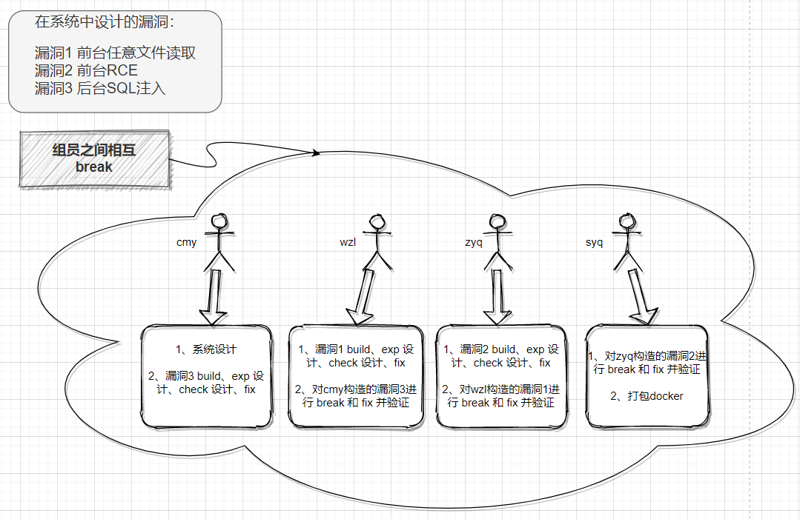

# 作品名

基于开源项目 `PbootCMS2.07` 设计 `WEB` 安全漏洞并进行利用

## 功能清单

本项目设计要求较高，设计广泛，从系统设计、数据库设计、架构设计、漏洞设计、编程语言、环境配置等方面要求较高。**重点难点是三个漏洞的设计**，既要符合逻辑规范，也要符合设计要求，符合实际应用场景。对于漏洞设计完成后，再进行 exp 的测试，以及漏洞的修复。最后整个项目的打包。以上这些都是具有一定挑战性的工作。

| 整体功能                                                     | 完成情况 |
| ------------------------------------------------------------ | :------: |
| 基于开源项目 `PbootCMS2.07` 设计管理系统 — 仿真性            |    √     |
| 设计并嵌入漏洞，进行漏洞利用（详情见下表）                   |    √     |
| 整个项目的打包并对照[评分要求](https://c4pr1c3.github.io/cuc-wiki/cp/assessment.html)测试能否正常使用 |    √     |

| 漏洞利用详情                                                 | 漏洞设计 | EXP设计 | Check设计 | Fix  |
| ------------------------------------------------------------ | :------: | :-----: | :-------: | :--: |
| 漏洞一 —**系统自带（较新）**——**前台任意文件读取**           |    √     |    √    |     √     |  √   |
| 漏洞二 — 参照历史版本在系统内**自行构造**（有参考历史版本漏洞）——**前台RCE** |    √     |    √    |     √     |  √   |
| 漏洞三 — 参照历史版本在系统内**自行构造**（有参考历史版本漏洞）——**后台 sql 注入** |    √     |    √    |     √     |  √   |


## 小组分工 



## 本项目用到的关键技术


## 快速安装与使用方法说明

```
#注：awdBreak文件夹中是未修复漏洞的容器；awdFix文件夹中是修复漏洞后的容器

##执行切换至相应文件夹路径下执行
sudo docker-compose build 
sudo docker-compose up -d 


###中途不能执行 sudo docker-compose stop，如果不慎执行了，进行如下操作：

##查看全部镜像
sudo docker images

##删除镜像
sudo docker rmi IMAGE_ID  -f

##重新执行启动命令

##查看是否正常启动
sudo docker-compose ps

##成功后本机访问127.0.0.1即可出现系统界面。

###本机访问127.0.0.1成功后，使用VScode执行awdScript文件夹中的exp脚本和check脚本进行测试即可。(python)
```

## 演示
